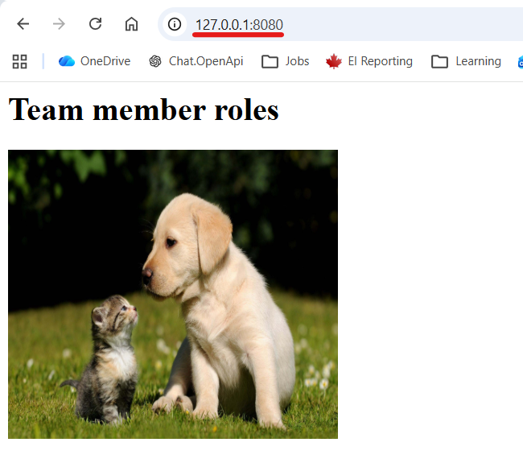
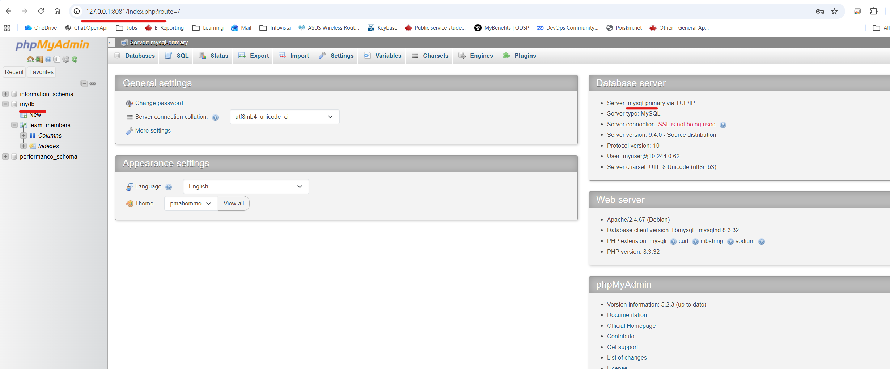

# Module 10 - Kubernetes

## Repo: 
https://gitlab.com/IrinaRoiter/aws-exercises

<details>
<summary><b>EXERCISE 1: Create a Kubernetes cluster</b></summary>

* Create a Kubernetes cluster in Minikube

I am connected an empty cluster in minikube

```
PS C:\repos> minikube status
minikube
type: Control Plane
host: Running
kubelet: Running
apiserver: Running
kubeconfig: Configured

PS C:\repos> kubectl get all
NAME                 TYPE        CLUSTER-IP   EXTERNAL-IP   PORT(S)   AGE
service/kubernetes   ClusterIP   10.96.0.1    <none>        443/TCP   44d

PS C:\repos> kubectl get nodes
NAME       STATUS   ROLES           AGE   VERSION
minikube   Ready    control-plane   44d   v1.35.1
```

</details>
<details>
<summary><b>EXERCISE 2: Deploy Mysql with 2 replicas</b></summary>

* Add bitnamilegacy to helm
```
PS C:\repos\kubernetes-exercises> helm repo add bitnami https://charts.bitnami.com/bitnami
"bitnami" has been added to your repositories

PS C:\repos\kubernetes-exercises> helm repo update
Hang tight while we grab the latest from your chart repositories...
...Successfully got an update from the "ingress-nginx" chart repository
...Successfully got an update from the "bitnami" chart repository
...Successfully got an update from the "bitnamilegacy" chart repository
Update Complete. ⎈Happy Helming!⎈

PS C:\repos\kubernetes-exercises> helm search repo bitnami/mysql
NAME                    CHART VERSION   APP VERSION     DESCRIPTION
bitnamilegacy/mysql     14.0.3          9.4.0           MySQL is a fast, reliable, scalable, and easy t...
```
* Create a custom values file

https://github.com/IrinaRoiter/kubernetes-exercises/blob/b19ff8a43497645f1ec56f23015afcab714b3f05/mysql-values.yaml


* Deploy Mysql database with 2 replicas and volumes for data persistence
```
PS C:\repos\kubernetes-exercises> helm install mysql -f mysql-values.yaml ./mysql
NAME: mysql
LAST DEPLOYED: Tue Jun 30 13:45:56 2026
NAMESPACE: default
STATUS: deployed
REVISION: 1
DESCRIPTION: Install complete
TEST SUITE: None
NOTES:
CHART NAME: mysql
CHART VERSION: 14.0.3
APP VERSION: 9.4.0

PS C:\repos\kubernetes-exercises> kubectl get pods
NAME                READY   STATUS    RESTARTS   AGE
mysql-primary-0     1/1     Running   0          60m
mysql-secondary-0   1/1     Running   0          60m
mysql-secondary-1   1/1     Running   0          59m

```
* Check 'mysql' db inside of the primary pod
```
PS C:\Repos\DevOps> kubectl exec -it mysql-primary-0 -- sh
Defaulted container "mysql" out of: mysql, preserve-logs-symlinks (init)
$ pwd
/
$ mysql -u myuser -p
Enter password: 
Welcome to the MySQL monitor.  Commands end with ; or \g.
Your MySQL connection id is 120
Server version: 9.4.0 Source distribution
...
mysql> SHOW DATABASES;
+--------------------+
| Database           |
+--------------------+
| information_schema |
| mydb               |
| performance_schema |
+--------------------+
3 rows in set (0.007 sec)

mysql> exit
Bye
$ exit
PS C:\Repos\DevOps>
```
* Check volumes
```
PS C:\repos\kubernetes-exercises> kubectl get pv
NAME                                       CAPACITY   ACCESS MODES   RECLAIM POLICY   STATUS   CLAIM                            STORAGECLASS   VOLUMEATTRIBUTESCLASS   REASON   AGE
pvc-3c27df36-7ca6-4728-a37b-87b2063d065c   1Gi        RWO            Delete           Bound    default/data-mysql-primary-0     standard       <unset>                          119m
pvc-68f37e3a-0fe9-4751-a485-5c9acfec2aad   1Gi        RWO            Delete           Bound    default/data-mysql-secondary-0   standard       <unset>                          119m
pvc-703b7e49-56be-465e-bcb9-b3eb3123a4d7   1Gi        RWO            Delete           Bound    default/data-mysql-secondary-1   standard       <unset>                          117m
PS C:\repos\kubernetes-exercises> kubectl get pvc
NAME                     STATUS   VOLUME                                     CAPACITY   ACCESS MODES   STORAGECLASS   VOLUMEATTRIBUTESCLASS   AGE
data-mysql-primary-0     Bound    pvc-3c27df36-7ca6-4728-a37b-87b2063d065c   1Gi        RWO            standard       <unset>                 119m
data-mysql-secondary-0   Bound    pvc-68f37e3a-0fe9-4751-a485-5c9acfec2aad   1Gi        RWO            standard       <unset>                 119m
data-mysql-secondary-1   Bound    pvc-703b7e49-56be-465e-bcb9-b3eb3123a4d7   1Gi        RWO            standard       <unset>                 118m
```
</details>
<details>
<summary><b>EXERCISE 3: Deploy your Java Application with 2 replicas</b></summary>

Deploy the Java application with 2 replicas
Create ConfigMap and Secret with the correct values and reference them in the application deployment config file.

* Build Java app
```
PS C:\Repos\kubernetes-exercises> gradle build

[Incubating] Problems report is available at: file:///C:/Repos/kubernetes-exercises/build/reports/problems/problems-report.html

Deprecated Gradle features were used in this build, making it incompatible with Gradle 10.

You can use '--warning-mode all' to show the individual deprecation warnings and determine if they come from your own scripts or plugins.

For more on this, please refer to https://docs.gradle.org/9.3.1/userguide/command_line_interface.html#sec:command_line_warnings in the Gradle documentation.

BUILD SUCCESSFUL in 8s
```
```
PS C:\Repos\kubernetes-exercises> ls ./build/libs

    Directory: C:\Repos\kubernetes-exercises\build\libs

Mode                 LastWriteTime         Length Name
----                 -------------         ------ ----
-a---        Tue 30.06.26  5:01 PM           7151 bootcamp-kubernetes-exercise-project-1.0-SNAPSHOT-plain.jar
-a---        Tue 30.06.26  5:01 PM       26512156 bootcamp-kubernetes-exercise-project-1.0-SNAPSHOT.jar
```

* Build and push Docker image to DockerHub
```
PS C:\Repos\kubernetes-exercises> docker build -t irinaroiter/demo-app:java-gradle-app-1.1 .
[+] Building 34.9s (9/9) FINISHED                                                                                                                                                      docker:desktop-linux
...                                                                                                                                0.2s 
View build details: docker-desktop://dashboard/build/desktop-linux/desktop-linux/46c1czkoz55v7otoqo5oiujuj
```
```
PS C:\Repos\kubernetes-exercises> docker images 

IMAGE                                                                                                 ID             DISK USAGE   CONTENT SIZE   EXTRA
alpine:latest                                                                                         5b10f432ef3d       13.1MB         3.95MB
irinaroiter/demo-app:java-gradle-app-1.1                                                              c4af592e943b        778MB          267MB
```
```
PS C:\Repos\kubernetes-exercises> docker login
Authenticating with existing credentials... [Username: irinaroiter]

Login Succeeded

PS C:\Repos\kubernetes-exercises> docker push irinaroiter/demo-app:java-gradle-app-1.1
The push refers to repository [docker.io/irinaroiter/demo-app]
38a980f2cc8a: Pushed
a7203ca35e75: Pushed
4a57cc9b23fe: Pushed
4f4fb700ef54: Layer already exists
de849f1cfbe6: Pushed
a2f551961a5a: Pushed
b76eb2179538: Pushed
java-gradle-app-1.1: digest: sha256:c4af592e943b5cfa8b3248f29871cfcb8e4c5fa8b7becdf7673598b6a8f8170c size: 856
```
* Create ConfigMap

https://github.com/IrinaRoiter/kubernetes-exercises/blob/f8ed6eeffd83bd50931606dd601f9988065c1b9e/config-map.yaml

* Encode sensitive data with 64-base encoding and create Secret

```
PS C:\repos\kubernetes-exercises> [Convert]::ToBase64String([System.Text.Encoding]::UTF8.GetBytes("rootPassword"))
cm9vdFBhc3N3b3Jk
PS C:\repos\kubernetes-exercises> [Convert]::ToBase64String([System.Text.Encoding]::UTF8.GetBytes("myuser"))
bXl1c2Vy
PS C:\repos\kubernetes-exercises> [Convert]::ToBase64String([System.Text.Encoding]::UTF8.GetBytes("mypassword"))
bXlwYXNzd29yZA==
```

https://github.com/IrinaRoiter/kubernetes-exercises/blob/b19ff8a43497645f1ec56f23015afcab714b3f05/secret.yaml

* Create deployment file 

https://github.com/IrinaRoiter/kubernetes-exercises/blob/b19ff8a43497645f1ec56f23015afcab714b3f05/deployment.yaml

* Deploy Java app to K8s cluster
```
PS C:\repos\kubernetes-exercises> kubectl apply -f .\config-map.yaml
configmap/java-gradle-config-file created

PS C:\repos\kubernetes-exercises> kubectl apply -f .\secret.yaml
secret/java-app-secret-file created

PS C:\repos\kubernetes-exercises> kubectl create secret docker-registry dockerhub-secret `
>>   --docker-username=irinaroiter `
>>   --docker-password=<DockerHub-PAT> `
>>   --docker-email=irina.roiter@yahoo.com
secret/dockerhub-secret created
ℹ️ The step is required to allow to login to Docker from minikube before pulling an image. 
'docker login' outside of minikube does not help.

PS C:\repos\kubernetes-exercises> kubectl apply -f ./deployment.yaml
deployment.apps/java-gradle-app created
service/java-gradle-app created
```
* Verify that all pods have started successfully
```
PS C:\repos\kubernetes-exercises> kubectl get pod
NAME                              READY   STATUS    RESTARTS        AGE
java-gradle-app-b98769776-jfjwm   1/1     Running   0               5m50s 👈🏻 Pod 1
java-gradle-app-b98769776-w2wxp   1/1     Running   2 (4m47s ago)   5m50s 👈🏻 Pod 2
mysql-primary-0                   1/1     Running   2 (17h ago)     2d22h
mysql-secondary-0                 1/1     Running   2 (17h ago)     2d22h
mysql-secondary-1                 1/1     Running   2 (17h ago)     2d22h
```
* Start minikube tunnel
```
PS C:\repos\kubernetes-exercises> minikube tunnel
✅  Tunnel successfully started

📌  NOTE: Please do not close this terminal as this process must stay alive for the tunnel to be accessible ...

🔗  Starting tunnel for service java-gradle-app.
❗  Access to ports below 1024 may fail on Windows with OpenSSH clients older than v8.1. For more information, see: https://minikube.sigs.k8s.io/docs/handbook/accessing/#access-to-ports-1024-on-windows-requires-root-permission
🔗  Starting tunnel for service dashboard-ingress.
```
* Connect to application from a browser

</details>
<details>
<summary><b>EXERCISE 4: Deploy phpmyadmin</b></summary>

Deploy phpmyadmin to access Mysql UI with 1 replica

* Create deployment file

https://github.com/IrinaRoiter/kubernetes-exercises/blob/4e4edfed0c05ac1ad0614cc1ff4a89e35a3f5411/php-deployment.yaml

* Start deployment
```
PS C:\repos\kubernetes-exercises> kubectl apply -f .\php-deployment.yaml
deployment.apps/phpmyadmin-app created
service/phpmyadmin-app created

PS C:\repos\kubernetes-exercises> kubectl get pod
NAME                              READY   STATUS    RESTARTS      AGE
java-gradle-app-b98769776-jfjwm   1/1     Running   0             3h8m
java-gradle-app-b98769776-w2wxp   1/1     Running   4 (46m ago)   3h8m
mysql-primary-0                   1/1     Running   2 (20h ago)   3d1h
mysql-secondary-0                 1/1     Running   2 (20h ago)   3d1h
mysql-secondary-1                 1/1     Running   2 (20h ago)   3d1h
phpmyadmin-app-bbfbf7467-bhcct    1/1     Running   0             2m39s 👈🏻 Pod is up and running
```
* Connect to phpmysql via browser

</details>


