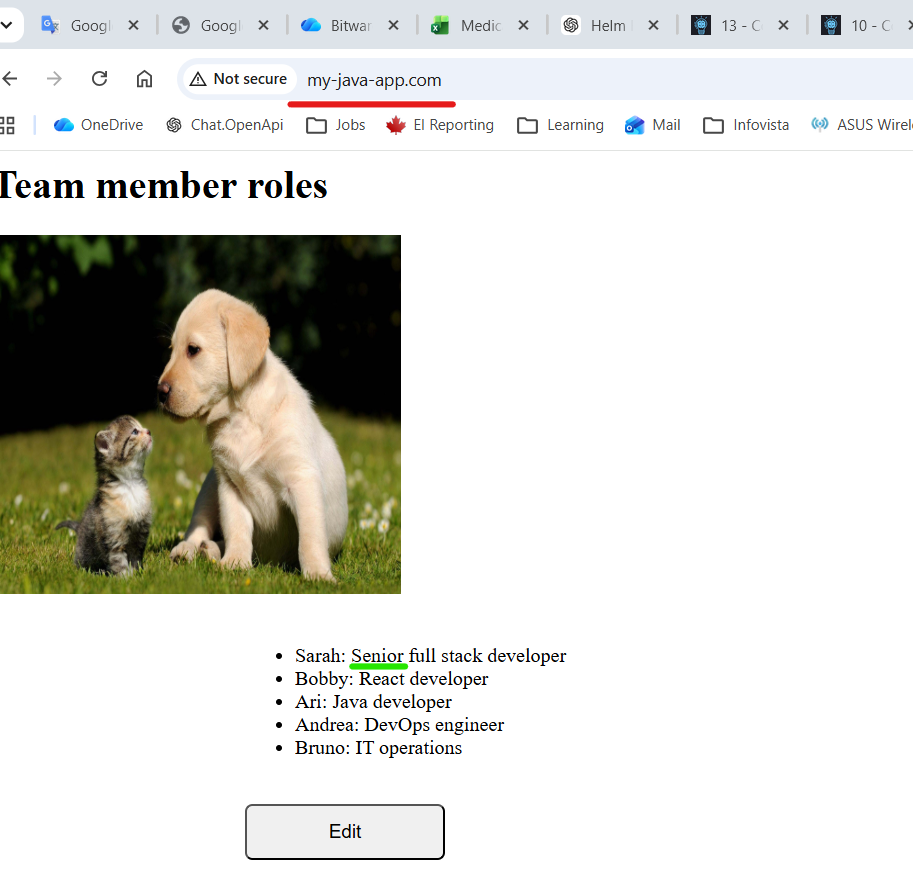
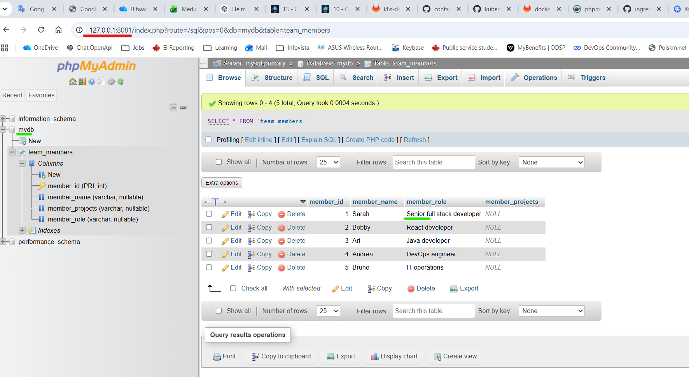
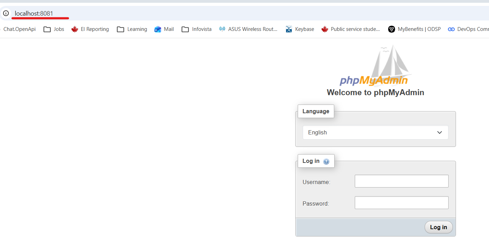

# Module 10 - Kubernetes

## Repo: 
https://gitlab.com/IrinaRoiter/aws-exercises

<details>
<summary><b>EXERCISE 1: Create a Kubernetes cluster</b></summary>

* Create a Kubernetes cluster in Minikube

I am connected an empty cluster in minikube

```
PS C:\repos> minikube status
minikube
type: Control Plane
host: Running
kubelet: Running
apiserver: Running
kubeconfig: Configured

PS C:\repos> kubectl get all
NAME                 TYPE        CLUSTER-IP   EXTERNAL-IP   PORT(S)   AGE
service/kubernetes   ClusterIP   10.96.0.1    <none>        443/TCP   44d

PS C:\repos> kubectl get nodes
NAME       STATUS   ROLES           AGE   VERSION
minikube   Ready    control-plane   44d   v1.35.1
```

</details>
<details>
<summary><b>EXERCISE 2: Deploy Mysql with 2 replicas</b></summary>

* Add bitnamilegacy to helm
```
PS C:\repos\kubernetes-exercises> helm repo add bitnami https://charts.bitnami.com/bitnami
"bitnami" has been added to your repositories

PS C:\repos\kubernetes-exercises> helm repo update
Hang tight while we grab the latest from your chart repositories...
...Successfully got an update from the "ingress-nginx" chart repository
...Successfully got an update from the "bitnami" chart repository
...Successfully got an update from the "bitnamilegacy" chart repository
Update Complete. ⎈Happy Helming!⎈

PS C:\repos\kubernetes-exercises> helm search repo bitnami/mysql
NAME                    CHART VERSION   APP VERSION     DESCRIPTION
bitnamilegacy/mysql     14.0.3          9.4.0           MySQL is a fast, reliable, scalable, and easy t...
```
* Create a custom values file

https://github.com/IrinaRoiter/kubernetes-exercises/blob/b19ff8a43497645f1ec56f23015afcab714b3f05/mysql-values.yaml


* Deploy Mysql database with 2 replicas and volumes for data persistence
```
PS C:\repos\kubernetes-exercises> helm install mysql -f mysql-values.yaml ./mysql
NAME: mysql
LAST DEPLOYED: Tue Jun 30 13:45:56 2026
NAMESPACE: default
STATUS: deployed
REVISION: 1
DESCRIPTION: Install complete
TEST SUITE: None
NOTES:
CHART NAME: mysql
CHART VERSION: 14.0.3
APP VERSION: 9.4.0

PS C:\repos\kubernetes-exercises> kubectl get pods
NAME                READY   STATUS    RESTARTS   AGE
mysql-primary-0     1/1     Running   0          60m
mysql-secondary-0   1/1     Running   0          60m
mysql-secondary-1   1/1     Running   0          59m

```
* Check 'mysql' db inside of the primary pod
```
PS C:\Repos\DevOps> kubectl exec -it mysql-primary-0 -- sh
Defaulted container "mysql" out of: mysql, preserve-logs-symlinks (init)
$ pwd
/
$ mysql -u myuser -p
Enter password: 
Welcome to the MySQL monitor.  Commands end with ; or \g.
Your MySQL connection id is 120
Server version: 9.4.0 Source distribution
...
mysql> SHOW DATABASES;
+--------------------+
| Database           |
+--------------------+
| information_schema |
| mydb               |
| performance_schema |
+--------------------+
3 rows in set (0.007 sec)

mysql> exit
Bye
$ exit
PS C:\Repos\DevOps>
```
* Check volumes
```
PS C:\repos\kubernetes-exercises> kubectl get pv
NAME                                       CAPACITY   ACCESS MODES   RECLAIM POLICY   STATUS   CLAIM                            STORAGECLASS   VOLUMEATTRIBUTESCLASS   REASON   AGE
pvc-3c27df36-7ca6-4728-a37b-87b2063d065c   1Gi        RWO            Delete           Bound    default/data-mysql-primary-0     standard       <unset>                          119m
pvc-68f37e3a-0fe9-4751-a485-5c9acfec2aad   1Gi        RWO            Delete           Bound    default/data-mysql-secondary-0   standard       <unset>                          119m
pvc-703b7e49-56be-465e-bcb9-b3eb3123a4d7   1Gi        RWO            Delete           Bound    default/data-mysql-secondary-1   standard       <unset>                          117m
PS C:\repos\kubernetes-exercises> kubectl get pvc
NAME                     STATUS   VOLUME                                     CAPACITY   ACCESS MODES   STORAGECLASS   VOLUMEATTRIBUTESCLASS   AGE
data-mysql-primary-0     Bound    pvc-3c27df36-7ca6-4728-a37b-87b2063d065c   1Gi        RWO            standard       <unset>                 119m
data-mysql-secondary-0   Bound    pvc-68f37e3a-0fe9-4751-a485-5c9acfec2aad   1Gi        RWO            standard       <unset>                 119m
data-mysql-secondary-1   Bound    pvc-703b7e49-56be-465e-bcb9-b3eb3123a4d7   1Gi        RWO            standard       <unset>                 118m
```
</details>
<details>
<summary><b>EXERCISE 3: Deploy your Java Application with 2 replicas</b></summary>

Deploy the Java application with 2 replicas
Create ConfigMap and Secret with the correct values and reference them in the application deployment config file.

* Build Java app
```
PS C:\Repos\kubernetes-exercises> gradle build

[Incubating] Problems report is available at: file:///C:/Repos/kubernetes-exercises/build/reports/problems/problems-report.html

Deprecated Gradle features were used in this build, making it incompatible with Gradle 10.

You can use '--warning-mode all' to show the individual deprecation warnings and determine if they come from your own scripts or plugins.

For more on this, please refer to https://docs.gradle.org/9.3.1/userguide/command_line_interface.html#sec:command_line_warnings in the Gradle documentation.

BUILD SUCCESSFUL in 8s
```
```
PS C:\Repos\kubernetes-exercises> ls ./build/libs

    Directory: C:\Repos\kubernetes-exercises\build\libs

Mode                 LastWriteTime         Length Name
----                 -------------         ------ ----
-a---        Tue 30.06.26  5:01 PM           7151 bootcamp-kubernetes-exercise-project-1.0-SNAPSHOT-plain.jar
-a---        Tue 30.06.26  5:01 PM       26512156 bootcamp-kubernetes-exercise-project-1.0-SNAPSHOT.jar
```

* Build and push Docker image to DockerHub
```
PS C:\Repos\kubernetes-exercises> docker build -t irinaroiter/demo-app:java-gradle-app-1.1 .
[+] Building 34.9s (9/9) FINISHED                                                                                                                                                      docker:desktop-linux
...                                                                                                                                0.2s 
View build details: docker-desktop://dashboard/build/desktop-linux/desktop-linux/46c1czkoz55v7otoqo5oiujuj
```
```
PS C:\Repos\kubernetes-exercises> docker images 

IMAGE                                                                                                 ID             DISK USAGE   CONTENT SIZE   EXTRA
alpine:latest                                                                                         5b10f432ef3d       13.1MB         3.95MB
irinaroiter/demo-app:java-gradle-app-1.1                                                              c4af592e943b        778MB          267MB
```
```
PS C:\Repos\kubernetes-exercises> docker login
Authenticating with existing credentials... [Username: irinaroiter]

Login Succeeded

PS C:\Repos\kubernetes-exercises> docker push irinaroiter/demo-app:java-gradle-app-1.1
The push refers to repository [docker.io/irinaroiter/demo-app]
38a980f2cc8a: Pushed
a7203ca35e75: Pushed
4a57cc9b23fe: Pushed
4f4fb700ef54: Layer already exists
de849f1cfbe6: Pushed
a2f551961a5a: Pushed
b76eb2179538: Pushed
java-gradle-app-1.1: digest: sha256:c4af592e943b5cfa8b3248f29871cfcb8e4c5fa8b7becdf7673598b6a8f8170c size: 856
```
* Create ConfigMap

https://github.com/IrinaRoiter/kubernetes-exercises/blob/f8ed6eeffd83bd50931606dd601f9988065c1b9e/config-map.yaml

* Encode sensitive data with 64-base encoding and create Secret

```
PS C:\repos\kubernetes-exercises> [Convert]::ToBase64String([System.Text.Encoding]::UTF8.GetBytes("rootPassword"))
cm9vdFBhc3N3b3Jk
PS C:\repos\kubernetes-exercises> [Convert]::ToBase64String([System.Text.Encoding]::UTF8.GetBytes("myuser"))
bXl1c2Vy
PS C:\repos\kubernetes-exercises> [Convert]::ToBase64String([System.Text.Encoding]::UTF8.GetBytes("mypassword"))
bXlwYXNzd29yZA==
```

https://github.com/IrinaRoiter/kubernetes-exercises/blob/b19ff8a43497645f1ec56f23015afcab714b3f05/secret.yaml

* Create deployment file 

https://github.com/IrinaRoiter/kubernetes-exercises/blob/b19ff8a43497645f1ec56f23015afcab714b3f05/deployment.yaml

* Deploy Java app to K8s cluster
```
PS C:\repos\kubernetes-exercises> kubectl apply -f .\config-map.yaml
configmap/java-gradle-config-file created

PS C:\repos\kubernetes-exercises> kubectl apply -f .\secret.yaml
secret/java-app-secret-file created

PS C:\repos\kubernetes-exercises> kubectl create secret docker-registry dockerhub-secret `
>>   --docker-username=irinaroiter `
>>   --docker-password=<DockerHub-PAT> `
>>   --docker-email=irina.roiter@yahoo.com
secret/dockerhub-secret created
ℹ️ The step is required to allow to login to Docker from minikube before pulling an image. 
'docker login' outside of minikube does not help.

PS C:\repos\kubernetes-exercises> kubectl apply -f ./deployment.yaml
deployment.apps/java-gradle-app created
service/java-gradle-app created
```
* Verify that all pods have started successfully
```
PS C:\repos\kubernetes-exercises> kubectl get pod
NAME                              READY   STATUS    RESTARTS        AGE
java-gradle-app-b98769776-jfjwm   1/1     Running   0               5m50s 👈🏻 Pod 1
java-gradle-app-b98769776-w2wxp   1/1     Running   2 (4m47s ago)   5m50s 👈🏻 Pod 2
mysql-primary-0                   1/1     Running   2 (17h ago)     2d22h
mysql-secondary-0                 1/1     Running   2 (17h ago)     2d22h
mysql-secondary-1                 1/1     Running   2 (17h ago)     2d22h
```
* Start minikube tunnel
```
PS C:\repos\kubernetes-exercises> minikube tunnel
✅  Tunnel successfully started

📌  NOTE: Please do not close this terminal as this process must stay alive for the tunnel to be accessible ...

🔗  Starting tunnel for service java-gradle-app.
❗  Access to ports below 1024 may fail on Windows with OpenSSH clients older than v8.1. For more information, see: https://minikube.sigs.k8s.io/docs/handbook/accessing/#access-to-ports-1024-on-windows-requires-root-permission
🔗  Starting tunnel for service dashboard-ingress.
```
* Connect to application from a browser

</details>
<details>
<summary><b>EXERCISE 4: Deploy phpmyadmin</b></summary>

Deploy phpmyadmin to access Mysql UI with 1 replica

* Create deployment file

https://github.com/IrinaRoiter/kubernetes-exercises/blob/4e4edfed0c05ac1ad0614cc1ff4a89e35a3f5411/php-deployment.yaml

* Start deployment
```
PS C:\repos\kubernetes-exercises> kubectl apply -f .\php-deployment.yaml
deployment.apps/phpmyadmin-app created
service/phpmyadmin-app created

PS C:\repos\kubernetes-exercises> kubectl get pod
NAME                              READY   STATUS    RESTARTS      AGE
java-gradle-app-b98769776-jfjwm   1/1     Running   0             3h8m
java-gradle-app-b98769776-w2wxp   1/1     Running   4 (46m ago)   3h8m
mysql-primary-0                   1/1     Running   2 (20h ago)   3d1h
mysql-secondary-0                 1/1     Running   2 (20h ago)   3d1h
mysql-secondary-1                 1/1     Running   2 (20h ago)   3d1h
phpmyadmin-app-bbfbf7467-bhcct    1/1     Running   0             2m39s 👈🏻 Pod is up and running
```
* Connect to phpmysql via browser

</details>
<details>
<summary><b>EXERCISE 5: Deploy Ingress Controller</b></summary>

* Deploy Ingress Controller in the cluster - using Helm
```
PS C:\repos\kubernetes-exercises> helm search repo ingress
NAME                                    CHART VERSION   APP VERSION     DESCRIPTION
bitnami/nginx-ingress-controller        12.0.7          1.13.1          NGINX Ingress Controller is an Ingress controll... 
ingress-nginx/ingress-nginx             4.15.1          1.15.1          Ingress controller for Kubernetes using NGINX a... 👈🏻 Ingress controller chart
bitnami/contour                         21.1.4          1.32.1          Contour is an open source Kubernetes ingress co...
bitnami/apisix                          6.0.0           3.13.0          Apache APISIX is high-performance, real-time AP...
bitnami/contour-operator                4.2.1           1.24.0          DEPRECATED The Contour Operator extends the Kub...
bitnami/envoy-gateway                   2.0.4           1.5.0           Envoy Gateway simplifies traffic management by ...
bitnami/kong                            15.4.22         3.9.1           Kong is an open source Microservice API gateway...
PS C:\repos\kubernetes-exercises> 

PS C:\repos\kubernetes-exercises> helm repo update
Hang tight while we grab the latest from your chart repositories...
...Successfully got an update from the "ingress-nginx" chart repository
...Successfully got an update from the "bitnami" chart repository
Update Complete. ⎈Happy Helming!⎈
PS C:\repos\kubernetes-exercises>

PS C:\repos\kubernetes-exercises> helm install nginx-ingress ingress-nginx/ingress-nginx `
>>   --set controller.publishService.enabled=true
NAME: nginx-ingress
LAST DEPLOYED: Mon Jul  6 15:41:11 2026
NAMESPACE: default
STATUS: deployed
REVISION: 1
DESCRIPTION: Install complete
TEST SUITE: None

PS C:\repos\kubernetes-exercises> helm list
NAME            NAMESPACE       REVISION        UPDATED                                 STATUS          CHART                   APP VERSION
mysql           default         1               2026-06-30 13:45:56.0862132 -0400 EDT   deployed        mysql-14.0.3            9.4.0
nginx-ingress   default         1               2026-07-06 15:41:11.0058335 -0400 EDT   deployed        ingress-nginx-4.15.1    1.15.1

PS C:\repos\kubernetes-exercises> kubectl get pods -n default
NAME                                                      READY   STATUS    RESTARTS        AGE
java-gradle-app-b98769776-jfjwm                           1/1     Running   6 (13m ago)     3d3h
java-gradle-app-b98769776-w2wxp                           1/1     Running   11 (40m ago)    3d3h
mysql-primary-0                                           1/1     Running   2 (3d21h ago)   6d2h
mysql-secondary-0                                         1/1     Running   2 (3d21h ago)   6d2h
mysql-secondary-1                                         1/1     Running   2 (3d21h ago)   6d1h
nginx-ingress-ingress-nginx-controller-6fc4c9ff49-vm2dt   1/1     Running   0               4m44s 👈🏻 Ingress controller pod is up and running
phpmyadmin-app-bbfbf7467-bhcct                            1/1     Running   0               3d
PS C:\repos\kubernetes-exercises>

```
</details>
<details>
<summary><b>EXERCISE 6: Create Ingress rule</b></summary>

Create an Ingress rule for your application’s access.
If you are using Minikube, the application must be accessible on my-java-app.com

* Map my-java-app.com to 127.0.0.1
```
On Windows 11:
Open 'C:\Windows\System32\drivers\etc\hosts' in Notepad ++
Add '127.0.0.1 my-java-app.com'
Save 
```

* Create an ingress yaml file

https://github.com/IrinaRoiter/kubernetes-exercises/blob/ff4599d8273d516752db4f862e54fdc674621a6a/java-gradle-ingress.yamls

```
PS C:\repos\kubernetes-exercises> kubectl apply -f java-gradle-ingress.yaml
ingress.networking.k8s.io/java-gradle-app created

PS C:\repos\kubernetes-exercises> kubectl get ingress
NAME              CLASS   HOSTS             ADDRESS   PORTS   AGE
java-gradle-app   nginx   my-java-app.com             80      4m33s
```

* Connect from browser to my java app, make an update



* Verify connection to my sql db



💭 Since I have Ingress deployed there is not need to expose Java deployment and Phpmysql deployment outside of the cluster. Ingress should be the sigle entrypoint to cluster.

* Change LoadBalancer type to ClusterIP type for java-gradle-app and phpmyadmin-app services

https://github.com/IrinaRoiter/kubernetes-exercises/blob/92d3bf90c67c86fb888c2b3d7a3708586ab6b585/deployment.yaml#L68

https://github.com/IrinaRoiter/kubernetes-exercises/blob/92d3bf90c67c86fb888c2b3d7a3708586ab6b585/php-deployment.yaml#L38

```
PS C:\repos\kubernetes-exercises> kubectl apply -f .\deployment.yaml
deployment.apps/java-gradle-app configured
service/java-gradle-app configured

PS C:\repos\kubernetes-exercises> kubectl apply -f .\php-deployment.yaml
deployment.apps/phpmyadmin-app unchanged
service/phpmyadmin-app configured
```
```
PS C:\repos\kubernetes-exercises> kubectl get svc
NAME                                               TYPE           CLUSTER-IP       EXTERNAL-IP   PORT(S)                      AGE
java-gradle-app                                    ClusterIP      10.99.199.149    <none>        8080/TCP                     4d
kubernetes                                         ClusterIP      10.96.0.1        <none>        443/TCP                      54d
mysql-primary                                      ClusterIP      10.105.232.141   <none>        3306/TCP                     6d22h
mysql-primary-headless                             ClusterIP      None             <none>        3306/TCP                     6d22h
mysql-secondary                                    ClusterIP      10.102.228.22    <none>        3306/TCP                     6d22h
mysql-secondary-headless                           ClusterIP      None             <none>        3306/TCP                     6d22h
nginx-ingress-ingress-nginx-controller             LoadBalancer   10.102.144.169   <pending>     80:31245/TCP,443:30357/TCP   20h
nginx-ingress-ingress-nginx-controller-admission   ClusterIP      10.111.199.51    <none>        443/TCP                      20h
phpmyadmin-app                                     ClusterIP      10.105.27.40     <none>        8081/TCP                     3d21h
```
</details>

<details>
<summary><b>EXERCISE 7: Port-forward for phpmyadmin</b></summary>

However, you don't want to expose phpmyadmin for security reasons. So you configure port-forwarding for the service to access on localhost, whenever you need it.
Configure port-forwarding for phpmyadmin

* Start port-forwarding in the cluster
```
PS C:\repos\kubernetes-exercises> kubectl port-forward service/phpmyadmin-app 8081:8081
Forwarding from 127.0.0.1:8081 -> 80
Forwarding from [::1]:8081 -> 80
Handling connection for 8081
Handling connection for 8081
```
* Verify in the browser 

</details>

<details>
<summary><b>EXERCISE 8: Create Helm Chart for Java App</b></summary>

As the final step, you decide to create a helm chart for your Java application where all the configuration files are configurable. You can then tell developers how they can use it by setting all the chart values. This chart will be hosted in its own git repository.

All config files: service, deployment, ingress, configMap, secret, will be part of the chart
Create custom values file as an example for developers to use when deploying the application
Deploy the java application using the chart with helmfile
Host the chart in its own git repository


</details>