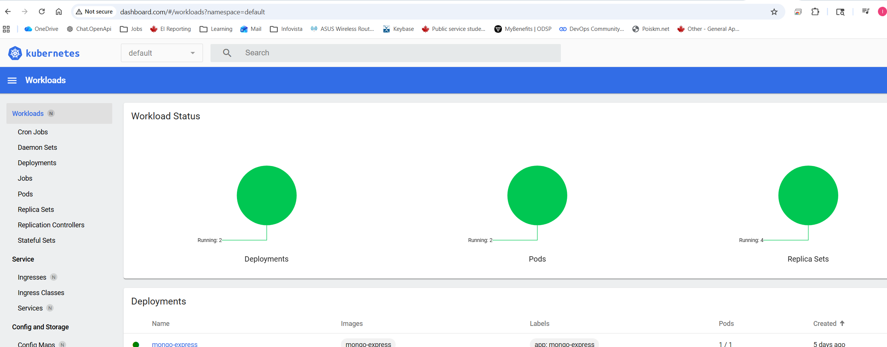

# Module 10 - Kubernetes
## Demo Project:
Use Ingress for external communication with the Cluster
## Technologies used:
Kubernetes, Docker, Ingress
## Project Description:
Install Ingress Controller, enable K8s dashboard in minikube, configure Ingress to route requests to 'dashboard.com' to 'kubernetes-dashboard' internal service


# Solution

## Repo:

<details>
<summary><b>Install Ingress controller</b></summary>

List of Ingress Controllers: </br>
https://kubernetes.io/docs/concepts/services-networking/ingress-controllers/

EX: K8s nginx ingress controller from K8s itself

* Install Ingress controller in Minikube
```
PS C:\repos\DevOps\TWN-DevOps-Bootcamp\10-K8s> kubectl config get-contexts
CURRENT   NAME       CLUSTER    AUTHINFO   NAMESPACE
*         minikube   minikube   minikube   default
PS C:\repos\DevOps\TWN-DevOps-Bootcamp\10-K8s> minikube addons enable ingress
💡  ingress is an addon maintained by Kubernetes. For any concerns contact minikube on GitHub.
You can view the list of minikube maintainers at: https://github.com/kubernetes/minikube/blob/master/OWNERS
💡  After the addon is enabled, please run "minikube tunnel" and your ingress resources would be available at "127.0.0.1"
    ▪ Using image registry.k8s.io/ingress-nginx/controller:v1.14.3
    ▪ Using image registry.k8s.io/ingress-nginx/kube-webhook-certgen:v1.6.7
    ▪ Using image registry.k8s.io/ingress-nginx/kube-webhook-certgen:v1.6.7
🔎  Verifying ingress addon...
🌟  The 'ingress' addon is enabled
PS C:\repos\DevOps\TWN-DevOps-Bootcamp\10-K8s>
```  
</details>
<details>
<summary><b>Enable minikube dashboard</b></summary>

* Enable minikube dashboard

```
PS C:\repos\DevOps\TWN-DevOps-Bootcamp\10-K8s> minikube dashboard
🔌  Enabling dashboard ...
    ▪ Using image docker.io/kubernetesui/metrics-scraper:v1.0.8
    ▪ Using image docker.io/kubernetesui/dashboard:v2.7.0
💡  Some dashboard features require the metrics-server addon. To enable all features please run:

        minikube addons enable metrics-server

🤔  Verifying dashboard health ...
🚀  Launching proxy ...
🤔  Verifying proxy health ...
🎉  Opening http://127.0.0.1:57996/api/v1/namespaces/kubernetes-dashboard/services/http:kubernetes-dashboard:/proxy/ in your default browser...
```
* List namespaces
```
PS C:\repos\DevOps\TWN-DevOps-Bootcamp\10-K8s> kubectl get ns
NAME                   STATUS   AGE
default                Active   7d
ingress-nginx          Active   41m
kube-node-lease        Active   7d
kube-public            Active   7d
kube-system            Active   7d
kubernetes-dashboard   Active   2m27s
```
* List all the components under 'kubernetes-dashboard' namespace
```
PS C:\repos\DevOps\TWN-DevOps-Bootcamp\10-K8s> kubectl get all -n kubernetes-dashboard
NAME                                             READY   STATUS    RESTARTS   AGE
pod/dashboard-metrics-scraper-5565989548-nqqmq   1/1     Running   0          7m21s
pod/kubernetes-dashboard-b84665fb8-kh982         1/1     Running   0          7m21s 

NAME                                TYPE        CLUSTER-IP     EXTERNAL-IP   PORT(S)    AGE
service/dashboard-metrics-scraper   ClusterIP   10.99.29.31    <none>        8000/TCP   7m21s
service/kubernetes-dashboard        ClusterIP   10.101.15.41   <none>        80/TCP     7m21s

👆🏻 'kubernetes-dashboard' is internal because its type is ClusterIP

NAME                                        READY   UP-TO-DATE   AVAILABLE   AGE
deployment.apps/dashboard-metrics-scraper   1/1     1            1           7m21s
deployment.apps/kubernetes-dashboard        1/1     1            1           7m21s

NAME                                                   DESIRED   CURRENT   READY   AGE
replicaset.apps/dashboard-metrics-scraper-5565989548   1         1         1       7m21s
replicaset.apps/kubernetes-dashboard-b84665fb8         1         1         1       7m21s
```
</details>
<details>
<summary><b>Implement Ingress in the minikube that directs requests to dashboard.com on port 80 to internal service 'kubernetes-dashboard'</b></summary>

* Write Ingress config file

Ingress config file:
https://github.com/IrinaRoiter/DevOps/blob/main/TWN-DevOps-Bootcamp/10-K8s/dashboard-ingress.yaml

```
PS C:\repos\DevOps\TWN-DevOps-Bootcamp\10-K8s> kubectl apply -f dashboard-ingress.yaml
ingress.networking.k8s.io/dashboard-ingress created

PS C:\repos\DevOps\TWN-DevOps-Bootcamp\10-K8s> kubectl get ingress -n kubernetes-dashboard
NAME                CLASS   HOSTS           ADDRESS        PORTS   AGE
dashboard-ingress   nginx   dashboard.com   192.168.49.2   80      75s
```
* Map dashboard.com to 127.0.0.1
```
On Windows 11:
Open 'C:\Windows\System32\drivers\etc\hosts' in Notepad ++
Add '127.0.0.1 dashboard.com'
Save

PS C:\repos\DevOps\TWN-DevOps-Bootcamp\10-K8s> minikube tunnel
✅  Tunnel successfully started

📌  NOTE: Please do not close this terminal as this process must stay alive for the tunnel to be accessible ...

🔗  Starting tunnel for service mongo-express-service.
❗  Access to ports below 1024 may fail on Windows with OpenSSH clients older than v8.1. For more information, see: https://minikube.sigs.k8s.io/docs/handbook/accessing/#access-to-ports-1024-on-windows-requires-root-permission
🔗  Starting tunnel for service dashboard-ingress.
````
* Verify the access in the browser


</details>
<details>
<summary><b></b></summary>

```
PS C:\Users\user> kubectl describe ingress dashboard-ingress -n kubernetes-dashboard
Name:             dashboard-ingress
Labels:           <none>
Namespace:        kubernetes-dashboard
Address:          192.168.49.2
Ingress Class:    nginx
Default backend:  <default> 👈🏻Ingress has a default backend to redirect requests if a rule does not exists
Rules:
  Host           Path  Backends
  ----           ----  --------
  dashboard.com
                 /   kubernetes-dashboard:80 (10.244.0.22:9090)
Annotations:     <none>
Events:
  Type    Reason  Age                From                      Message
  ----    ------  ----               ----                      -------
  Normal  Sync    55m (x2 over 56m)  nginx-ingress-controller  Scheduled for sync
  ```