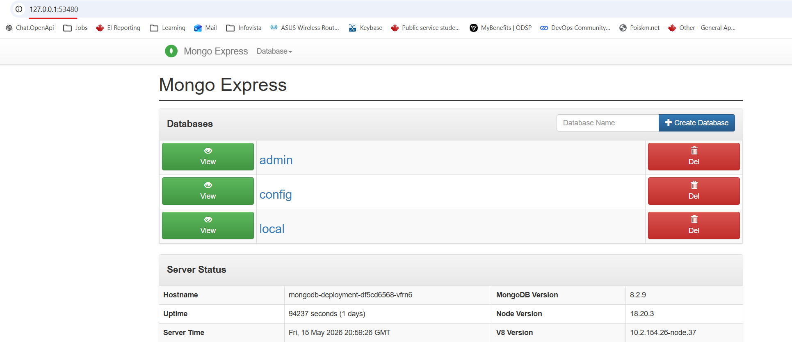

# Module 10 - Kubernetes
## Demo Project:
Deploy MongoDB and Mongo Express into local K8s
cluster
## Technologies used:
Kubernetes, Docker, MongoDB, Mongo Express
## Project Description:
Setup local K8s cluster with Minikube Deploy MongoDB and MongoExpress with configuration and credentials extracted into ConfigMap and Secret


# Solution

## Repo:
 

<details>
<summary><b>Configure and start MongoDB deployment</b></summary>

* Starting point - empty cluster, only default service is running
```
PS C:\repos\DevOps\TWN-DevOps-Bootcamp\10-K8s> kubectl get all
NAME                 TYPE        CLUSTER-IP   EXTERNAL-IP   PORT(S)   AGE
service/kubernetes   ClusterIP   10.96.0.1    <none>        443/TCP   24h
```  
* Write a config file for MongoDB

File: mongo.yaml
https://github.com/IrinaRoiter/DevOps/blob/main/TWN-DevOps-Bootcamp/10-K8s/mongo.yaml

* Encode root username and password for mongo DB pod
```
PS C:\repos\DevOps\TWN-DevOps-Bootcamp\10-K8s> [System.Convert]::ToBase64String([System.Text.Encoding]::UTF8.GetBytes('mongo-db-root'))
XXXXXXXXX 👈🏻 64base encoded output 

PS C:\repos\DevOps\TWN-DevOps-Bootcamp\10-K8s> [System.Convert]::ToBase64String([System.Text.Encoding]::UTF8.GetBytes('mongo-db-password'))
XXXXXXXXX 👈🏻 64base encoded output 

````
* Create a secret file and add encoded values there

https://github.com/IrinaRoiter/DevOps/blob/main/TWN-DevOps-Bootcamp/10-K8s/mongo-secret.yaml 

* Create a secret in minikube
```
PS C:\repos\DevOps\TWN-DevOps-Bootcamp\10-K8s> kubectl apply -f mongo-secret.yaml
secret/mongodb-secret created
```

* Start mongoDB deployment
```
PS C:\repos\DevOps\TWN-DevOps-Bootcamp\10-K8s> kubectl apply -f mongo.yaml
deployment.apps/mongodb-deployment created

PS C:\repos\DevOps\TWN-DevOps-Bootcamp\10-K8s> kubectl get all
NAME                                     READY   STATUS    RESTARTS   AGE
pod/mongodb-deployment-df5cd6568-vfrn6   1/1     Running   0          10s

NAME                 TYPE        CLUSTER-IP   EXTERNAL-IP   PORT(S)   AGE
service/kubernetes   ClusterIP   10.96.0.1    <none>        443/TCP   25h

NAME                                 READY   UP-TO-DATE   AVAILABLE   AGE
deployment.apps/mongodb-deployment   1/1     1            1           10s

NAME                                           DESIRED   CURRENT   READY   AGE
replicaset.apps/mongodb-deployment-df5cd6568   1         1         1       10s

PS C:\repos\DevOps\TWN-DevOps-Bootcamp\10-K8s> kubectl get pod mongodb-deployment-df5cd6568-vfrn6
NAME                                 READY   STATUS    RESTARTS   AGE
mongodb-deployment-df5cd6568-vfrn6   1/1     Running   0          2m14s
```
* Create service
```
Add the section below to mongo.yaml config file
ℹ️ One yaml file can contain configuration for more than one K8s component!
In this case, it contains Deployment and Service
---
apiVersion: v1
kind: Service
metadata:
  name: mongodb-service
spec:
  selector:
    app: mongodb
  ports:
    - protocol: TCP
      port: 27017
      targetPort: 27017 
```

* Start service
```
PS C:\repos\DevOps\TWN-DevOps-Bootcamp\10-K8s> kubectl apply -f mongo.yaml
deployment.apps/mongodb-deployment unchanged
service/mongodb-service created

PS C:\repos\DevOps\TWN-DevOps-Bootcamp\10-K8s> kubectl get service
NAME              TYPE        CLUSTER-IP       EXTERNAL-IP   PORT(S)     AGE
kubernetes        ClusterIP   10.96.0.1        <none>        443/TCP     26h
mongodb-service   ClusterIP   10.104.191.114   <none>        27017/TCP   65s 👈🏻 a service is added and listens on port 27017

PS C:\repos\DevOps\TWN-DevOps-Bootcamp\10-K8s> kubectl describe service mongodb-service
Name:                     mongodb-service
Namespace:                default
Labels:                   <none>
Annotations:              <none>
Selector:                 app=mongodb
Type:                     ClusterIP
IP Family Policy:         SingleStack
IP Families:              IPv4
IP:                       10.104.191.114
IPs:                      10.104.191.114
Port:                     <unset>  27017/TCP
TargetPort:               27017/TCP
Endpoints:                10.244.0.15:27017 👈🏻 pod IP
Session Affinity:         None
Internal Traffic Policy:  Cluster
Events:                   <none>

PS C:\repos\DevOps\TWN-DevOps-Bootcamp\10-K8s> kubectl get pod -o wide 👈🏻 Get more detailed info about pod
NAME                                 READY   STATUS    RESTARTS   AGE   IP            NODE       NOMINATED NODE   READINESS GATES
mongodb-deployment-df5cd6568-vfrn6   1/1     Running   0          23m   10.244.0.15   minikube   <none>           <none>
                                                                        👆🏻 pod IP
```
</details>

<details>
<summary><b>Configure and start Mongo-Express deployment</b></summary>

* Write a config file for Mongo-Express

File: mongo-express.yaml
https://github.com/IrinaRoiter/DevOps/blob/main/TWN-DevOps-Bootcamp/10-K8s/mongo-express.yaml

* Write a ConfigMap file

File: mongo-configmap.yaml
https://github.com/IrinaRoiter/DevOps/blob/main/TWN-DevOps-Bootcamp/10-K8s/mongo-configmap.yaml

* Create a configmap
```
PS C:\repos\DevOps\TWN-DevOps-Bootcamp\10-K8s> kubectl apply -f mongo-configmap.yaml
configmap/mongodb-configmap created
```
* Create a mongo-express deployment
```
PS C:\repos\DevOps\TWN-DevOps-Bootcamp\10-K8s> kubectl apply -f mongo-express.yaml
deployment.apps/mongo-express created

PS C:\repos\DevOps\TWN-DevOps-Bootcamp\10-K8s> kubectl get pod
NAME                                 READY   STATUS    RESTARTS   AGE
mongo-express-5747d566b9-6hvzk       1/1     Running   0          10s
mongodb-deployment-df5cd6568-vfrn6   1/1     Running   0          171m

PS C:\repos\DevOps\TWN-DevOps-Bootcamp\10-K8s> kubectl logs mongo-express-5747d566b9-6hvzk
Waiting for mongodb-service:27017...
No custom config.js found, loading config.default.js
Welcome to mongo-express 1.0.2
------------------------


Mongo Express server listening at http://0.0.0.0:8081
Server is open to allow connections from anyone (0.0.0.0)
basicAuth credentials are "admin:pass", it is recommended you change this in your config.js!
```
* Configure a service for mongo-express deployment
```
Add the following section to mongo-express.yaml
---
apiVersion: v1
kind: Service
metadata:
  name: mongo-express-service
spec:
  selector:
    app: mongo-express
  type: LoadBalancer  👈🏻 Assign service an external IP address and accepts external requests
  ports:
    - protocol: TCP
      port: 8081
      targetPort: 8081
      nodePort: 30000 👈🏻 must be between 30000-32767
```
```
PS C:\repos\DevOps\TWN-DevOps-Bootcamp\10-K8s> kubectl apply -f mongo-express.yaml
deployment.apps/mongo-express unchanged
service/mongo-express-service created

PS C:\repos\DevOps\TWN-DevOps-Bootcamp\10-K8s> kubectl get service
NAME                    TYPE           CLUSTER-IP       EXTERNAL-IP   PORT(S)          AGE
kubernetes              ClusterIP      10.96.0.1        <none>        443/TCP          2d3h
mongo-express-service   LoadBalancer   10.105.57.207    <pending>     8081:30000/TCP   5m35s
mongodb-service         ClusterIP      10.104.191.114   <none>        27017/TCP        25h

```     
* Start the service
```
PS C:\repos\DevOps\TWN-DevOps-Bootcamp\10-K8s> minikube service mongo-express-service
┌───────────┬───────────────────────┬─────────────┬───────────────────────────┐
│ NAMESPACE │         NAME          │ TARGET PORT │            URL            │
├───────────┼───────────────────────┼─────────────┼───────────────────────────┤
│ default   │ mongo-express-service │ 8081        │ http://192.168.49.2:30000 │
└───────────┴───────────────────────┴─────────────┴───────────────────────────┘
🔗  Starting tunnel for service mongo-express-service.
┌───────────┬───────────────────────┬─────────────┬────────────────────────┐
│ NAMESPACE │         NAME          │ TARGET PORT │          URL           │
├───────────┼───────────────────────┼─────────────┼────────────────────────┤
│ default   │ mongo-express-service │             │ http://127.0.0.1:53480 │
└───────────┴───────────────────────┴─────────────┴────────────────────────┘
🎉  Opening service default/mongo-express-service in default browser...
❗  Because you are using a Docker driver on windows, the terminal needs to be open to run it.

```
Browser opens up at - http://127.0.0.1:53480


```
⚠️ Default values were used to authenticate to Mongo-Express service. 
Default values can be obtained this way:

PS C:\Users\user> kubectl logs mongo-express-5747d566b9-6hvzk
Waiting for mongodb-service:27017...
No custom config.js found, loading config.default.js
Welcome to mongo-express 1.0.2

Mongo Express server listening at http://0.0.0.0:8081
Server is open to allow connections from anyone (0.0.0.0)
basicAuth credentials are "admin:pass", it is recommended you change this in your config.js!
```

</details>