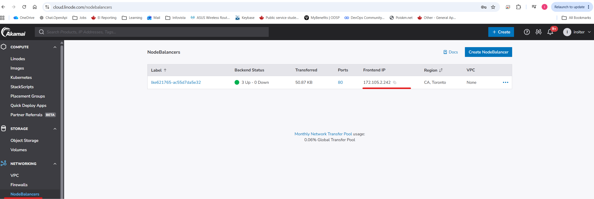
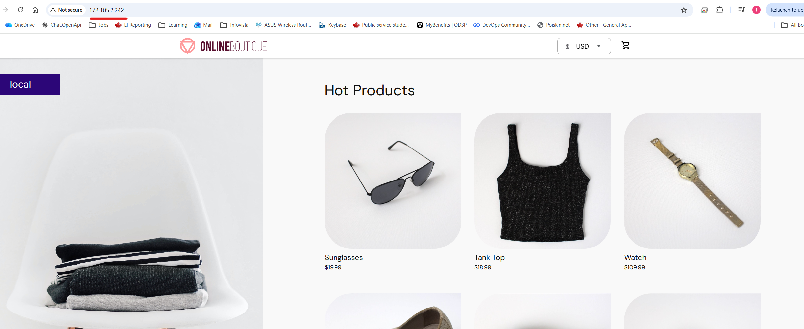

 # Module 10 - Kubernetes
## Demo Project:
Deploy Microservices with Helmfile
## Technologies used:
Kubernetes, Helm, Helmfile
## Project Description:
Deploy Microservices with Helmfile

# Repo:

# Solution

<details>
<summary><b>Create a default helm chart</b></summary>

ℹ️ Helm file - a declarative way for deploying Helm charts

* Create a helmfile

https://github.com/IrinaRoiter/helm-chart-microservices/blob/8a3efd2ab92be7684cda4357918a335b9e80e25d/helmfile.yaml


* Install helmfile software
```
PS C:\repos\helm-chart-microservices> choco install kubernetes-helmfile
Chocolatey v2.6.0
Installing the following packages:
kubernetes-helmfile
...
 The install of kubernetes-helmfile was successful.
  Deployed to 'C:\ProgramData\chocolatey\lib\kubernetes-helmfile\tools'

Chocolatey installed 1/1 packages.
 See the log for details (C:\ProgramData\chocolatey\logs\chocolatey.log).
```
</details>
<details>
<summary><b>Istall microservices with helmfile </b></summary>

* Install helm charts
```
PS C:\repos\helm-chart-microservices> helmfile sync
Building dependency release=redis-cart, chart=./charts/redis
Building dependency release=emailservice, chart=./charts/microservice
Building dependency release=adservice, chart=./charts/microservice
Building dependency release=cartservice, chart=./charts/microservice
Building dependency release=checkoutservice, chart=./charts/microservice
Building dependency release=frontend, chart=./charts/microservice
Building dependency release=paymentservice, chart=./charts/microservice
Building dependency release=productcatalogservice, chart=./charts/microservice
Building dependency release=shippingservice, chart=./charts/microservice
Building dependency release=recommendationservice, chart=./charts/microservice
Building dependency release=currencyservice, chart=./charts/microservice
Upgrading release=redis-cart, chart=./charts/redis, namespace=microservices
Upgrading release=emailservice, chart=./charts/microservice, namespace=microservices
Upgrading release=adservice, chart=./charts/microservice, namespace=microservices
Upgrading release=cartservice, chart=./charts/microservice, namespace=microservices
Upgrading release=checkoutservice, chart=./charts/microservice, namespace=microservices
Upgrading release=currencyservice, chart=./charts/microservice, namespace=microservices
Upgrading release=frontend, chart=./charts/microservice, namespace=microservices
Upgrading release=paymentservice, chart=./charts/microservice, namespace=microservices
Upgrading release=productcatalogservice, chart=./charts/microservice, namespace=microservices
Upgrading release=recommendationservice, chart=./charts/microservice, namespace=microservices
Upgrading release=shippingservice, chart=./charts/microservice, namespace=microservices
Release "emailservice" does not exist. Installing it now.
NAME: emailservice
LAST DEPLOYED: Fri Jun 26 11:50:35 2026
NAMESPACE: microservices
STATUS: deployed
REVISION: 1
DESCRIPTION: Install complete
TEST SUITE: None

Listing releases matching ^emailservice$
Release "adservice" does not exist. Installing it now.
NAME: adservice
LAST DEPLOYED: Fri Jun 26 11:50:35 2026
NAMESPACE: microservices
STATUS: deployed
REVISION: 1
DESCRIPTION: Install complete
TEST SUITE: None

Listing releases matching ^adservice$
Release "recommendationservice" does not exist. Installing it now.
NAME: recommendationservice
LAST DEPLOYED: Fri Jun 26 11:50:35 2026
NAMESPACE: microservices
STATUS: deployed
REVISION: 1
DESCRIPTION: Install complete
TEST SUITE: None

Listing releases matching ^recommendationservice$
Release "currencyservice" does not exist. Installing it now.
NAME: currencyservice
LAST DEPLOYED: Fri Jun 26 11:50:35 2026
NAMESPACE: microservices
STATUS: deployed
REVISION: 1
DESCRIPTION: Install complete
TEST SUITE: None

Listing releases matching ^currencyservice$
Release "paymentservice" does not exist. Installing it now.
NAME: paymentservice
LAST DEPLOYED: Fri Jun 26 11:50:35 2026
NAMESPACE: microservices
STATUS: deployed
REVISION: 1
DESCRIPTION: Install complete
TEST SUITE: None

Listing releases matching ^paymentservice$
Release "checkoutservice" does not exist. Installing it now.
NAME: checkoutservice
LAST DEPLOYED: Fri Jun 26 11:50:35 2026
NAMESPACE: microservices
STATUS: deployed
REVISION: 1
DESCRIPTION: Install complete
TEST SUITE: None

Listing releases matching ^checkoutservice$
Release "frontend" does not exist. Installing it now.
NAME: frontend
LAST DEPLOYED: Fri Jun 26 11:50:35 2026
NAMESPACE: microservices
STATUS: deployed
REVISION: 1
DESCRIPTION: Install complete
TEST SUITE: None

Listing releases matching ^frontend$
Release "shippingservice" does not exist. Installing it now.
NAME: shippingservice
LAST DEPLOYED: Fri Jun 26 11:50:35 2026
NAMESPACE: microservices
STATUS: deployed
REVISION: 1
DESCRIPTION: Install complete
TEST SUITE: None

Listing releases matching ^shippingservice$
Release "productcatalogservice" does not exist. Installing it now.
NAME: productcatalogservice
LAST DEPLOYED: Fri Jun 26 11:50:35 2026
NAMESPACE: microservices
STATUS: deployed
REVISION: 1
DESCRIPTION: Install complete
TEST SUITE: None

Listing releases matching ^productcatalogservice$
Release "cartservice" does not exist. Installing it now.
NAME: cartservice
LAST DEPLOYED: Fri Jun 26 11:50:35 2026
NAMESPACE: microservices
STATUS: deployed
REVISION: 1
DESCRIPTION: Install complete
TEST SUITE: None

Listing releases matching ^cartservice$
emailservice    microservices   1               2026-06-26 11:50:35.7976946 -0400 EDT   deployed        microservice-0.1.0      1.16.0

adservice       microservices   1               2026-06-26 11:50:35.7997625 -0400 EDT   deployed        microservice-0.1.0      1.16.0

recommendationservice   microservices   1               2026-06-26 11:50:35.7934826 -0400 EDT   deployed        microservice-0.1.0      1.16.0

Release "redis-cart" does not exist. Installing it now.
NAME: redis-cart
LAST DEPLOYED: Fri Jun 26 11:50:35 2026
NAMESPACE: microservices
STATUS: deployed
REVISION: 1
DESCRIPTION: Install complete
TEST SUITE: None

Listing releases matching ^redis-cart$
currencyservice microservices   1               2026-06-26 11:50:35.7992494 -0400 EDT   deployed        microservice-0.1.0      1.16.0

checkoutservice microservices   1               2026-06-26 11:50:35.8002774 -0400 EDT   deployed        microservice-0.1.0      1.16.0

shippingservice microservices   1               2026-06-26 11:50:35.7934826 -0400 EDT   deployed        microservice-0.1.0      1.16.0

productcatalogservice   microservices   1               2026-06-26 11:50:35.7992494 -0400 EDT   deployed        microservice-0.1.0      1.16.0

redis-cart      microservices   1               2026-06-26 11:50:35.7997625 -0400 EDT   deployed        redis-0.1.0     1.16.0

cartservice     microservices   1               2026-06-26 11:50:35.7971808 -0400 EDT   deployed        microservice-0.1.0      1.16.0

paymentservice  microservices   1               2026-06-26 11:50:35.7982228 -0400 EDT   deployed        microservice-0.1.0      1.16.0

frontend        microservices   1               2026-06-26 11:50:35.7997625 -0400 EDT   deployed        microservice-0.1.0      1.16.0


UPDATED RELEASES:
NAME                    NAMESPACE       CHART                   VERSION   DURATION
emailservice            microservices   ./charts/microservice   0.1.0           2s
adservice               microservices   ./charts/microservice   0.1.0           2s
recommendationservice   microservices   ./charts/microservice   0.1.0           2s
currencyservice         microservices   ./charts/microservice   0.1.0           2s
paymentservice          microservices   ./charts/microservice   0.1.0           2s
checkoutservice         microservices   ./charts/microservice   0.1.0           2s
frontend                microservices   ./charts/microservice   0.1.0           2s
shippingservice         microservices   ./charts/microservice   0.1.0           2s
productcatalogservice   microservices   ./charts/microservice   0.1.0           2s
cartservice             microservices   ./charts/microservice   0.1.0           2s
redis-cart              microservices   ./charts/redis          0.1.0           2s
```
* List releases
```
PS C:\repos\helm-chart-microservices> helmfile list
NAME                    NAMESPACE       ENABLED INSTALLED       LABELS                                                                  CHART                VERSION
adservice               microservices   true    true            chart:microservice,name:adservice,namespace:microservices               ./charts/microservice
cartservice             microservices   true    true            chart:microservice,name:cartservice,namespace:microservices             ./charts/microservice
checkoutservice         microservices   true    true            chart:microservice,name:checkoutservice,namespace:microservices         ./charts/microservice
currencyservice         microservices   true    true            chart:microservice,name:currencyservice,namespace:microservices         ./charts/microservice
emailservice            microservices   true    true            chart:microservice,name:emailservice,namespace:microservices            ./charts/microservice
frontend                microservices   true    true            chart:microservice,name:frontend,namespace:microservices                ./charts/microservice
paymentservice          microservices   true    true            chart:microservice,name:paymentservice,namespace:microservices          ./charts/microservice
productcatalogservice   microservices   true    true            chart:microservice,name:productcatalogservice,namespace:microservices   ./charts/microservice
recommendationservice   microservices   true    true            chart:microservice,name:recommendationservice,namespace:microservices   ./charts/microservice
redis-cart              microservices   true    true            chart:redis,name:redis-cart,namespace:microservices                     ./charts/redis
shippingservice         microservices   true    true            chart:microservice,name:shippingservice,namespace:microservices
```
* Check running pods
```
PS C:\repos\helm-chart-microservices> kubectl get pods
NAME                                     READY   STATUS    RESTARTS   AGE
adservice-6bc97f5c69-vgbdc               1/1     Running   0          2m53s
adservice-6bc97f5c69-xzgb8               1/1     Running   0          2m53s
cartservice-6685ccbfd5-dtb8m             1/1     Running   0          2m53s
cartservice-6685ccbfd5-x7lsp             1/1     Running   0          2m52s
checkoutservice-5ddf6f97dd-78rc5         1/1     Running   0          2m53s
checkoutservice-5ddf6f97dd-rhl5h         1/1     Running   0          2m53s
currencyservice-5f94f77bd9-48l4f         1/1     Running   0          2m53s
currencyservice-5f94f77bd9-dxzdq         1/1     Running   0          2m53s
emailservice-5bfb757754-h2xm6            1/1     Running   0          2m53s
emailservice-5bfb757754-mqwzv            1/1     Running   0          2m53s
frontend-774d5dddc7-d72wp                1/1     Running   0          2m53s
frontend-774d5dddc7-xgq2q                1/1     Running   0          2m53s
paymentservice-dd989b544-4df75           1/1     Running   0          2m53s
paymentservice-dd989b544-xzx74           1/1     Running   0          2m53s
productcatalogservice-6b99844786-6jj6f   1/1     Running   0          2m53s
productcatalogservice-6b99844786-xzrzp   1/1     Running   0          2m52s
recommendationservice-747db4b555-f9jz9   1/1     Running   0          2m53s
recommendationservice-747db4b555-hk7ch   1/1     Running   0          2m53s
redis-cart-74d8866659-7nks7              1/1     Running   0          2m52s 👈🏻 We have only one replace of redis because we overwrote the default value in helmfile
shippingservice-7b89dcc654-97b4x         1/1     Running   0          2m53s
shippingservice-7b89dcc654-nb565         1/1     Running   0          2m53s
```
</details>
<details>
<summary><b>Validate that the app is up and running</b></summary>

* Validate that the app is running

ℹ️ Since our frontend service is defined as LoadBalancer, the way to access my app is with public IP of a NodeBalancer





</details>

<details>
<summary><b>Uninstall the app with helmchart</b></summary>

* Uninstall the app
```
PS C:\repos\helm-chart-microservices> helmfile destroy
Building dependency release=recommendationservice, chart=./charts/microservice
Building dependency release=shippingservice, chart=./charts/microservice
Building dependency release=productcatalogservice, chart=./charts/microservice
Building dependency release=paymentservice, chart=./charts/microservice
Building dependency release=frontend, chart=./charts/microservice
Building dependency release=redis-cart, chart=./charts/redis
Building dependency release=currencyservice, chart=./charts/microservice
Building dependency release=checkoutservice, chart=./charts/microservice
Building dependency release=cartservice, chart=./charts/microservice
Building dependency release=emailservice, chart=./charts/microservice
Building dependency release=adservice, chart=./charts/microservice
Listing releases matching ^shippingservice$
shippingservice microservices   1               2026-06-26 11:50:35.7934826 -0400 EDT   deployed        microservice-0.1.0      1.16.0

Listing releases matching ^recommendationservice$
recommendationservice   microservices   1               2026-06-26 11:50:35.7934826 -0400 EDT   deployed        microservice-0.1.0      1.16.0

Listing releases matching ^productcatalogservice$
productcatalogservice   microservices   1               2026-06-26 11:50:35.7992494 -0400 EDT   deployed        microservice-0.1.0      1.16.0

Listing releases matching ^paymentservice$
paymentservice  microservices   1               2026-06-26 11:50:35.7982228 -0400 EDT   deployed        microservice-0.1.0      1.16.0

Listing releases matching ^frontend$
frontend        microservices   1               2026-06-26 11:50:35.7997625 -0400 EDT   deployed        microservice-0.1.0      1.16.0

Listing releases matching ^currencyservice$
currencyservice microservices   1               2026-06-26 11:50:35.7992494 -0400 EDT   deployed        microservice-0.1.0      1.16.0

Listing releases matching ^checkoutservice$
checkoutservice microservices   1               2026-06-26 11:50:35.8002774 -0400 EDT   deployed        microservice-0.1.0      1.16.0

Listing releases matching ^cartservice$
cartservice     microservices   1               2026-06-26 11:50:35.7971808 -0400 EDT   deployed        microservice-0.1.0      1.16.0

Listing releases matching ^adservice$
adservice       microservices   1               2026-06-26 11:50:35.7997625 -0400 EDT   deployed        microservice-0.1.0      1.16.0

Listing releases matching ^emailservice$
emailservice    microservices   1               2026-06-26 11:50:35.7976946 -0400 EDT   deployed        microservice-0.1.0      1.16.0

Listing releases matching ^redis-cart$
redis-cart      microservices   1               2026-06-26 11:50:35.7997625 -0400 EDT   deployed        redis-0.1.0     1.16.0

Deleting shippingservice
Deleting productcatalogservice
Deleting checkoutservice
Deleting frontend
Deleting currencyservice
Deleting cartservice
Deleting paymentservice
Deleting redis-cart
Deleting recommendationservice
Deleting emailservice
Deleting adservice
release "frontend" uninstalled

release "productcatalogservice" uninstalled

release "cartservice" uninstalled

release "paymentservice" uninstalled

release "checkoutservice" uninstalled

release "shippingservice" uninstalled

release "redis-cart" uninstalled

release "recommendationservice" uninstalled

release "adservice" uninstalled

release "emailservice" uninstalled

release "currencyservice" uninstalled


DELETED RELEASES:
NAME                    NAMESPACE       DURATION
frontend                microservices         1s
productcatalogservice   microservices         1s
cartservice             microservices         1s
paymentservice          microservices         1s
checkoutservice         microservices         1s
shippingservice         microservices         1s
redis-cart              microservices         1s
recommendationservice   microservices         1s
adservice               microservices         1s
emailservice            microservices         1s
currencyservice         microservices         1s
```

* Verify that microservices were uninstalled
```
PS C:\repos\helm-chart-microservices> helm ls
NAME    NAMESPACE       REVISION        UPDATED STATUS  CHART   APP VERSION

PS C:\repos\helm-chart-microservices> kubectl get pod
No resources found in microservices namespace.
```

</details>