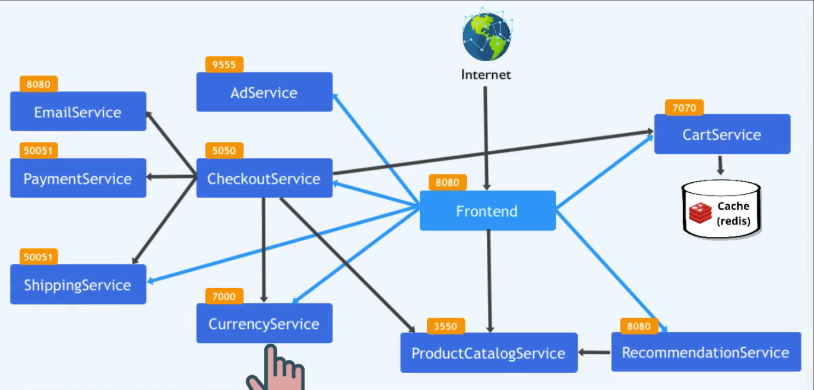
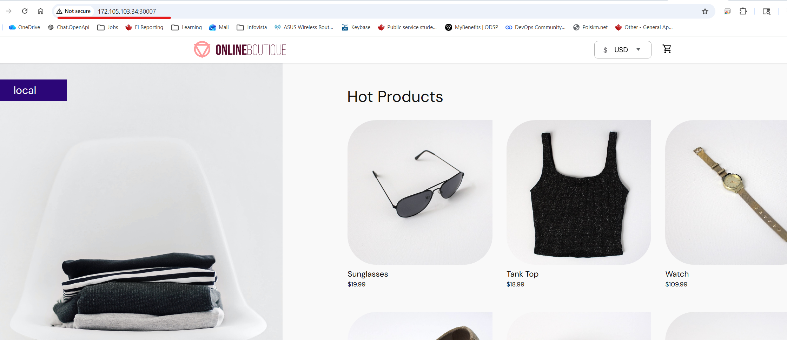
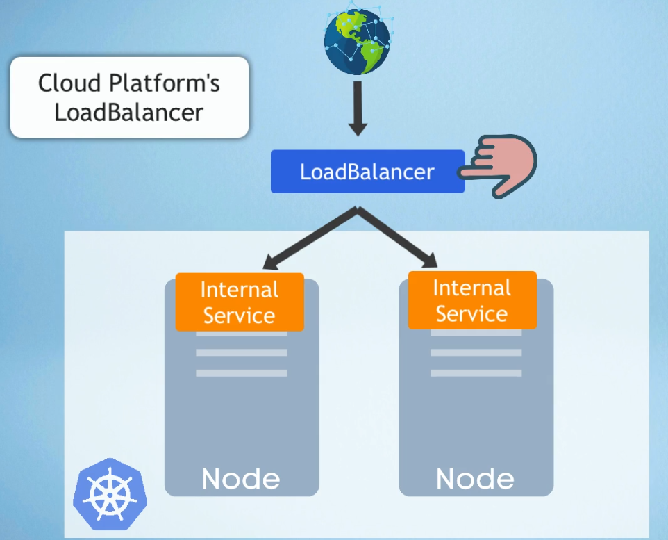

# Module 10 - Kubernetes
## Demo Project:
Deploy Microservices application in Kubernetes with Production & Security Best Practices
## Technologies used:
Kubernetes, Redis, Linux, Linode LKE
## Project Description:
Create K8s manifests for Deployments and Services for all microservices of an online shop application
Deploy microservices to Linode’s managed Kubernetes cluster

# Repo:
https://github.com/IrinaRoiter/microservices-demo


# Solution

<details>
<summary><b>Create K8s manifests for Deployments and Services for all microservices of an online shop application</b></summary>



K8s manifest for Deployments and Services - initial version
https://github.com/IrinaRoiter/DevOps/blob/71570957d0a85f73e15304b1981904f02dccf6d8/TWN-DevOps-Bootcamp/10-K8s/config.yaml

</details> 

<details>
<summary><b>Create K8s manifests for Deployments and Services for all microservices of an online shop application</b></summary>

* Create a cluster on Linode
```
Linode->Kubernetes->Create Cluster
Cluster label: online-shop-microservices
Region: CA, Toronto (ca-central)
HA Control plane: No
Node Pools: Shared CPU, 3 nodes of 2 GB RAM, 1 CPU, 50 GB storage
Create Cluster
```
* Download online-shop-microservices-kubeconfig.yaml and connect to Cluster 
```
iroiter@WINDOWS-CTBM1LI:/mnt/c/repos/DevOps/TWN-DevOps-Bootcamp/10-K8s$ chmod 400 ./online-shop-microservices-kubeconfig.yaml

iroiter@WINDOWS-CTBM1LI:/mnt/c/repos/DevOps/TWN-DevOps-Bootcamp/10-K8s$ ls -l ./online-shop-microservices-kubeconfig.yaml
-r------- 1 iroiter iroiter 2825 Jun 10 13:33 ./online-shop-microservices-kubeconfig.yaml

iroiter@WINDOWS-CTBM1LI:/mnt/c/repos/DevOps/TWN-DevOps-Bootcamp/10-K8s$ export KUBECONFIG=/mnt/c/repos/DevOps/TWN-DevOps-Bootcamp/10-K8s/online-shop-microservices-kubeconfig.yaml

iroiter@WINDOWS-CTBM1LI:/mnt/c/repos/DevOps/TWN-DevOps-Bootcamp/10-K8s$ printenv KUBECONFIG
/mnt/c/repos/DevOps/TWN-DevOps-Bootcamp/10-K8s/online-shop-microservices-kubeconfig.yaml

iroiter@WINDOWS-CTBM1LI:/mnt/c/repos/DevOps/TWN-DevOps-Bootcamp/10-K8s$ kubectl get node
NAME                            STATUS   ROLES    AGE   VERSION
lke615508-902710-1650287a0000   Ready    <none>   54m   v1.35.3
lke615508-902710-5a3d36d40000   Ready    <none>   54m   v1.35.3
lke615508-902710-685514290000   Ready    <none>   54m   v1.35.3

```
* Create services under the designated workspace
```
iroiter@WINDOWS-CTBM1LI:/mnt/c/repos/DevOps/TWN-DevOps-Bootcamp/10-K8s$ kubectl create ns microservices
namespace/microservices created

iroiter@WINDOWS-CTBM1LI:/mnt/c/repos/DevOps/TWN-DevOps-Bootcamp/10-K8s$ kubectl apply -f config.yaml -n microservices
deployment.apps/emailservice unchanged
service/emailservice unchanged
deployment.apps/recommendationservice unchanged
service/recommendationservice unchanged
deployment.apps/productcatalogservice unchanged
service/productcatalogservice created
deployment.apps/paymentservice created
service/paymentservice created
deployment.apps/currencyservice created
service/currencyservice created
deployment.apps/shippingservice created
service/shippingservice created
deployment.apps/adservice created
service/adservice created
deployment.apps/cartservice created
service/cartservice created
deployment.apps/redis-cart created
service/redis-cart created
deployment.apps/checkoutservice created
service/checkoutservice created
deployment.apps/frontend created
service/frontend created

iroiter@WINDOWS-CTBM1LI:/mnt/c/repos/DevOps/TWN-DevOps-Bootcamp/10-K8s$ kubectl get pod -n microservices
NAME                                     READY   STATUS    RESTARTS   AGE
adservice-89c7f5774-kbwpw                1/1     Running   0          5m23s
cartservice-fd7f76d8c-bkt9b              1/1     Running   0          5m23s
checkoutservice-c775cbdfd-kvc57          1/1     Running   0          5m22s
currencyservice-655c76664d-247lw         1/1     Running   0          5m23s
emailservice-6bc597f8c6-tcc8n            1/1     Running   0          16m
frontend-57689df686-jbcrw                1/1     Running   0          5m22s
paymentservice-d8f99d556-bbc55           1/1     Running   0          5m24s
productcatalogservice-867b8c8548-9kmbw   1/1     Running   0          16m
recommendationservice-64565b6fd-87fkg    1/1     Running   0          16m
redis-cart-9d9b58b5f-zrnvh               1/1     Running   0          5m23s
shippingservice-f69f5b9c4-l9pj7          1/1     Running   0          5m23s

iroiter@WINDOWS-CTBM1LI:/mnt/c/repos/DevOps/TWN-DevOps-Bootcamp/10-K8s$ kubectl get svc -n microservices
NAME                    TYPE        CLUSTER-IP       EXTERNAL-IP   PORT(S)        AGE
adservice               ClusterIP   10.128.46.255    <none>        9555/TCP       11m
cartservice             ClusterIP   10.128.83.37     <none>        7070/TCP       11m
checkoutservice         ClusterIP   10.128.224.87    <none>        5050/TCP       11m
currencyservice         ClusterIP   10.128.219.58    <none>        7000/TCP       11m
emailservice            ClusterIP   10.128.211.129   <none>        5000/TCP       21m
frontend                NodePort    10.128.128.197   <none>        80:30007/TCP   11m 👈🏻 port 30007 is open on each node 
paymentservice          ClusterIP   10.128.239.102   <none>        50051/TCP      11m
productcatalogservice   ClusterIP   10.128.157.27    <none>        3550/TCP       11m
recommendationservice   ClusterIP   10.128.171.5     <none>        8080/TCP       21m
redis-cart              ClusterIP   10.128.19.16     <none>        6379/TCP       11m
shippingservice         ClusterIP   10.128.100.83    <none>        50051/TCP      11m

```
* Access the application in the browser

```
iroiter@WINDOWS-CTBM1LI:/mnt/c/repos/DevOps/TWN-DevOps-Bootcamp/10-K8s$ kubectl get nodes -o wide -n microservices
NAME                            STATUS   ROLES    AGE    VERSION   INTERNAL-IP       EXTERNAL-IP      OS-IMAGE                         KERNEL-VERSION         CONTAINER-RUNTIME
lke615508-902710-1650287a0000   Ready    <none>   117m   v1.35.3   192.168.128.223   172.105.103.34   Debian GNU/Linux 12 (bookworm)   6.1.0-47-cloud-amd64   containerd://2.2.3
lke615508-902710-5a3d36d40000   Ready    <none>   117m   v1.35.3   192.168.128.154   172.105.11.222   Debian GNU/Linux 12 (bookworm)   6.1.0-47-cloud-amd64   containerd://2.2.3
lke615508-902710-685514290000   Ready    <none>   117m   v1.35.3   192.168.128.221   172.105.103.28   Debian GNU/Linux 12 (bookworm)   6.1.0-47-cloud-amd64   containerd://2.2.3
```
👉🏻 3 nodes with external IP
Access to the application can be done on any <EXTERNAL-IP>:30007



</details>

<details>
<summary><b>Implement production best practices</b></summary>

* Best practise #1 </br>
✅ Use specific image version 
```
    spec:
      containers:
      - name: service
        image: gcr.io/google-samples/microservices-demo/emailservice:v0.8.0 👈🏻 Already implemented
``` 

* Best  practice #2 </br>
✅ K8s runs a special script to check if a container (application inside) is up and running in the pod. It contacts an app inside of container using grpc protocol in port 8080 every 5 sec. If the container fails to respond. K8s tries to restart the container. The protocol can be https, or tcp
```
        livenessProbe:
          grpc:
            port: 8080
          periodSeconds: 5 
```
* Best practice #3 </br>
✅ K8s monitors app during start up process and runs a test that determines if an app is ready to receive any communications every 5 sec. When an app is ready, redinessProbe stops and livenssProbe starts monitoring the running app.
```
        redinessProbe:
          grpc:
            port: 8080
          periodSeconds: 5  
```         
📝 Note: </br>
1. we use tcp protocol for 'redisCart'  microservice
2. we tell kubelet to wait 5 sec before start checking for rediness and livensess probes with 'initialDelaySeconds: 5' attribute
```
        livenessProbe:
          initialDelaySeconds: 5
          tcpSocket:
            port: 6379
          periodSeconds: 5
        redinessProbe:
          initialDelaySeconds: 5
          tcpSocket:
            port: 6379
          periodSeconds: 5
```
📝 Note: </br>
For a service that has an endpoint like our 'frontend' microservice we use httpGet protocol with the special endpoint "/_healthz"
```
      livenessProbe:
        httpGet:
          path: "/_healthz"
          port: 8080
        periodSeconds: 5
      redinessProbe:
        httpGet:
          path: "/_healthz"
          port: 8080
        periodSeconds: 5
```   
* Best practice #4 </br>
✅ Request and define limits for resources for each microservice. If requested resources are biggier than a node resouces, the pod won't be scheduled. Recommended values for limits are twice of requested resources.
``` 
        resources:
          requests: 
            cpu: 100m
            memory: 64Mi
          limits:
            cpu: 200m
            memory: 128Mi
```  
* Best practice #5 </br>
✅ Service type NodePort opens a port on each node outside, which increases a surphase of a cyber attack. The more secure way is to have single entry point outside of the cluster using LoadBalancer available through a cloud provider

```
apiVersion: v1
kind: Service
metadata:
  name: frontend
spec:
  type: LoadBalancer 👈🏻 Instead of a NodePort
  selector:
    app: frontend
  ports:
  - protocol: TCP
    port: 80
    targetPort: 8080
```      
* Best practice #7 </br>
✅ Define at least two replicas of each deployment to ensure there is no downtime if pod is crashes and new pod gets crerated and started.
```
spec:
  replicas: 2
```  
* Best practice #8 </br>
✅ Define at least two worker nodes in a cluster.

* Best practice #9 </br>
✅ Label the resources in the cluster.
```
Label is a key-value pair that gives the resource an unique identifier

Example: 
we label all the pods in the deployment
  template:
    metadata:
      labels:
        app: emailservice 👈🏻

We reference them in the correspondent service
apiVersion: v1
kind: Service
metadata:
  name: emailservice 👈🏻
spec:
  type: ClusterIP
  selector:
    app: emailservice        
```
* Best practice #10 </br>
✅ Group the resources with namespaces. It makes it easier to manage the cluster.
```
1. You can set context to specific namespace for kubectl. 
2. Define access rights based on namespaces
Practical use cases:

case #1: multi-team 
Team A develops 'Customer Portal'
Team B develops 'Billing System'

namespace: customer-portal
namespace: billing

Kubernetes RBAC:

Team A -> access only customer-portal namespace
Team B -> access only billing namespace

case #2: Multi-tenant platform
namespace: customer-a
namespace: customer-b
namespace: customer-c

```
</details>

<details>
<summary><b>Implement security best practices</b></summary>

* Ensure that images are free of vulnerabilities scan
```
Run a vulnerabilities scan manually, or automatically as part of CI/CD pipeline
```
* Ensure that a container is not run as root user
```
It minimizes the risk of damaging the Node and a cluster. Check documentation of the 3rd-Party image before using it. 
```
* Update Kubernetes cluster to the latest version if possible

</details>