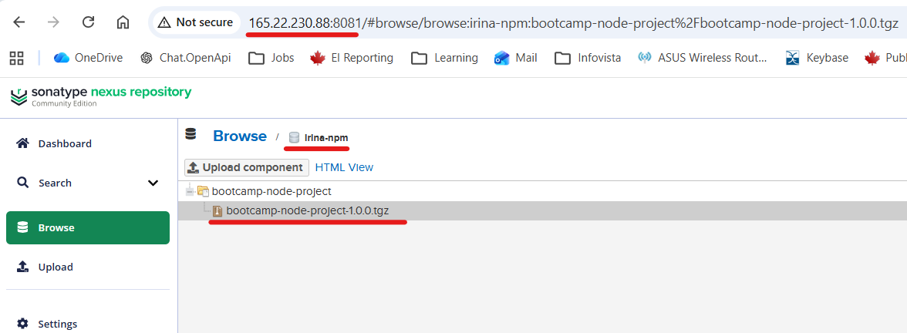
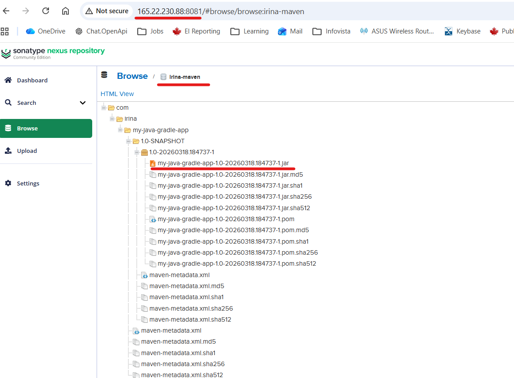
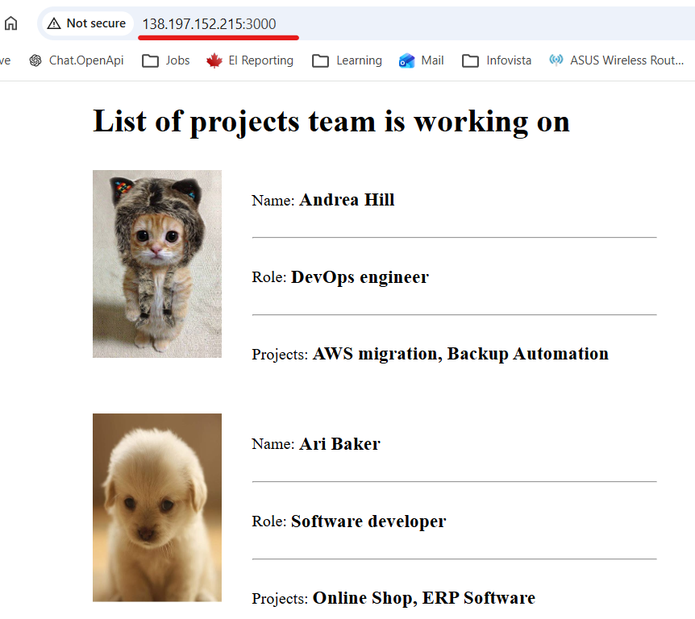

## Module 6 - Artifact Repository Manager with Nexus

<details>
<summary><b>Exercise 1: Install Nexus on a server</b></summary>

* Nexus is installed on Digital Ocean server as part of Module 6 Project - [module-6-project.md](https://gitlab.com/IrinaRoiter/java-app/-/blob/f51c9cfd80b9a2b275f9560147d38bc27a796e4e/module-6-project.md)
* Allow connecting to Nexus with Bearer token
```
Settings->Security->Realms->add 'NPM Bearer token realm' to Active Realms
```
</details>
<details>
<summary><b>Exercise 2: Create npm hosted repository</b></summary>

* Create a new blob store
```
Login as admin to Nexus - http://165.22.230.88:8081
Settings->Repository->Blob Store->Create
Type: File
Name: irina-file-blob-store
Path: /opt/sonatype-work/nexus3/blobs/irina-file-blob-store
Save
```

* Create a nmp repo
```
Settings->Repository->Repository->Create Repository
Select nmp hosted
Name: irina-npm
Blob store: irina-file-blob-store
Create Repository
```
</details>

<details>
<summary><b>Exercise 3: Create user for team 1</b></summary>

* Create local user
```
Settings->Security->Users->Create Local User
ID: npm-viewer
Name: npm-viewer
Password: npm-viewer
Role: nx-anonymous
Create Local User
```
* Create a Role
```
Settings->Security->Roles->Create Role
Type: Nexus Role
Role ID: npm-viewer
Applied priviledges: nx-repository-view-npm-*-*
Save
``` 
* Assosiate npm-viewer Role with npm-viewer user
```
Settings->Security->Users->npm-user
Role: replace nx-anonymous with npm-viewer
Save
```
</details>

<details>
<summary><b>Exercise 4: Build and publish npm tar</b></summary>

repo: https://gitlab.com/IrinaRoiter/cloud-basics-exercises

* Build tar

```
iroiter@irina-ubuntu:~/repos/cloud-basics-exercises/app$ npm pack
npm notice
npm notice 📦  bootcamp-node-project@1.0.0
npm notice Tarball Contents
npm notice 60.5kB images/profile-andrea.jpg
npm notice 17.5kB images/profile-ari.jpeg
npm notice 1.2kB index.html
npm notice 283B package.json
npm notice 724B server.js
npm notice 205B server.test.js
npm notice Tarball Details
npm notice name: bootcamp-node-project
npm notice version: 1.0.0
npm notice filename: bootcamp-node-project-1.0.0.tgz
npm notice package size: 79.4 kB
npm notice unpacked size: 80.4 kB
npm notice shasum: 39b56239164e64619a8ddbcba48b0ed8ed8feab0
npm notice integrity: sha512-eQgr8E+kquMAY[...]yGD3lXWQSdG6A==
npm notice total files: 6
npm notice
bootcamp-node-project-1.0.0.tgz
```

* Push to irina-npm repo in Nexus
```
iroiter@irina-ubuntu:~/repos/cloud-basics-exercises/app$ npm login --registry=http://165.22.230.88:8081/repository/irina-npm/
npm notice Log in on http://165.22.230.88:8081/repository/irina-npm/
Username: npm-viewer
Password: 

Logged in on http://165.22.230.88:8081/repository/irina-npm/.
```
```

iroiter@irina-ubuntu:~/repos/cloud-basics-exercises/app$ npm publish --registry=http://165.22.230.88:8081/repository/irina-npm/ bootcamp-node-project-1.0.0.tgz
npm notice
npm notice 📦  bootcamp-node-project@1.0.0
npm notice Tarball Contents
npm notice 60.5kB images/profile-andrea.jpg
npm notice 17.5kB images/profile-ari.jpeg
npm notice 1.2kB index.html
npm notice 283B package.json
npm notice 724B server.js
npm notice 205B server.test.js
npm notice Tarball Details
npm notice name: bootcamp-node-project
npm notice version: 1.0.0
npm notice filename: bootcamp-node-project-1.0.0.tgz
npm notice package size: 79.4 kB
npm notice unpacked size: 80.4 kB
npm notice shasum: 39b56239164e64619a8ddbcba48b0ed8ed8feab0
npm notice integrity: sha512-eQgr8E+kquMAY[...]yGD3lXWQSdG6A==
npm notice total files: 6
npm notice
npm notice Publishing to http://165.22.230.88:8081/repository/irina-npm/ with tag latest and default access
+ bootcamp-node-project@1.0.0
``` 

* Verify an artifact on Nexus


</details>

<details>
<summary><b>Exercise 5: Create maven hosted repository </b></summary>

* Create a maven repo
```
Settings->Repository->Repository->Create Repository
Select maven2 hosted
Name: irina-maven
Version policy: Mixed
Blob store: irina-file-blob-store
Create Repository
```
</details>

<details>
<summary><b>Exercise 6: Create user for team 2</b></summary>

* Create local user
```
Settings->Security->Users->Create Local User
ID: npm-viewer
Name: maven-viewer
Password: maven-viewer
Role: nx-anonymous
Create Local User
```
* Create a Role
```
Settings->Security->Roles->Create Role
Type: Nexus Role
Role ID: nx-maven-viewer
Applied priviledges: nx-repository-view-maven2-*-*
Save
``` 
* Assosiate maven-viewer Role with npm-viewer user
```
Settings->Security->Users->maven-viewer
Role: replace nx-anonymous with maven-viewer
Save
```
</details>

<details>
<summary><b>Exercise 7: Build and publish JAR file</b></summary>

repo: https://gitlab.com/IrinaRoiter/build-tools-exercises

* Configure JAR name and Nexus Repo in build.gradle file
```
apply plugin: 'maven-publish'

publishing {
    publications {
        maven(MavenPublication) {
            artifact("build/libs/${project.name}-$version"+".jar"){
                extension 'jar'
            }
        }
    }

    repositories {
        maven {
            name 'nexus'
            url "http://165.22.230.88:8081/repository/irina-maven/"
            allowInsecureProtocol = true
            credentials {
                username project.repoUser
                password project.repoPassword
            }
        }
    }
}

```
* Set common properties gradle.properties file
```
repoUser = maven-viewer
repoPassword = maven-viewer
```
* Set custom project name in setting.gradle file
```
rootProject.name = 'my-java-gradle-app'
```
* Build JAR file
```
iroiter@irina-ubuntu:~/repos/build-tools-exercises$ gradle build

[Incubating] Problems report is available at: file:///home/iroiter/repos/build-tools-exercises/build/reports/problems/problems-report.html
...
BUILD SUCCESSFUL in 25s
7 actionable tasks: 7 executed
```
* Upload JAR file
```
iroiter@irina-ubuntu:~/repos/build-tools-exercises$ gradle publish

[Incubating] Problems report is available at: file:///home/iroiter/repos/build-tools-exercises/build/reports/problems/problems-report.html
...
BUILD SUCCESSFUL in 12s
2 actionable tasks: 2 executed

```
* Verify uploaded artifact in Nexus


</details>

<details>
<summary><b>Exercise 8: Download from Nexus and start application</b></summary>

* Create a Role that has read access to irina-npm and irina-maven repos on Nexus

```
Settings->Security->Roles->Create Role
Type: Nexus Role
Role ID: nx-artifact-consumer
Applied priviledges: nx-repository-view-maven2-irina-maven-read
nx-repository-view-npm-irina-npm-read
Save
``` 

* Create new user for droplet server that has access to both repositories

```
Settings->Security->Users->Create Local User
ID: artifact-consumer
Name: artifact-consumer
Password: artifact-consumer
Role: nx-artifact-consumer
Create Local User
```

* On a digital ocean droplet, using Nexus Rest API, fetch the download URL info for the latest NodeJS app artifact

```
iroiter@irina-ubuntu:~/repos/build-tools-exercises$ ssh root@138.197.152.215
Welcome to Ubuntu 24.04.3 LTS (GNU/Linux 6.8.0-101-generic x86_64)

root@ubuntu-s-1vcpu-512mb-10gb-tor1-01:~# curl -u artifact-consumer:artifact-consumer -X GET "http://165.22.230.88:8081/service/rest/v1/assets?repository=irina-npm"
{
  "items" : [ {
    "downloadUrl" : "http://165.22.230.88:8081/repository/irina-npm/bootcamp-node-project/-/bootcamp-node-project-1.0.0.tgz",
    "path" : "/bootcamp-node-project/-/bootcamp-node-project-1.0.0.tgz",
    "id" : "aXJpbmEtbnBtOjRmMWJiY2Rk",
    "repository" : "irina-npm",
    "format" : "npm",
    "checksum" : {
      "sha1" : "39b56239164e64619a8ddbcba48b0ed8ed8feab0",
      "md5" : "e5aa08c39a3115d9ca036911351d653c"
    },
    .....
  } ],
  "continuationToken" : null

```

* Execute a command to fetch the latest artifact itself with the download URL

```
root@ubuntu-s-1vcpu-512mb-10gb-tor1-01:/opt/node-js-nexus# curl -u artifact-consumer:artifact-consumer -o bootcamp-node-project-1.0.0.tgz "http://165.22.230.88:8081/repository/irina-npm/bootcamp-node-project/-/bootcamp-node-project-1.0.0.tgz"
  % Total    % Received % Xferd  Average Speed   Time    Time     Time  Current
                                 Dload  Upload   Total   Spent    Left  Speed
100 79382  100 79382    0     0  2980k      0 --:--:-- --:--:-- --:--:-- 3100k
root@ubuntu-s-1vcpu-512mb-10gb-tor1-01:/opt/node-js-nexus# ls
bootcamp-node-project-1.0.0.tgz
```

* Run it on the server

```
root@ubuntu-s-1vcpu-512mb-10gb-tor1-01:/opt/node-js-nexus# tar -xzf bootcamp-node-project-1.0.0.tgz
root@ubuntu-s-1vcpu-512mb-10gb-tor1-01:/opt/node-js-nexus# ls
bootcamp-node-project-1.0.0.tgz  package

root@ubuntu-s-1vcpu-512mb-10gb-tor1-01:/opt/node-js-nexus# ls -l
total 84
-rw-r--r-- 1 root  root  79382 Mar 19 18:24 bootcamp-node-project-1.0.0.tgz
drwxr-xr-x 3 irina irina  4096 Mar 19 18:32 package

root@ubuntu-s-1vcpu-512mb-10gb-tor1-01:/opt/node-js-nexus# npm install
...
added 354 packages, and audited 355 packages in 45s

root@ubuntu-s-1vcpu-512mb-10gb-tor1-01:/opt/node-js-nexus# su - irina

irina@ubuntu-s-1vcpu-512mb-10gb-tor1-01:/opt/node-js-nexus/package$ node server.js &
[1] 44605
irina@ubuntu-s-1vcpu-512mb-10gb-tor1-01:/opt/node-js-nexus/package$ app listening on port 3000!

irina@ubuntu-s-1vcpu-512mb-10gb-tor1-01:/opt/node-js-nexus/package$ ps aux | grep node | grep -v grepux | grep node | grep -v grep
irina      44605  0.9 11.9 611360 56024 pts/1    Sl   18:52   0:00 node server.js

irina@ubuntu-s-1vcpu-512mb-10gb-tor1-01:/opt/node-js-nexus/package$ netstat -lpnt | grep 44605

tcp6       0      0 :::3000                 :::*                    LISTEN      44605/node    

```

</details>

<details>
<summary><b>Exercise 9: Automate</b></summary>

* Write a script that fetches the latest version from npm repository. Untar it and run on the server</br>

Script:
https://github.com/IrinaRoiter/DevOps/blob/main/TWN-DevOps-Bootcamp/6-Nexus/get-from-nexus-start-app.sh

* Deploy script to a Droplet
```
iroiter@irina-ubuntu:~/BashScripts$  scp ./get-from-nexus-start-app.sh  root@138.197.152.215:/root
get-from-nexus-start-app.sh  
```
* Login to a Droplet
```
iroiter@irina-ubuntu:~/BashScripts$ ssh root@138.197.152.215
Welcome to Ubuntu 24.04.3 LTS (GNU/Linux 6.8.0-101-generic x86_64)
```

* Execute the script on the droplet

```
root@ubuntu-s-1vcpu-512mb-10gb-tor1-01:~# sudo ./get-from-nexus-start-app.sh 
Installation directory does not exist. Creating it...
curl is installed.
curl version: 8.5.0
Adding NodeSource repo...
2026-03-20 14:37:28 - Installing pre-requisites
....
nodejs is installed.
nodejs version: v18.19.1
npm is installed.
npm version: 9.2.0
jq is installed.
jq version: jq-1.7
http://165.22.230.88:8081/repository/irina-npm/bootcamp-node-project/-/bootcamp-node-project-1.1.0.tgz
/opt/nexus-node-js-app/bootcamp-node-project-1.1.0.tgz
...
Application is running as:
USER         PID CMD
node-js+   49591 node server.js
Port: 3000
root@ubuntu-s-1vcpu-512mb-10gb-tor1-01:~# 
```

</details>


 