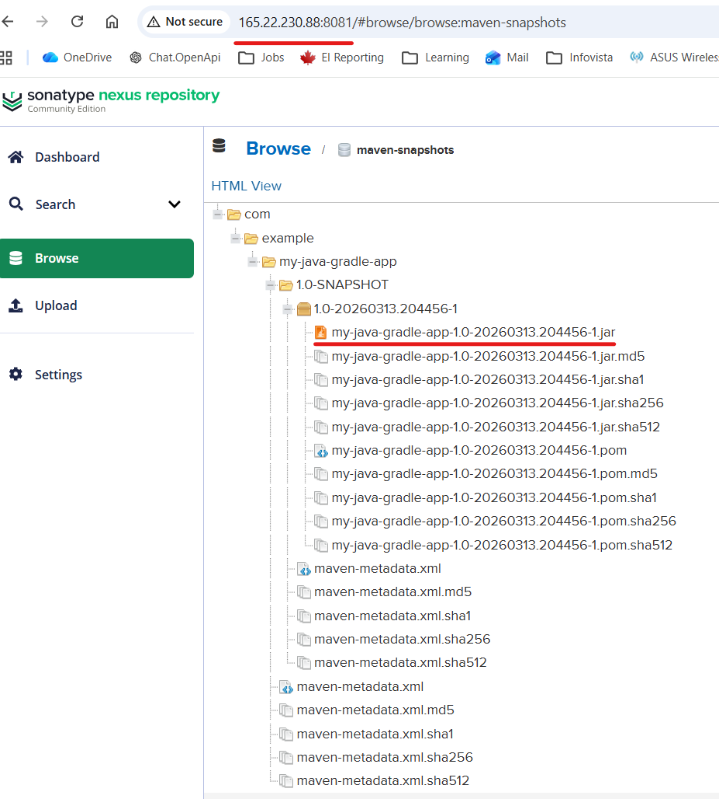
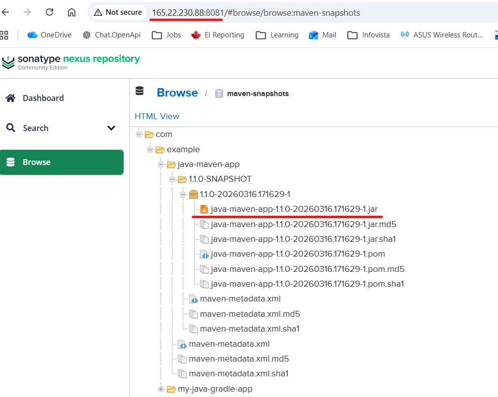

# Module 6 - Artifact Repository Manager with Nexus
## Demo Project:
Run Nexus on Droplet and Publish Artifact to Nexus
## Technologies used:
Nexus, DigitalOcean, Linux, Java, Gradle, Maven
## Project Description:
* Install and configure Nexus from scratch on a cloud server
* Create new User on Nexus with relevant permissions
* Java Gradle Project: Build Jar & Upload to Nexus
* Java Maven Project: Build Jar & Upload to Nexus

# Solution

<details>
<summary><b>Install and configure Nexus from scratch on a cloud server</b></summary>

* Create a server on Digital Ocean
```
Follow instructions under "Setup and configure a server on DigitalOcean" section in the file:
https://gitlab.com/IrinaRoiter/java-react-example/-/blob/3a0b5562fd1f0de747a1ce8ec137164d0b86a224/module-5-project.md
Choose at least 8GB memory, 160 GB disk space scope to ensure a smooth Nexus performance
```
* Install Java and net-tools
```
root@ubuntu-s-4vcpu-8gb-tor1-01:~#java
Command 'java' not found, but can be installed with:
sudo apt install default-jre              # version 2:1.17-75, or
sudo apt install openjdk-17-jre-headless  # version 17.0.18+8-1~24.04.1
sudo apt install openjdk-21-jre-headless  # version 21.0.10+7-1~24.04
sudo apt install openjdk-11-jre-headless  # version 11.0.30+7-1ubuntu1~24.04

root@ubuntu-s-4vcpu-8gb-tor1-01:~# sudo apt update
Get:1 http://security.ubuntu.com/ubuntu noble-security InRelease [126 kB]
Hit:2 http://mirrors.digitalocean.com/ubuntu noble InRelease               
.....
root@ubuntu-s-4vcpu-8gb-tor1-01:~# sudo apt install openjdk-17-jre-headless
Reading package lists... Done
Building dependency tree... Done
Reading state information... Done
.....

root@ubuntu-s-4vcpu-8gb-tor1-01:~# java -version
openjdk version "17.0.18" 2026-01-20

root@ubuntu-s-4vcpu-8gb-tor1-01:~# apt install net-tools
Reading package lists... Done
Building dependency tree... Done
.....
```
* Download and install Nexus
```
root@ubuntu-s-4vcpu-8gb-tor1-01:/opt# wget https://download.sonatype.com/nexus/3/nexus-3.90.1-01-linux-x86_64.tar.gz
--2026-03-12 16:51:24--  https://download.sonatype.com/nexus/3/nexus-3.90.1-01-linux-x86_64.tar.gz
Resolving download.sonatype.com (download.sonatype.com)... 13.56.83.105, 52.8.54.153
Connecting to download.sonatype.com (download.sonatype.com)|13.56.83.105|:443... connected.
......
2026-03-12 16:51:26 (247 MB/s) - ‘nexus-3.90.1-01-linux-x86_64.tar.gz’ saved [465604118/465604118]

root@ubuntu-s-4vcpu-8gb-tor1-01:/opt#  tar -zxvf nexus-3.90.1-01-linux-x86_64.tar.gz
nexus-3.90.1-01/bin/nexus
nexus-3.90.1-01/bin/nexus.vmoptions
....

root@ubuntu-s-4vcpu-8gb-tor1-01:/opt# ls
digitalocean  nexus-3.90.1-01  nexus-3.90.1-01-linux-x86_64.tar.gz  sonatype-work
```
</details>

<details>
<summary><b>Create new User on Nexus with relevant permissions</b></summary>

* create nexus account and add it to sudo group
```
root@ubuntu-s-4vcpu-8gb-tor1-01:/opt# adduser nexus
info: Adding user `nexus' ...
info: Selecting UID/GID from range 1000 to 59999 ...
info: Adding new group `service' (1000) ...

root@ubuntu-s-4vcpu-8gb-tor1-01:/opt# usermod -aG sudo nexus
```
* Change ownership of Nexus app directories
```
root@ubuntu-s-4vcpu-8gb-tor1-01:/opt# chown nexus:nexus -R sonatype-work
root@ubuntu-s-4vcpu-8gb-tor1-01:/opt# chown nexus:nexus  -R nexus-3.90.1-01

root@ubuntu-s-4vcpu-8gb-tor1-01:/opt# ls -l
total 454708
drwxr-xr-x 4 root  root       4096 Mar  9 20:33 digitalocean
drwxr-xr-x 6 nexus nexus      4096 Mar  9 20:41 nexus-3.90.1-01
-rw-r--r-- 1 root  root  465604118 Mar  6 20:58 nexus-3.90.1-01-linux-x86_64.tar.gz
drwxr-xr-x 3 nexus nexus      4096 Mar  6 19:02 sonatype-work
```
* allow ssh connection with 'nexus' account
```
Follow instructions under "allow ssh connection with service account" section in the file:
https://gitlab.com/IrinaRoiter/java-react-example/-/blob/3a0b5562fd1f0de747a1ce8ec137164d0b86a224/module-5-project.md
```
* Configure Nexus app to run under 'nexus' account
```
root@ubuntu-s-4vcpu-8gb-tor1-01:/opt# vim ./nexus-3.90.1-01/bin/nexus.rc
Insert 
run_as_user="nexus"
Save and Exit Vim Editor
```
</details>

<details>
<summary><b>Start Nexus app under nexus account</b></summary>

* Start Nexus app
```
root@ubuntu-s-4vcpu-8gb-tor1-01:/opt# su - nexus
nexus@ubuntu-s-4vcpu-8gb-tor1-01:~$ /opt/nexus-3.90.1-01/bin/nexus start
Starting nexus

nexus@ubuntu-s-4vcpu-8gb-tor1-01:/opt$ ps aux | grep nexus | grep -v grep
nexus      37660  136 29.5 6645764 2401712 pts/0 Sl   17:50   2:14 /opt/nexus-3.90.1-01/jdk/temurin_21.0.9_10_linux_x86_64/jdk-21.0.9+10/bin/java -server -Dnexus.installer.....

nexus@ubuntu-s-4vcpu-8gb-tor1-01:/opt$ netstat -lpnt 37660
Proto Recv-Q Send-Q Local Address           Foreign Address         State       PID/Program name
tcp        0      0 127.0.0.53:53           0.0.0.0:*               LISTEN      -
tcp        0      0 127.0.0.54:53           0.0.0.0:*               LISTEN      -
tcp        0      0 0.0.0.0:22              0.0.0.0:*               LISTEN      -
tcp6       0      0 :::8081                 :::*                    LISTEN      37660/java
tcp6       0      0 :::22                   :::*                    LISTEN      -
```
* Nexus app runs on port 8081. Open port 8081 to outside connections
```
ℹ️ My public IP address: https://whatismyipaddress.com/

Networking -> Firewalls -> Inboubd rules -> New rule -> Type: Custom -> Port 8081 -> Sources: only my public IP address ->Save

```
* Connect to Nexus from a browser
```
http://165.22.230.88:8081
```

* Configure admin account for Nexus
```
nexus@ubuntu-s-4vcpu-8gb-tor1-01:/opt/sonatype-work$ ls ./nexus3/
admin.password blobs  clean_cache  db  downloads  etc  keystores  log  nexus.pid  restore-from-backup  tmp
nexus@ubuntu-s-4vcpu-8gb-tor1-01:/opt/sonatype-work$ cat ./nexus3/admin.password
Copy a default password -> follow UI prompts to set a new password 
```
</details>

<details>
<summary><b>Configure an user for uploading / downloading artifacts</b></summary>

* Add a new user with specific role
```
From Nexus UI login as Admin ->Settings -> Security -> Users -> Create New User
Name: irina
From Nexus UI login as Admin ->Settings -> Security -> Roles -> Create Role -> 
-> Choose nx-repository-view-maven2-maven-snapshots-* priviledge 
Role name: nx-java-maven-view
Assign the nx-java-maven-view role to new user - irina
```

</details>

<details>
<summary><b>Java Gradle Project: Build Jar & Upload to Nexus</b></summary>
repo: https://gitlab.com/IrinaRoiter/java-app

* Configure JAR name and Nexus Repo in build.gradle file
```
apply plugin: 'maven-publish'

publishing {
    publications {
        maven(MavenPublication) {
            artifact("build/libs/${project.name}-$version"+".jar"){
                extension 'jar'
            }
        }
    }

    repositories {
        maven {
            name 'nexus'
            url "http://165.22.230.88:8081/repository/maven-snapshots/"
            allowInsecureProtocol = true
            credentials {
                username project.repoUser
                password project.repoPassword
            }
        }
    }
}

```
* Set common properties gradle.properties file
```
repoUser = irina
repoPassword = irinaroiter
```
* Set custom project name in setting.gradle file
```
rootProject.name = 'my-java-gradle-app'
```
* Build JAR file
```
roiter@irina-ubuntu:~/repos/java-app$ gradle build

[Incubating] Problems report is available at: file:///home/iroiter/repos/java-app/build/reports/problems/problems-report.html
.....
BUILD SUCCESSFUL in 18s
5 actionable tasks: 5 executed
```
* Upload JAR file
```
iroiter@irina-ubuntu:~/repos/java-app$ gradle publish

[Incubating] Problems report is available at: file:///home/iroiter/repos/java-app/build/reports/problems/problems-report.html
...
BUILD SUCCESSFUL in 15s
2 actionable tasks: 2 executed
```
* Verify uploaded artifact in Nexus


</details>
<details>
<summary><b>Java Maven Project: Build Jar & Upload to Nexus</b></summary>
repo: https://gitlab.com/IrinaRoiter/java-maven-app 

* Configure Nexus URL and nexus Repo in pom.xml
```
<project xmlns="http://maven.apache.org/POM/4.0.0"
    <build>
        <plugins>
            <plugin>
                <groupId>org.apache.maven.plugins</groupId>
                <artifactId>maven-deploy-plugin</artifactId>
                <version>3.1.4</version>
            </plugin>
```
```
<project xmlns="http://maven.apache.org/POM/4.0.0"
    <distributionManagement>
        <snapshotRepository>
            <id>nexus-snapshots</id>
            <url>http://165.22.230.88:8081/repository/maven-snapshots</url>
        </snapshotRepository>
    </distributionManagement>
```
* Configure Nexus repo name and credentials in settings.xml
```
iroiter@irina-ubuntu:~/.m2$ vim settings.xml
<settings>
        <servers>
                <server>
                        <id>nexus-snapshots</id>
                        <username>irina</usernme>
                        <password>irinaroiter</password>
                </server>
        </servers>
</settings>

```
* Build JAR file
```
iroiter@irina-ubuntu:~/repos/java-maven-app$ mvn package
[INFO] Scanning for projects...
[INFO] 
[INFO] ---------------------< com.example:java-maven-app >---------------------
[INFO] Building java-maven-app 1.1.0-SNAPSHOT
[INFO] --------------------------------[ jar ]---------------------------------
Downloading from central: https://repo.maven.apache.org/maven2/org/apache/maven/plugins/maven-resources-plugin/2.6/maven-resources-plugin-2.6.pom
.....
[INFO] ------------------------------------------------------------------------
[INFO] BUILD SUCCESS
[INFO] ------------------------------------------------------------------------
[INFO] Total time:  16.946 s
[INFO] Finished at: 2026-03-16T13:02:49-04:00
[INFO] ------------------------------------------------------------------------
iroiter@irina-ubuntu:~/repos/java-maven-app$ ls
pom.xml  src  target
iroiter@irina-ubuntu:~/repos/java-maven-app$ ls target
classes            java-maven-app-1.1.0-SNAPSHOT.jar           maven-archiver
generated-sources  java-maven-app-1.1.0-SNAPSHOT.jar.original  maven-status
```

* Upload JAR to Nexus
```
iroiter@irina-ubuntu:~/repos/java-maven-app$ mvn deploy
[INFO] Scanning for projects...
[INFO] 
[INFO] ---------------------< com.example:java-maven-app >---------------------
[INFO] Building java-maven-app 1.1.0-SNAPSHOT
[INFO] --------------------------------[ jar ]---------------------------------
.....
Uploaded to nexus-snapshots: http://165.22.230.88:8081/repository/maven-snapshots/com/example/java-maven-app/maven-metadata.xml (285 B at 1.2 kB/s)
[INFO] ------------------------------------------------------------------------
[INFO] BUILD SUCCESS
[INFO] ------------------------------------------------------------------------
[INFO] Total time:  12.413 s
[INFO] Finished at: 2026-03-16T13:16:41-04:00
[INFO] ------------------------------------------------------------------------
iroiter@irina-ubuntu:~/repos/java-maven-app$ 
```
* Verify uploaded artifact in Nexus

</details>


