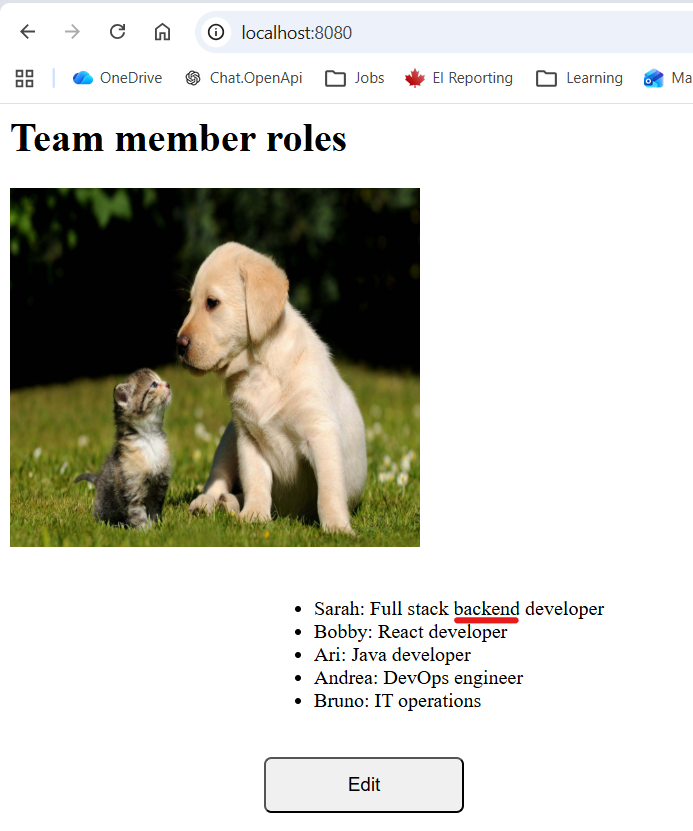
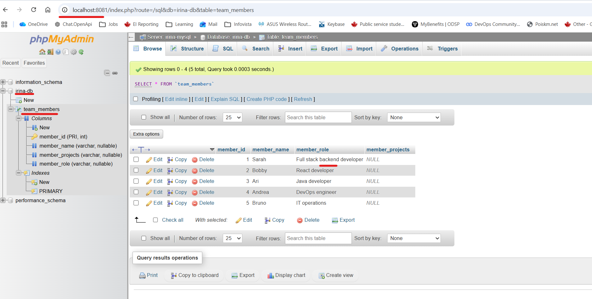
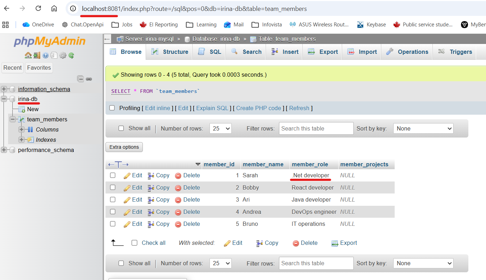
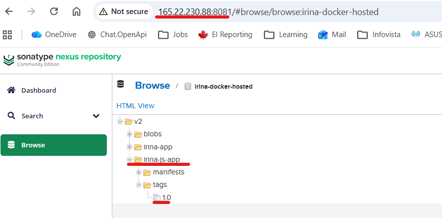
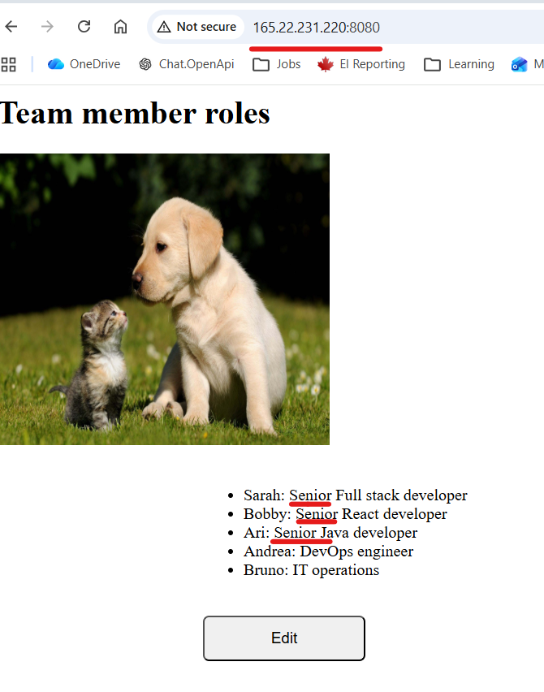

# Module 7 - Containers with Docker
## Repo:
https://gitlab.com/IrinaRoiter/docker-execises

Your team member has improved your previous static java application and added mysql database connection, to let users edit information and save the edited data.

They ask you to configure and run the application with Mysql database on a server using docker-compose.

You notice that we are using environment variables for the database and its credentials inside the application.

This is very important for 2 reasons:

You don't want to expose the password to your database by hardcoding it into the app and checking it into the repository!
These values may change based on the environment, so you want to be able to set them dynamically when deploying the application, instead of hardcoding them.

<details>
<summary><b>EXERCISE 1: Start Mysql container</b></summary>

First you want to test the application locally with a mysql database. But you don't want to install Mysql, you want to get started fast, so you start it as a docker container:

Start mysql container locally using the official Docker image. Set all needed environment variables.
Export all needed environment variables for your application for connecting with the database (check variable names inside the code)
Build a jar file and start the application. Test access from browser. Make some changes.

* Find offical mysql Docker image and choose the version
```
https://hub.docker.com/_/mysql

I will go for v8.4.8 because it is a specific version, stable and is based on Oracle - Linux 9 LTS
Check overview of the image, find env. variables that need to be set up.
MYSQL_ROOT_PASSWORD
MYSQL_DATABASE
MYSQL_USER, MYSQL_PASSWORD
```
* Find the port that is exposed for communication
```
Info about the port can be found in Docker file for v8.4.8 located in GitHub
https://github.com/docker-library/mysql/blob/f8c2facfccdc3c8b8b2c9b5a6aec31db3115105b/8.4/Dockerfile.oracle#L122
Port 3306

```
* Start container
```
PS C:\repos\docker-exercises> docker run -d --name irina-mysql -p 3306:3306 `
>> -e MYSQL_ROOT_PASSWORD=password `
>> -e MYSQL_DATABASE=irina-db `
>> -e MYSQL_USER=user `
>> -e MYSQL_PASSWORD=password `
>> mysql:8.4.8

Unable to find image 'mysql:8.4.8' locally
8.4.8: Pulling from library/mysql
91c980086743: Pull complete
68420c358694: Pull complete
50200b0c89a3: Pull complete
03f8ae82fc56: Pull complete
eba8eed90d75: Pull complete
d4c7048d1cf1: Pull complete
3cd28adefbd9: Pull complete
43105b2d4e4a: Pull complete
1a7d4892b7d2: Pull complete
4d14d7bf02a4: Pull complete
09ed159fbec4: Download complete
0ad5e3bd9c41: Download complete
Digest: sha256:da906917ca4ace3ba55538b7c2ee97a9bc865ef14a4b6920b021f0249d603f3d
Status: Downloaded newer image for mysql:8.4.8
59b3afad3af2c213189db3317249c063d371c752871e1781c2e5b5e66881636c
```
```
PS C:\repos\docker-exercises> docker ps
CONTAINER ID   IMAGE         COMMAND                  CREATED         STATUS         PORTS                                         NAMES
59b3afad3af2   mysql:8.4.8   "docker-entrypoint.s…"   6 minutes ago   Up 6 minutes   0.0.0.0:3306->3306/tcp, [::]:3306->3306/tcp   irina-mysql
```
* Validate that the irina-db database is created
```
PS C:\repos\docker-exercises> docker exec -it irina-mysql mysql -u user -p
Enter password:
Welcome to the MySQL monitor.  Commands end with ; or \g.
Your MySQL connection id is 9
Server version: 8.4.8 MySQL Community Server - GPL

Copyright (c) 2000, 2026, Oracle and/or its affiliates.

Oracle is a registered trademark of Oracle Corporation and/or its
affiliates. Other names may be trademarks of their respective
owners.

Type 'help;' or '\h' for help. Type '\c' to clear the current input statement.

mysql> SHOW DATABASES;
+--------------------+
| Database           |
+--------------------+
| information_schema |
| irina-db           |
| performance_schema |
+--------------------+
3 rows in set (0.01 sec)

mysql>
```
* Set env. vars for Java app
```
$env:DB_USER=user
$env:DB_PWD=password
$env:DB_SERVER=localhost
$env:DB_NAME=irina-db
```
* Build Java app
 ```
 PS C:\Repos\docker-exercises> gradle build   
Starting a Gradle Daemon (subsequent builds will be faster)
...
BUILD SUCCESSFUL in 30s
7 actionable tasks: 7 executed
```
```
PS C:\Repos\docker-exercises> ls ./build/libs

    Directory: C:\Repos\docker-exercises\build\libs

Mode                 LastWriteTime         Length Name
----                 -------------         ------ ----
-a---        Wed 01.04.26 12:26 PM         441809 irina-java-gradle-app-1.0-SNAPSHOT-plain.jar
-a---        Wed 01.04.26 12:26 PM       26832634 irina-java-gradle-app-1.0-SNAPSHOT.jar
```

* Start Java app
```
PS C:\Repos\docker-exercises> java -jar .\build\libs\irina-java-gradle-app-1.0-SNAPSHOT.jar 

  .   ____          _            __ _ _
 /\\ / ___'_ __ _ _(_)_ __  __ _ \ \ \ \
( ( )\___ | '_ | '_| | '_ \/ _` | \ \ \ \
 \\/  ___)| |_)| | | | | || (_| |  ) ) ) )
  '  |____| .__|_| |_|_| |_\__, | / / / /
 =========|_|==============|___/=/_/_/_/

 :: Spring Boot ::                (v3.5.5)

2026-04-01T12:57:14.335-04:00  INFO 8936 --- [           main] com.example.Application                  : Starting Application v1.0-SNAPSHOT using Java 17.0.18 with PID 8936 (C:\Repos\docker-exercises\build\libs\irina-java-gradle-app-1.0-SNAPSHOT.jar started by user in C:\Repos\docker-exercises)
...
: Started Application in 2.37 seconds (process running for 2.875)
```
* Connect to the Java app from browser

localhost:8080

* Click on 'Edit' button and make changes
```
I updated Sarah's role from 'Full stack developer' to 'Full stack backend developer'
```
* Reload the browser and verify visually that the changes are there



* Verify the changes are in the irina-db database
```
PS C:\repos\docker-exercises> docker exec -it irina-mysql mysql -u user -p
Enter password:
Welcome to the MySQL monitor.  Commands end with ; or \g.
Your MySQL connection id is 12
Server version: 8.4.8 MySQL Community Server - GPL

mysql> SHOW DATABASES;
+--------------------+
| Database           |
+--------------------+
| information_schema |
| irina-db           |
| performance_schema |
+--------------------+
3 rows in set (0.02 sec)

mysql> USE irina-db
Reading table information for completion of table and column names
You can turn off this feature to get a quicker startup with -A

mysql> SHOW TABLES;
+--------------------+
| Tables_in_irina-db |
+--------------------+
| team_members       |
+--------------------+
1 row in set (0.00 sec)

mysql> SELECT * FROM team_members;
+-----------+-------------+------------------------------+-----------------+
| member_id | member_name | member_role                  | member_projects |
+-----------+-------------+------------------------------+-----------------+
|         1 | Sarah       | Full stack backend developer | NULL            |
|         2 | Bobby       | React developer              | NULL            |
|         3 | Ari         | Java developer               | NULL            |
|         4 | Andrea      | DevOps engineer              | NULL            |
|         5 | Bruno       | IT operations                | NULL            |
+-----------+-------------+------------------------------+-----------------+
5 rows in set (0.00 sec)
```
</details>

<details>
<summary><b>EXERCISE 2: Start Mysql GUI container</b></summary>

Now you have a database, you want to be able to see the database data using a UI tool, so you decide to deploy phpmyadmin. Again, you don't want to install it locally, so you want to start it also as a docker container.

Start phpmyadmin container using the official image.
Access phpmyadmin from your browser and test logging in to your Mysql database

* Find an official image on DockerHub and choose the tag
```
https://hub.docker.com/_/phpmyadmin
phpmyadmin:5.2.1
```
* Create a network
```
PS C:\repos\docker-exercises> docker network create irina-network
d2efc4d6085e52cbf17498631da6a53f4d2367cf6d7201f076b6a8b75d9ae06e
```
* Connect mysql container to the network
```
PS C:\repos\docker-exercises> docker network connect irina-network irina-mysql
```
* Start container
```
PS C:\repos\docker-exercises> docker run -d `
>>  --name irina-phpmyadmin `
>>  --network irina-network `
>>  -p 8081:80 `
>>  -e PMA_HOST=irina-mysql `
>>  -e PMA_USER=user `
>>  -e PMA_PASSWORD=password `
>>  phpmyadmin:5.2.1
Unable to find image 'phpmyadmin:5.2.1' locally
5.2.1: Pulling from library/phpmyadmin
0814cbbf72a2: Pull complete
38f1cd12cfc7: Pull complete
4743f1287a2d: Pull complete
858a356e9dad: Pull complete
b3207e60ff9a: Pull complete
9df2a6231627: Pull complete
44ab24e7d26a: Pull complete
4f4fb700ef54: Pull complete
88324ccb20a1: Pull complete
685676cf086d: Pull complete
3ef8d0774deb: Pull complete
2ab7ef40feaf: Pull complete
11d17388a3b8: Pull complete
ed15d8442633: Pull complete
71a74ed03dab: Pull complete
673faad72ba8: Pull complete
d18c9f420b35: Pull complete
ad5f2fca9132: Pull complete
3a28acedadf8: Pull complete
af302e5c37e9: Pull complete
cb49015937ad: Download complete
Digest: sha256:6e75aa8f767c5c9b7f3859e7f3006ad669739159d4e312e7570b66082da7f949
Status: Downloaded newer image for phpmyadmin:5.2.1
9af2c92d83589da990f3caa704ce47f99471e5d350a866f02d6e211e593bedff
```
* Validate the container is running
```
PS C:\repos\docker-exercises> docker ps
CONTAINER ID   IMAGE              COMMAND                  CREATED          STATUS          PORTS                                         NAMES
9af2c92d8358   phpmyadmin:5.2.1   "/docker-entrypoint.…"   39 seconds ago   Up 39 seconds   0.0.0.0:8081->80/tcp, [::]:8081->80/tcp       irina-phpmyadmin
59b3afad3af2   mysql:8.4.8        "docker-entrypoint.s…"   5 hours ago      Up 5 hours      0.0.0.0:3306->3306/tcp, [::]:3306->3306/tcp   irina-mysql
PS C:\repos\docker-exercises>
```

* Connect to container with http://localhost:8081 and validate data


</details>

<details>
<summary><b>EXERCISE 3: Use docker-compose for Mysql and Phpmyadmin</b></summary>

You have 2 containers your app needs and you don't want to start them separately all the time. So you configure a docker-compose file for both:

Create a docker-compose file with both containers
Configure a volume for your DB
Test that everything works again

* Write docker-compose file

```
version: '3'
services:
  irina-mysql:
    image: mysql:8.4.8
    restart: always
    ports:
      - 3306:3306
    environment:
      - MYSQL_ROOT_PASSWORD=password
      - MYSQL_DATABASE=irina-db
      - MYSQL_USER=user
      - MYSQL_PASSWORD=password
    volumes:
      - mysql-data:/var/lib/mysql
  irina-phpmyadmin:
    image: phpmyadmin:5.2.1
    restart: always
    ports:
      - 8081:80
    environment:
      - PMA_HOST=irina-mysql
      - PMA_USER=user
      - PMA_PASSWORD=password
    depends_on:
      - "irina-mysql"
volumes:
  mysql-data:
    driver: local
```
*  Start containers with docker-compose file
```
iroiter@WINDOWS-CTBM1LI:/mnt/c/repos/DevOps/TWN-DevOps-Bootcamp/7-Docker$ docker-compose -f ./docker-compose.yaml up -d
....
2026-04-02T12:39:51.965-04:00  INFO 8516 --- [           main] o.s.b.w.embedded.tomcat.TomcatWebServer  : Tomcat started on port 8080 (http) with context path '/'
2026-04-02T12:39:51.986-04:00  INFO 8516 --- [           main] com.example.Application                  : Started Application in 2.278 seconds (process running for 2.703)
```   
* Validate containers are running
```
iroiter@WINDOWS-CTBM1LI:/mnt/c/repos/DevOps/TWN-DevOps-Bootcamp/7-Docker$ docker ps
CONTAINER ID   IMAGE              COMMAND                  CREATED         STATUS         PORTS                                         NAMES
e35c59e98070   phpmyadmin:5.2.1   "/docker-entrypoint.…"   7 minutes ago   Up 7 minutes   0.0.0.0:8081->80/tcp, [::]:8081->80/tcp       7-docker-irina-phpmyadmin-1
162b7e8fae98   mysql:8.4.8        "docker-entrypoint.s…"   7 minutes ago   Up 7 minutes   0.0.0.0:3306->3306/tcp, [::]:3306->3306/tcp   7-docker-irina-mysql-1
```
* Connect to Java app 
```
http://localhost:8080/

=> previous change was lost because previosly run containers were removed
=> Make a new change: 'Full stack developer' to '.Net developer'
```
* Connect to phpMyAdmin and validate the change is recorded in irina-db



* Check data from mysql container
```
iroiter@WINDOWS-CTBM1LI:/mnt/c/repos/DevOps/TWN-DevOps-Bootcamp/7-Docker$ docker exec  -it 162b7e8fae98 mysql -u user -p
Enter password:
Welcome to the MySQL monitor.  Commands end with ; or \g.
Your MySQL connection id is 40
Server version: 8.4.8 MySQL Community Server - GPL

mysql> SHOW DATABASES;
+--------------------+
| Database           |
+--------------------+
| information_schema |
| irina-db           |
| performance_schema |
+--------------------+
3 rows in set (0.00 sec)

mysql> USE irina-db;
Reading table information for completion of table and column names
You can turn off this feature to get a quicker startup with -A

Database changed
mysql> SHOW TABLES;
+--------------------+
| Tables_in_irina-db |
+--------------------+
| team_members       |
+--------------------+
1 row in set (0.00 sec)

mysql> SELECT * FROM team_members;
+-----------+-------------+-----------------+-----------------+
| member_id | member_name | member_role     | member_projects |
+-----------+-------------+-----------------+-----------------+
|         1 | Sarah       | .Net developer  | NULL            |
|         2 | Bobby       | React developer | NULL            |
|         3 | Ari         | Java developer  | NULL            |
|         4 | Andrea      | DevOps engineer | NULL            |
|         5 | Bruno       | IT operations   | NULL            |
+-----------+-------------+-----------------+-----------------+
5 rows in set (0.00 sec)

mysql>
```

* Validate volume
```
iroiter@WINDOWS-CTBM1LI:/mnt/c/repos/DevOps/TWN-DevOps-Bootcamp/7-Docker$ docker volume ls
DRIVER    VOLUME NAME

local     docker-exercises_mysql-data

```
</details>
<details>
<summary><b>EXERCISE 4: Dockerize your Java Application</b></summary>

Now you are done with testing the application locally with Mysql database and want to deploy it on the server to make it accessible for others in the team, so they can edit information.

And since your DB and DB UI are running as docker containers, you want to make your app also run as a docker container. So you can all start them using 1 docker-compose file on the server. So you do the following:

Create a Dockerfile for your java application

* Create a Dockerfile for my Java app
```
FROM amazoncorretto:17-alpine AS BUILD

WORKDIR /opt/java-app

COPY . .

RUN chmod +x gradlew && ./gradlew build -x test

FROM amazoncorretto:17-alpine

WORKDIR /opt/java-app 

COPY --from=BUILD /opt/java-app/build/libs/*.jar app.jar

ENV DB_USER=user \
    DB_PWD=password \
    DB_SERVER=irina-mysql \
    DB_NAME=irina-db

ENTRYPOINT ["java", "-jar", "app.jar"]
```
* Build an image, start container and test it
```
PS C:\Repos\docker-exercises> docker build -t irina-js-app:1.0 . 
[+] Building 58.4s (10/10) FINISHED       
```
* Run container
```
PS C:\Users\user> docker run -d `
>>   --name irina-java-app `
>>   --network 7-docker_default `
>>   -p 8080:8080 `
>>   irina-js-app:1.0
2eccbdad043e3e496e8ec7bbe407a8e404f24f0eebff5ce555764b9f33d1f6dd
PS C:\Users\user>
```  
* Validate that container is running
```
PS C:\Users\user> docker ps
CONTAINER ID   IMAGE                      COMMAND                  CREATED        STATUS        PORTS                                         NAMES
2eccbdad043e   irina-js-app:1.0           "java -jar app.jar"      20 hours ago   Up 20 hours   0.0.0.0:8080->8080/tcp, [::]:8080->8080/tcp   irina-java-app
aa77965ae9b0   amazoncorretto:17-alpine   "/bin/sh"                22 hours ago   Up 22 hours                                                 condescending_hawking
e35c59e98070   phpmyadmin:5.2.1           "/docker-entrypoint.…"   24 hours ago   Up 24 hours   0.0.0.0:8081->80/tcp, [::]:8081->80/tcp       7-docker-irina-phpmyadmin-1
162b7e8fae98   mysql:8.4.8                "docker-entrypoint.s…"   24 hours ago   Up 24 hours   0.0.0.0:3306->3306/tcp, [::]:3306->3306/tcp   7-docker-irina-mysql-1
P
```
* Test from browser it still works
```
Reload http://localhost:8080/
Make changes
Save profile
```
</details>

<details>
<summary><b>EXERCISE 5: Build and push Java Application Docker Image</b></summary>

Now for you to be able to run your java app as a docker image on a remote server, it must be first hosted on a docker repository, so you can fetch it from there on the server. Therefore, you have to do the following:

Create a docker hosted repository on Nexus
Build the image locally and push to this repository

* Create a docker hosted repository on Nexus

[Detailed procedure](module-7-project-create-docker-repo-nexus.md)

* Create a new tag for an image that was built in Exercise 4
```
PS C:\repos\docker-exercises> docker images | Select-String js-app

165.22.230.88:8083/irina-js-app:1.0   ecc9fc6ecbe7        503MB          177MB   U
irina-js-app:1.0                      ecc9fc6ecbe7        503MB          177MB   U
```
* Login from Docker to Nexus
```
PS C:\repos\docker-exercises> docker login 165.22.230.88:8083
Authenticating with existing credentials... [Username: irina]

i Info → To login with a different account, run 'docker logout' followed by 'docker login'

Login Succeeded
PS C:\repos\docker-exercises>
```
* Push the image to Docker hosted repo on Nexus
```
PS C:\repos\docker-exercises> docker push 165.22.230.88:8083/irina-js-app:1.0
The push refers to repository [165.22.230.88:8083/irina-js-app]
8f171e06b3e2: Pushed
ed6290ed2724: Pushed
589002ba0eae: Layer already exists
3c3f433c96fd: Pushed
9c1ae7f6a22a: Pushed
1.0: digest: sha256:ecc9fc6ecbe7a281b9b361c9e40456a782b82c462781c1bf8c3573a182135853 size: 856
PS C:\repos\docker-exercises>
```
* Verify the image on Nexus


</details>

<details>
<summary><b>EXERCISE 6: Add application to docker-compose</b></summary>

Add your application's docker image to docker-compose. Configure all needed env vars.
TIP: Ensure you configure a health check on your mysql container.
Now your app and Mysql containers in your docker-compose are using environment variables.

Make all these environment variable values configurable, by setting them on the server when deploying.
INFO: Again, since docker-compose is part of your application and checked in to the repo, it shouldn't contain any sensitive data. But also allow configuring these values from outside based on an environment.

* Add js-app to docker-compose

[Docker-compose](https://gitlab.com/IrinaRoiter/docker-execises/-/blob/master/docker-compose.yaml?ref_type=heads)

* Create .env file for sandbox and for production servers

[Sandbox](sandbox.env)

[Production](production.env)

* Update docker-compose file to extract values from externally set env. vars

```
Example:
    environment:
      - DB_USER=${DB_USER}
      - DB_PWD=${DB_PWD}
      - DB_SERVER=${DB_SERVER}
      - DB_NAME=${DB_NAME}
```
</details>

<details>
<summary><b>EXERCISE 7: Run application on server with docker-compose</b></summary>

Finally your docker-compose file is completed and you want to run your application on the server with docker-compose. For that you need to do the following:

Set insecure docker repository on server, because Nexus uses http
Run docker login on the server to be allowed to pull the image
Your application index.html has a hardcoded localhost as a HOST to send requests to the backend. You need to fix that and set the server IP address instead, because the server is going to be the host when you deploy the application on a remote server. (Don't forget to rebuild and push the image and if needed adjust the docker-compose file)
Copy docker-compose.yaml to the server
Set the needed environment variables for all containers in docker-compose
Run docker-compose to start all 3 containers

* Create a VM on Digital Ocean, add it to Firewall

[Follow "Create and configure a new Linux user on the Droplet" section](../5-Cloud-Iaas/module-5-project.md)

New VM (remote server) IP: 165.22.231.220

* Install docker, docker-compose, configure insecure connection, login from Docker to Nexus

[Follow "Login to a private remote regisrty on a remote server to fetch an app image" section](module-7-project-deploy-docker-app-docker-compose.md)

* Replace "localhost" with IP address of the host

```
in index.html file replace 
  const HOST = "localhost"
with  
  const HOST = window.location.origin
```
* Update version to 1.1
```
version '1.1-SNAPSHOT'
```
* Build a new image and push it to Nexus
```
PS C:\Repos\docker-exercises> docker build -t 165.22.230.88:8083/irina-js-app:1.1 .
[+] Building 60.2s (10/10) FINISHED
```
```
PS C:\Repos\docker-exercises> docker push 165.22.230.88:8083/irina-js-app:1.1
The push refers to repository [165.22.230.88:8083/irina-js-app]
ed6290ed2724: Layer already exists
3c3f433c96fd: Layer already exists
ce4582913fab: Pushed
e2745fc53df8: Pushed
589002ba0eae: Layer already exists
1.1: digest: sha256:5db9fc3a673ebb98aa3d3b5f56338def8037ab9f4f13eadb2fb5858ea17db9ea size: 856
```
* Update docker-compose with v1.1; deploy docker-compose and sandbox.env on remote server
```
PS C:\repos\docker-exercises> scp docker-compose.yaml root@165.22.231.220:/opt
docker-compose.yaml                               100% 1164    45.5KB/s   00:00
```
```
PS C:\repos\DevOps\TWN-DevOps-Bootcamp\7-Docker> scp sandbox.env root@165.22.231.220:/opt
sandbox.env            100%  233     9.1KB/s   00:00
```
* Connect to remote server and start 3 containers
```
root@ubuntu-s-1vcpu-1gb-tor1-01:/opt# docker-compose -f ./docker-compose.yaml --env-file ./sandbox.env up -d
Creating network "opt_default" with the default driver
Creating volume "opt_mysql-data" with local driver
Pulling irina-mysql (mysql:8.4.8)...
8.4.8: Pulling from library/mysql
d4c7048d1cf1: Pull complete
...
Digest: sha256:da906917ca4ace3ba55538b7c2ee97a9bc865ef14a4b6920b021f0249d603f3d
Status: Downloaded newer image for mysql:8.4.8
Pulling irina-js-app (165.22.230.88:8083/irina-js-app:1.1)...
1.1: Pulling from irina-js-app
589002ba0eae: Pull complete
...
Digest: sha256:5db9fc3a673ebb98aa3d3b5f56338def8037ab9f4f13eadb2fb5858ea17db9ea
Status: Downloaded newer image for 165.22.230.88:8083/irina-js-app:1.1
Pulling irina-phpmyadmin (phpmyadmin:5.2.1)...
5.2.1: Pulling from library/phpmyadmin
af302e5c37e9: Pull complete
...
Digest: sha256:6e75aa8f767c5c9b7f3859e7f3006ad669739159d4e312e7570b66082da7f949
Status: Downloaded newer image for phpmyadmin:5.2.1
Creating opt_irina-mysql_1 ... done
Creating opt_irina-phpmyadmin_1 ... done
Creating opt_irina-js-app_1     ... done

```
* Verify containers are up and running
```
root@ubuntu-s-1vcpu-1gb-tor1-01:/opt# docker ps
CONTAINER ID   IMAGE                                 COMMAND                  CREATED         STATUS                   PORTS                                                    NAMES
435e8cf166b5   phpmyadmin:5.2.1                      "/docker-entrypoint.…"   4 minutes ago   Up 4 minutes             0.0.0.0:8081->80/tcp, [::]:8081->80/tcp                  opt_irina-phpmyadmin_1
cc871410e6d3   165.22.230.88:8083/irina-js-app:1.1   "java -jar app.jar"      4 minutes ago   Up 4 minutes             0.0.0.0:8080->8080/tcp, [::]:8080->8080/tcp              opt_irina-js-app_1
582e8eef8a11   mysql:8.4.8                           "docker-entrypoint.s…"   4 minutes ago   Up 4 minutes (healthy)   0.0.0.0:3306->3306/tcp, [::]:3306->3306/tcp, 33060/tcp   opt_irina-mysql_1
```
</details>

<details>
<summary><b>EXERCISE 8: Open port and test app</b></summary>

Open the necessary port on the server firewall and
Test access from the browser

* Open port 8080 on the Firewall
```
on Digital Ocean got to Networking->Firewalls->my-droplet-firewall
Add Inbound Rule
Type: Custom
Protocol: TCP
Port: 8080
Add inbound rule
```
* Test app
```
Connect to 165.22.231.220:8080
Make changes
Save
Reload browser => changes are still there
```



```

</details>