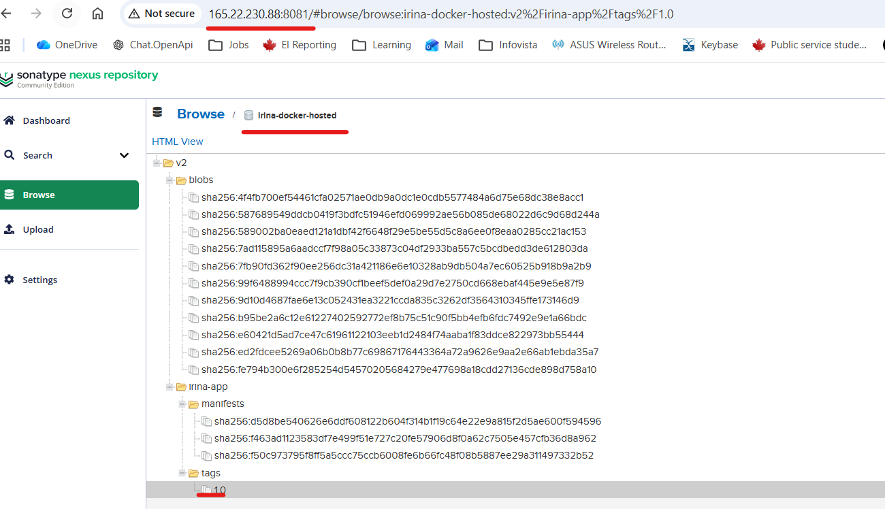

# Module 7 - Containers with Docker
## Demo Project:
Create Docker Repo on Nexus and push to it. 
## Technologies used:
Docker, Nexus, DigitalOcean, Linux
## Project Description:
* Create Docker hosted repository on Nexus
* Create Docker repository role on Nexus
* Configure Nexus, Digial Ocean Droplet and Docker to be able to push to Docker registry
* Build and push Docker image to Docker repository on Nexus


# Solution

<details>
<summary><b>Create Docker hosted repository on Nexus</b></summary>

* Create Docker hosted repository
```
Settings->Repository->Repository->Create Repository
Select Docker hosted
Name: irina-docker-hosted
Blob store: irina-file-blob-store
Create repository
```
</details>
<details>
<summary><b>Create Docker repository role on Nexus</b></summary>

* Create a Role
```
Settings->Security->Roles->Create Role
Type: Nexus Role
Role ID: nx-docker
Role Name: nx-docker
Applied priviledges: nx-repository-view-docker-irina-docker-hosted-*
Save
```
* Assosiate nx-docker Role with local user - 'irina'
```
Settings->Security->Users->irina
Role: add nx-docker role
Save
```
</details>
<details>
<summary><b>Configure Nexus, Digial Ocean Droplet and Docker to be able to push to Docker registry</b></summary>

* Create a spesific port to connect to docker hosted repo
```
Settings->Repository->Repositories->irina-docker-hosted
Other connectors->HTTP->8083
Save
```
* Verify that port 8083 is open on VM where nexus is running

```
root@ubuntu-s-4vcpu-8gb-tor1-01:~# netstat -lnpt
Active Internet connections (only servers)
Proto Recv-Q Send-Q Local Address           Foreign Address         State       PID/Program name
tcp        0      0 127.0.0.53:53           0.0.0.0:*               LISTEN      104416/systemd-reso
tcp        0      0 127.0.0.54:53           0.0.0.0:*               LISTEN      104416/systemd-reso
tcp        0      0 0.0.0.0:22              0.0.0.0:*               LISTEN      1/systemd
tcp6       0      0 :::8083                 :::*                    LISTEN      37660/java
tcp6       0      0 :::8081                 :::*                    LISTEN      37660/java
tcp6       0      0 :::22                   :::*                    LISTEN      1/systemd
```

* Open port 8083 on Digital Ocean Firewall
```
Networking->Firewalls->my-droplet-firewall
New Inbound rule
Type: Custom
Port: 8083
Add inbound rule
```
* Allow Docker bearer to connect to docker hosted repo on Nexus
```
Security->Realms
Select "Docker bearer token realm"
Add it to Active
Save
````
* Allow insecure connections for Docker Engine
```
Docker-Desktop->Settiiings->Docker Engine
Add this line:
  "insecure-registries": [
    "165.22.230.88:8083"
  ]
Apply and restart  
```
* Login to Docker
```
PS C:\repos\js-app> docker login 165.22.230.88:8083
Username: irina
Password:

Login Succeeded
```
</details>

<details>
<summary><b>Build and push Docker image to Docker repository on Nexus</b></summary>

* Create a new tag Node JS image 
```
PS C:\repos\js-app> docker tag irina-app:1.0 165.22.230.88:8083/irina-app:1.0
PS C:\repos\js-app> docker images
IMAGE                              ID             DISK USAGE   CONTENT SIZE   EXTRA
165.22.230.88:8083/irina-app:1.0   d5d8be540626        250MB         59.6MB
irina-app:1.0                      d5d8be540626        250MB         59.6MB
```
* Push the image to Nexus 

```
PS C:\repos\js-app> docker push 165.22.230.88:8083/irina-app:1.0
The push refers to repository [165.22.230.88:8083/irina-app]
ed2fdcee5269: Pushed
587689549ddc: Pushed
b95be2a6c12e: Pushed
589002ba0eae: Pushed
99f6488994cc: Pushed
7ad115895a6a: Pushed
9d10d4687fae: Pushed
7fb90fd362f9: Pushed
4f4fb700ef54: Pushed
1.0: digest: sha256:d5d8be540626e6ddf608122b604f314b1f19c64e22e9a815f2d5ae600f594596 size: 856
```
* Verify uploaded image on Nexus



* Fetch an uploaded image with Nexus API

```
iroiter@WINDOWS-CTBM1LI:/mnt/c/repos/js-app$ curl -u irina:irinaroiter -X GET '165.22.230.88:8081/service/rest/v1/components?repository=irina-docker-hosted'
{
  "items" : [ {
    "id" : "aXJpbmEtZG9ja2VyLWhvc3RlZDo0ZjFiYmNkZA",
    "repository" : "irina-docker-hosted",
    "format" : "docker",
    "group" : "",
    "name" : "irina-app",
    "version" : "1.0",
    "assets" : [ {
      "downloadUrl" : "http://165.22.230.88:8081/repository/irina-docker-hosted/v2/irina-app/manifests/1.0",
      "path" : "/v2/irina-app/manifests/1.0",
      "id" : "aXJpbmEtZG9ja2VyLWhvc3RlZDphMmEwMTBmMw",
      "repository" : "irina-docker-hosted",
      "format" : "docker",
      "checksum" : {
        "sha256" : "d5d8be540626e6ddf608122b604f314b1f19c64e22e9a815f2d5ae600f594596",
        "sha1" : "dc89b1b99472dc0a93e79e555abb6af5d50f13b5"
      },
      "contentType" : "application/vnd.oci.image.index.v1+json",
      "lastModified" : "2026-03-25T21:07:55.030+00:00",
      "lastDownloaded" : null,
      "uploader" : "irina",
      "uploaderIp" : "108.162.140.99",
      "fileSize" : 856,
      "blobCreated" : "2026-03-25T21:07:55.031+00:00",
      "blobStoreName" : "irina-file-blob-store",
      "docker" : { }
    } ]
  } ],
  "continuationToken" : null
```

</details>