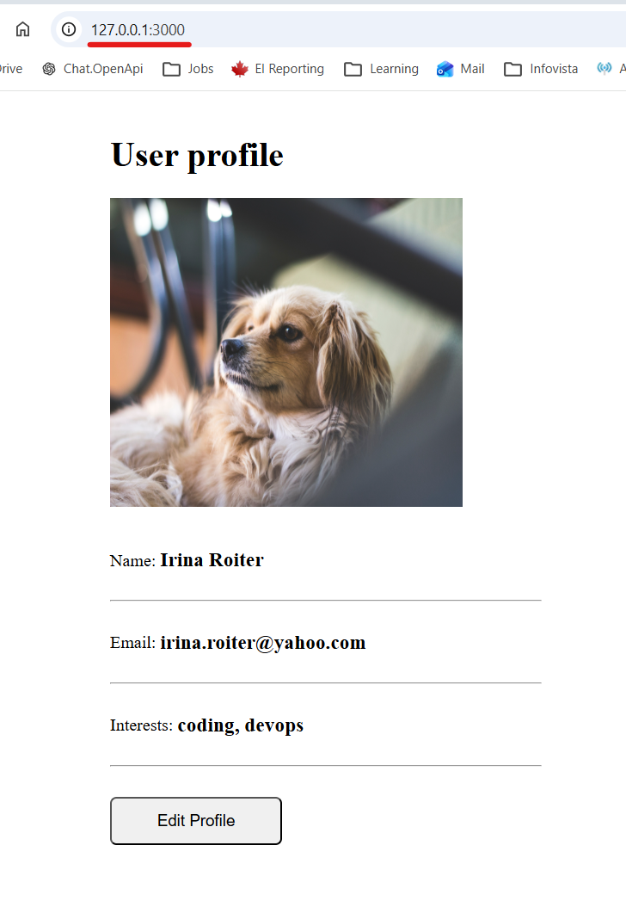

# Module 7 - Containers with Docker
## Demo Project:
Persist data with Docker volumes
## Technologies used:
Docker, Node JS, Mongo DB
## Project Description:
* Persist data of a Mongo DB container by attaching a volume to it


# Solution

<details>
<summary><b>Create volumes</b></summary>

* Define volumes in docker-compose.yaml file
```
version: '3'
services:
  irina-node-app:
    image: 165.22.230.88:8083/irina-app:1.5
    ports:
      - 3000:3000
  mongodb:
    image: mongo
    ports:
     - 27017:27017
    environment:
     - MONGO_INITDB_ROOT_USERNAME=admin
     - MONGO_INITDB_ROOT_PASSWORD=password
    volumes:
     - mongo-data:/data/db 
  mongo-express:
    image: mongo-express
    restart: always
    ports:
     - 8081:8081
    environment:
     - ME_CONFIG_MONGODB_ADMINUSERNAME=admin
     - ME_CONFIG_MONGODB_ADMINPASSWORD=password
     - ME_CONFIG_MONGODB_SERVER=mongodb
     - ME_CONFIG_BASICAUTH_USERNAME=user
     - ME_CONFIG_BASICAUTH_PASSWORD=password
     - ME_CONFIG_MONGODB_URL=mongodb://mongodb:27017
    depends_on:
     - "mongodb"
volumes:
  mongo-data:
    driver: local
```
</details>
<details>
<summary><b>Bring all the containers up</b></summary>

* Start containers
```
PS C:\repos\js-app> docker-compose -f .\docker-compose.yaml up -d
time="2026-03-30T15:09:33-04:00" level=warning msg="C:\\repos\\js-app\\docker-compose.yaml: the attribute `version` is obsolete, it will be ignored, please remove it to avoid potential confusion"
[+] up 5/5
 ✔ Network js-app_default            Created                                                                                                                                       0.0s
 ✔ Volume js-app_mongo-data          Created                                                                                                                                       0.0s
 ✔ Container js-app-mongodb-1        Started                                                                                                                                       0.5s
 ✔ Container js-app-irina-node-app-1 Started                                                                                                                                       0.5s
 ✔ Container js-app-mongo-express-1  Started 
```
* Validate containers are running
```
PS C:\repos\js-app> docker ps
CONTAINER ID   IMAGE                              COMMAND                  CREATED         STATUS         PORTS                                             NAMES
80fae6dfc39c   mongo-express                      "/sbin/tini -- /dock…"   7 seconds ago   Up 6 seconds   0.0.0.0:8081->8081/tcp, [::]:8081->8081/tcp       js-app-mongo-express-1
d4e79c0eba10   mongo                              "docker-entrypoint.s…"   7 seconds ago   Up 6 seconds   0.0.0.0:27017->27017/tcp, [::]:27017->27017/tcp   js-app-mongodb-1
c391b78924ea   165.22.230.88:8083/irina-app:1.5   "docker-entrypoint.s…"   7 seconds ago   Up 6 seconds   0.0.0.0:3000->3000/tcp, [::]:3000->3000/tcp       js-app-irina-node-app-1
```
* Validate created volume - js-app_mongo-data
```
PS C:\repos\js-app> docker volume ls
DRIVER    VOLUME NAME
local     0e2e30409dcbc0c9f75c8eed180c347dd1b2b1f93b780cac53161e5ededb703a
local     1bb26a0f3db7e4d3e259c09410c265d9bb10ab50dc8d67565562b29a10d4c87c
local     2a3741885ad09ef553ec91fac4bd3d2fca61a99286eed6699ce7a1bf04d8a5db
local     2be6739105797fd41e77dcb8e990f6ab9867d021ab9d9a3813f1c4c01bf95389
local     2f883a4d19d706baae060b9c55fb99e8463774551a91002966b89c3f8d0c1f85
local     8d3280d2c016aab721cc16d0d721b9c90dc810d90a89331ac6bfe8118546f5a0
local     36cc1149517506ff68029348402e461899922844c3f1f83ee4f56d786a96b324
local     37f82c90e7dad0d1714e66ae645268cd8a0359ca9f2a1b2020082509698ce6c5
local     65eebe9ce1a5e5ff15f2966321e37a96cdb894957f4501e92a3dacf3b3afc49c
local     90e463f9703fdd8eb6d90611960740605ae7a157916f5cc32b9f27df107f26ce
local     714cc899a0c4a1ce45c38611751df43c761812248df5c01e2bd624d00bd818c7
local     5799cfcecde9be9371694a04139663347ebfe63b9194264bc1de7c7ba612d7bd
local     34886e47b2f4a1cac118a2b09f8e562c8b677b95d9ad17efa212b803428377e2
local     52057ad0bf0af87e3ff796d4b232ad32f0e5f052b53a9077a3f0cc693efd175f
local     7667786f46d03639b6bda01f187d973907ee8524f2aa996465ef51936917be86
local     9753378d2b45ad6179d7164e896d315c63a00989e2df96d604da73684a1afb46
local     53118654e99b4821d7ebe24c1687f4ec35441e6507ecf9b93ed58926f1862cfa
local     aa698168aedacc75aa10a2b41b3de511a5cf0fa4c909dc801b31ff7b7070c5fa
local     c31fe2381ceb244c5800569d74c713064ab8108ddf37bf3f922a17aba108b2ed
local     cd02a2a51a1f2fd49b729792bd7e1ac70478c06d4f79c303587d283cc4d06295
local     e76fcd48e5e491a55b2705e3eee9c23dc10ed144f332af4655c790503e00166f
local     effd819351ef19f942a7dc63bc59e3e36d7763ffaa12d7bc60465ead8749ee52
local     f16c046f4d07a689e3a1c2937cae0ac7fd1b0b62dca879ec6ed74dd0661fb4a8
local     js-app_mongo-data
```
</details>
<details>
<summary><b>Update profile</b></summary>

* Connect to Mongo-Express - localhost:8081

* Create a database 'user-account' and a collection 'users'

* Connect to Node JS app - localhost:3000 and update profile



* Validate a new record in MongoDB database

```
{
    _id: ObjectId('69cacabe5cd5bbb25134f9f3'),
    userid: 1,
    email: 'irina.roiter@yahoo.com',
    interests: 'coding, devops',
    name: 'Irina Roiter'
}
```
* Find actual location of the data locally on my computer
```
PS C:\repos\js-app> docker run -it --privileged --pid=host debian nsenter -t 1 -m -u -n -i sh
Unable to find image 'debian:latest' locally
latest: Pulling from library/debian
8f6ad858d0a4: Pull complete
7098cf9488e7: Download complete
Digest: sha256:55a15a112b42be10bfc8092fcc40b6748dc236f7ef46a358d9392b339e9d60e8
Status: Downloaded newer image for debian:latest

sh-5.2# ls
EFI  boot          bpf.o       dev        etc   host-network.o  init   lib    media  mutagen-file-shares       opt            proc      root  sbin      src  sys  udpv6csum.o  var
bin  bpf-legacy.o  containers  dpkg.orig  home  host_mnt        initd  lib64  mnt    mutagen-file-shares-mark  parent-distro  pwatch.o  run   services  srv  tmp  usr

sh-5.2# ls /var/lib/docker/volumes/js-app_mongo-data/
_data
sh-5.2# ls /var/lib/docker/volumes/js-app_mongo-data/_data
WiredTiger         collection-01a52212-4bc6-4f0b-a560-23022186069d.wt  index-18203a88-071b-4d76-8073-95629612e4da.wt  index-fa359f1f-4d5a-4fd1-a534-b80ea0274887.wt
WiredTiger.lock    collection-0d1d6b8e-7cf6-4c4f-87c7-0629ea8c1cad.wt  index-1f79f683-138d-4692-95ed-96ef3e35e5df.wt  journal
WiredTiger.turtle  collection-2213bf6b-5dca-4891-8efb-a1827343af4b.wt  index-2469cc29-88d9-417e-9e7a-86173e920dca.wt  mongod.lock
WiredTiger.wt      collection-7a94ee7a-dae8-40f1-a41b-aa6e4dd218e7.wt  index-763f3117-31e5-466c-a9ec-b26e0461c240.wt  sizeStorer.wt
WiredTigerHS.wt    collection-997e8a67-69e3-41c6-ad5b-89384ed73b36.wt  index-7cef9b19-ce4f-465d-a325-135be0349e88.wt  storage.bson
_mdb_catalog.wt    collection-e493472d-5fd5-4c75-ab5d-1278129226ff.wt  index-daf25f3d-d1ce-44d7-815c-5c86a53d4776.wt
_tmp               diagnostic.data                                     index-f1c3f26b-7f1d-462d-8682-c2f4ef33bc45.wt    
```
</details>
<details>
<summary><b>Validate data persistence</b></summary>

* Bring all the containers down
```
PS C:\repos\js-app> docker-compose down
time="2026-03-30T15:55:38-04:00" level=warning msg="C:\\repos\\js-app\\docker-compose.yaml: the attribute `version` is obsolete, it will be ignored, please remove it to avoid potential confusion"
[+] down 4/4
 ✔ Container js-app-irina-node-app-1 Removed                                                                                                                                 1.4s
 ✔ Container js-app-mongo-express-1  Removed                                                                                                                                 0.3s
 ✔ Container js-app-mongodb-1        Removed                                                                                                                                 0.4s
 ✔ Network js-app_default            Removed 
```
* Validate that no containers are up and running
```
PS C:\repos\js-app> docker ps
CONTAINER ID   IMAGE     COMMAND   CREATED   STATUS    PORTS     NAMES
````
* Start new containers
```
PS C:\repos\js-app> docker-compose -f .\docker-compose.yaml up -d
time="2026-03-30T15:58:15-04:00" level=warning msg="C:\\repos\\js-app\\docker-compose.yaml: the attribute `version` is obsolete, it will be ignored, please remove it to avoid potential confusion"
[+] up 4/4
 ✔ Network js-app_default            Created                                                                                                                                 0.0s
 ✔ Container js-app-irina-node-app-1 Started                                                                                                                                 0.5s
 ✔ Container js-app-mongodb-1        Started                                                                                                                                 0.5s
 ✔ Container js-app-mongo-express-1  Started    
```
* Connect to Mongo-Express and validate that the database, colection and record are still there

```
{
    _id: ObjectId('69cacabe5cd5bbb25134f9f3'),
    userid: 1,
    email: 'irina.roiter@yahoo.com',
    interests: 'coding, devops',
    name: 'Irina Roiter'
}
```
</details>

