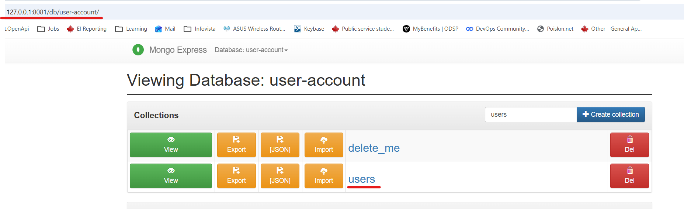

# Module 7 - Containers with Docker
## Demo Project:
Docker Compose - Run multiple Docker containers  
## Technologies used:
Docker, MongoDB, MongoExpress
## Project Description:
Write a Docker Compose to run MongoExpress MongoDB containers


# Solution

<details>
<summary><b>Pull MongoDB and MongoExpress images locally</b></summary>


* Pull mongo DB and mongo express latest version images from Docker Hub
```
PS C:\repos\js-app> docker pull mongo
Using default tag: latest
latest: Pulling from library/mongo
1e41d5f93e35: Pull complete
2605962b0286: Pull complete
0c85015575ad: Pull complete
01a854eada6f: Pull complete
8d1d6859a473: Pull complete
3a5c9bc3c6a6: Pull complete
e8567d1c4785: Pull complete
ee7db4c3583f: Download complete
51deed191cab: Download complete
Digest: sha256:d343c378b5c6e2fe373174abcf4a877be0dfc721b5d0b9d582204dccb1c00b86
Status: Downloaded newer image for mongo:latest
docker.io/library/mongo:latest
```
```
PS C:\repos\js-app> docker pull mongo-express
Using default tag: latest
latest: Pulling from library/mongo-express
619be1103602: Pull complete
0bf3571b6cd7: Pull complete
7e9a007eb24b: Pull complete
5189255e31c8: Pull complete
d8305ae32c95: Pull complete
45b24ec126f9: Pull complete
88f4f8a6bc8d: Pull complete
9f7f59574f7d: Pull complete
337574bd0f5e: Download complete
99ef4db52d2b: Download complete
Digest: sha256:1b23d7976f0210dbec74045c209e52fbb26d29b2e873d6c6fa3d3f0ae32c2a64
Status: Downloaded newer image for mongo-express:latest
docker.io/library/mongo-express:latest
```
```
PS C:\repos\js-app> docker images

IMAGE                  ID             DISK USAGE   CONTENT SIZE   EXTRA
mongo-express:latest   1b23d7976f02        287MB         59.8MB
mongo:latest           d343c378b5c6        1.3GB          341MB
postgres:14.22         705a5d5b5836        628MB          163MB    U
postgres:15.17         c635fa3e3b74        633MB          164MB    U
redis:6.2              83a75a9107fa        159MB         42.6MB    U
redis:latest           315270d16608        204MB         55.3MB    U
ubuntu:latest          186072bba1b2        119MB         31.7MB    U
```
</details>


<details>
<summary><b>Create Docker Compose file and start Mongodb and Mongo-Express containers with it</b></summary>

* Docker Compose file
```
version: '3'
services:
  mongodb:
    image: mongo
    ports:
     - 27017:27017
    environment:
     - MONGO_INITDB_ROOT_USERNAME=admin
     - MONGO_INITDB_ROOT_PASSWORD=password
  mongo-express:
    image: mongo-express
    restart: always
    ports:
     - 8081:8081
    environment:
     - ME_CONFIG_MONGODB_ADMINUSERNAME=admin
     - ME_CONFIG_MONGODB_ADMINPASSWORD=password
     - ME_CONFIG_MONGODB_SERVER=mongodb
     - ME_CONFIG_BASICAUTH_USERNAME=user
     - ME_CONFIG_BASICAUTH_PASSWORD=password
     - ME_CONFIG_MONGODB_URL=mongodb://mongodb:27017
    depends_on:
     - "mongodb"
```     

* Start Mongodb and Mongo-Express containers with Docker Compose file

```
PS C:\repos\js-app> docker-compose -f docker-compose.yaml up
time="2026-03-25T14:45:16-04:00" level=warning msg="C:\\repos\\js-app\\docker-compose.yaml: the attribute `version` is obsolete, it will be ignored, please remove it to avoid potential confusion"
[+] up 2/2
 ✔ Container js-app-mongodb-1       Created                                                                                                                                    0.1s
 ✔ Container js-app-mongo-express-1 Created                                                                                                                                    0.1s
Attaching to mongo-express-1, mongodb-1
......
```
</details>

<details>
<summary><b>Validate that containers are running</b></summary>

* Validate that containers are running
```
PS C:\Users\user> docker ps
CONTAINER ID   IMAGE           COMMAND                  CREATED          STATUS          PORTS                                             NAMES
52a2a5bacc5f   mongo-express   "/sbin/tini -- /dock…"   18 seconds ago   Up 18 seconds   0.0.0.0:8081->8081/tcp, [::]:8081->8081/tcp       js-app-mongo-express-1
af27602b4f68   mongo           "docker-entrypoint.s…"   18 seconds ago   Up 18 seconds   0.0.0.0:27017->27017/tcp, [::]:27017->27017/tcp   js-app-mongodb-1
```

* Inspect container
```
PS C:\repos\js-app> docker logs adfdd17cdeaa703e0cccc5160e38f0edd32e7ab30f05c5ec9ab7443ef0a4524c
app listening on port 3000!

PS C:\repos\js-app> docker exec -it adfdd17cdeaa703e0cccc5160e38f0edd32e7ab30f05c5ec9ab7443ef0a4524c /bin/sh
/home/app # ls
images             index.html         node_modules       package-lock.json  package.json       server.js

```

* Connect ot Mongo Express

URL: localhost:8081

* Create 'user-account' DB and 'users' collection



</details>

