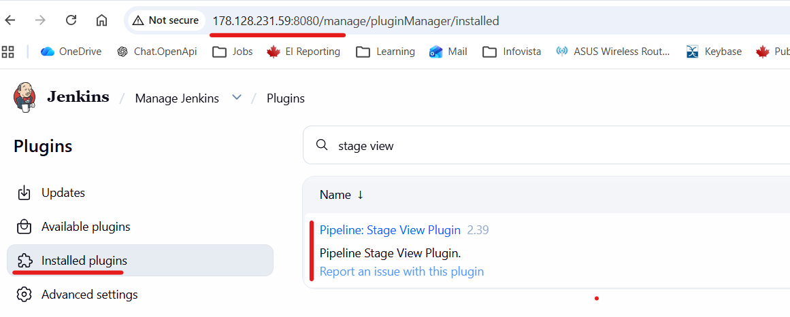
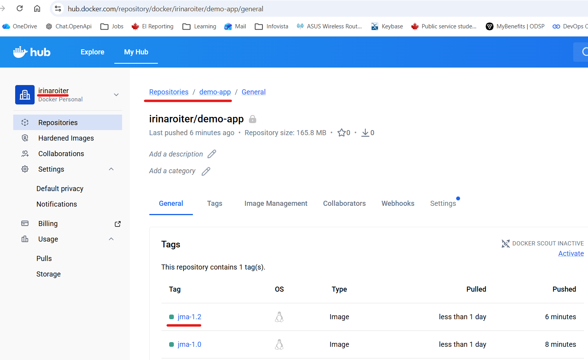
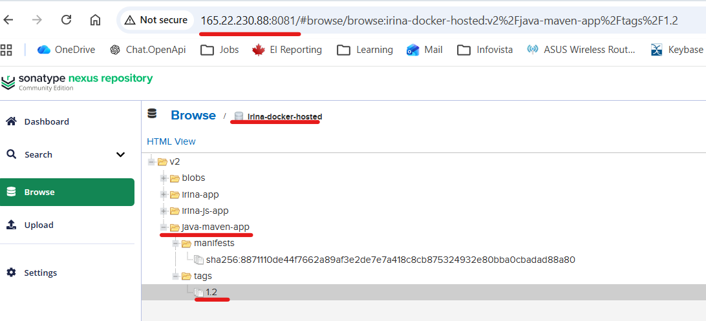
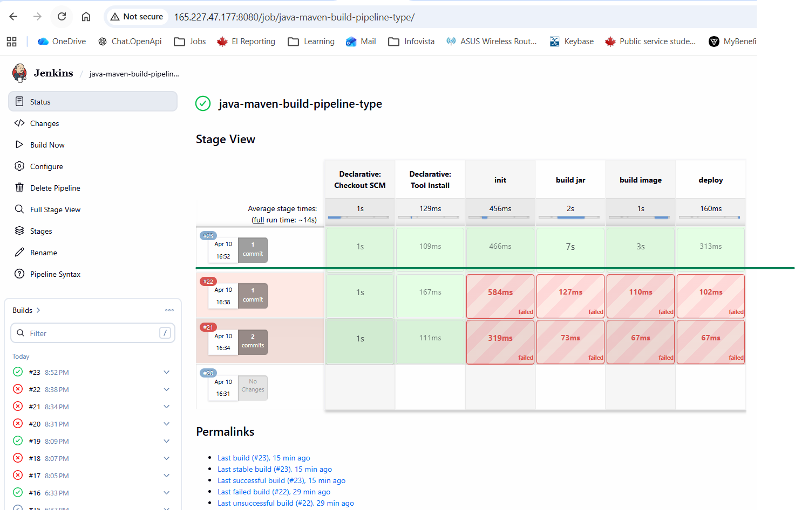
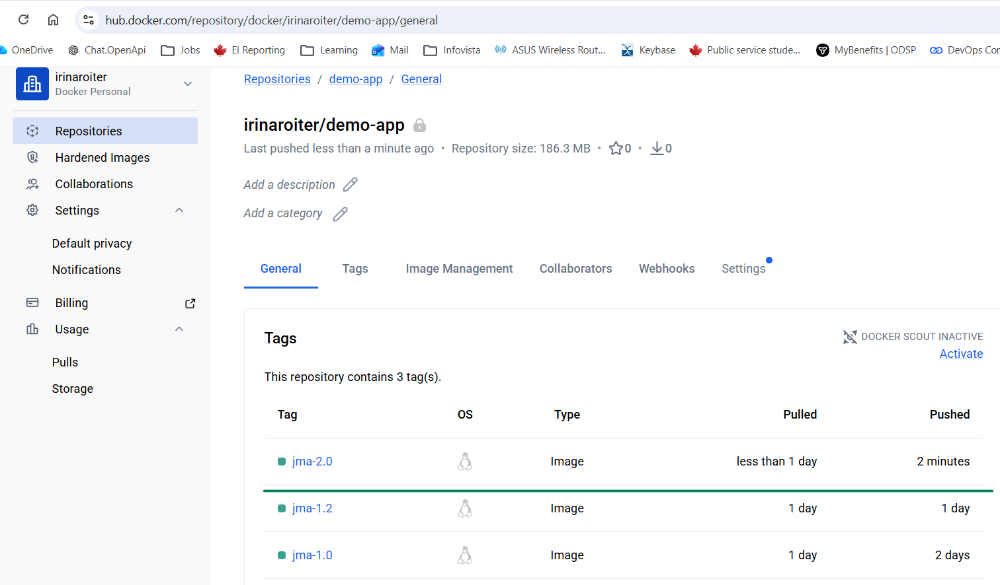
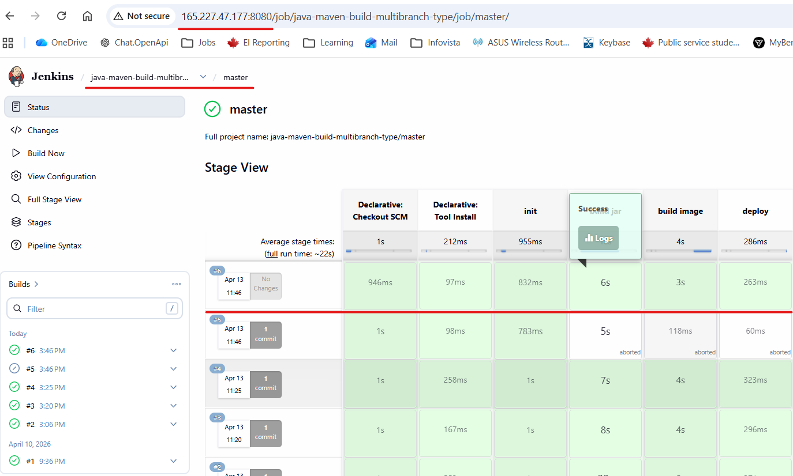
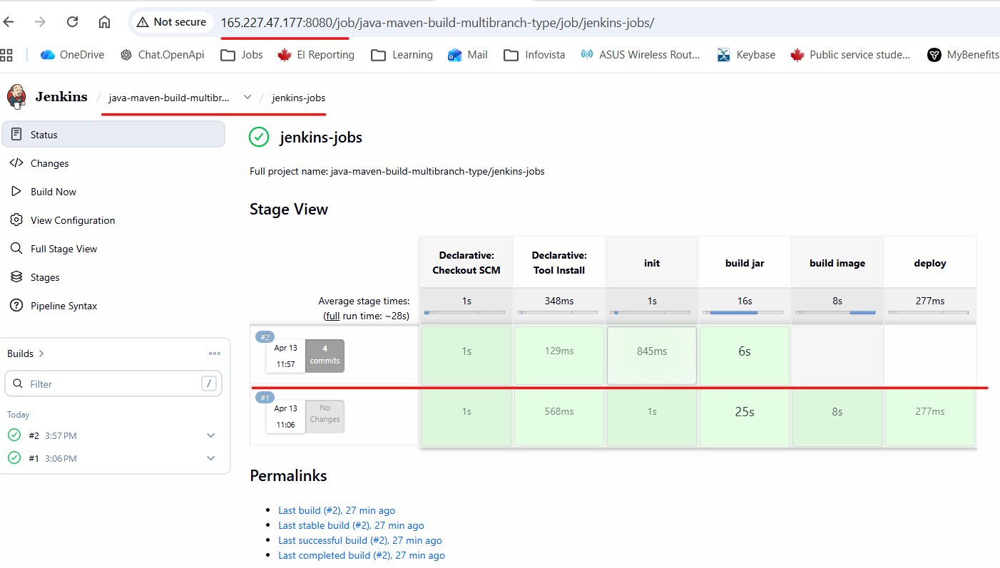

# Module 8 - Build Automation and CI/CD with Jenkins
## Demo Project:
Create a CI Pipeline with Jenkinsfile (Freestyle, Pipeline, Multibranch
Pipeline)
## Technologies used:
Jenkins, Docker, Linux, Git, Java, Maven
## Project Description:
### CI Pipeline for a Java Maven application to build and push to the repository
* Install Build Tools (Maven, Node) in Jenkins
* Make Docker available on Jenkins server
* Create Jenkins credentials for a git repository
* Create different Jenkins job types (Freestyle, Pipeline, Multibranch
pipeline) for the Java Maven project with Jenkinsfile to:

    * Connect to the application’s git repository
    * Build Jar   
    * Build Docker Image
    * Push to private DockerHub repository

## Java Maven Repo:
https://gitlab.com/IrinaRoiter/java-maven-app.git
    

# Solution

<details>
<summary><b>Install Build Tools - Maven in Jenkins</b></summary>

* Install Maven tools
```
After Jenkins has been initialized, Jenins offers installing either default tools, or customized the list. I installed default tools
```
* Configure tools
```
Manage Jenkins->Tools->Maven installations->Add Maven->select latest available version->Save
The version is 3.9.14
```
</details>
<details>
<summary><b>Install Build Tools - NodeJS and NPM in Jenkins</b></summary>

👉NodeJS and NPM does not appear under 'Tools' section => I will install it directly in Jenkins Docker container. </br>
👉I must login as root to the container to have admin priviladges to install tools


* Login into the container as ROOT user

```
root@ubuntu-s-2vcpu-4gb-tor1-01:~# docker ps
CONTAINER ID   IMAGE                 COMMAND                  CREATED       STATUS       PORTS                                                                                          NAMES
9da29d19fb28   jenkins/jenkins:lts   "/usr/bin/tini -- /u…"   2 hours ago   Up 2 hours   0.0.0.0:8080->8080/tcp, [::]:8080->8080/tcp, 0.0.0.0:50000->50000/tcp, [::]:50000->50000/tcp   hungry_wright

root@ubuntu-s-2vcpu-4gb-tor1-01:~# docker exec -it -u 0 9da29d19fb28 bash
root@9da29d19fb28:/#
```
* Check Linux distro inside of the container
```
root@9da29d19fb28:/# cat /etc/issue
Debian GNU/Linux 13 \n \l
```
```
root@9da29d19fb28:/# apt update
...
Fetched 10.0 MB in 2s (6026 kB/s)
10 packages can be upgraded. Run 'apt list --upgradable' to see them.
root@9da29d19fb28:/#
```
* Find a NodeJS for Debian distro and download it
```
root@9da29d19fb28:/# curl -sL https://deb.nodesource.com/setup_20.x -o nodesource_setup.sh
root@9da29d19fb28:/# ls
bin  boot  dev  etc  home  lib  lib64  media  mnt  nodesource_setup.sh  opt  proc  root  run  sbin  srv  sys  tmp  usr  var
```
* Execute the script
```
root@9da29d19fb28:/# bash nodesource_setup.sh
2026-04-06 18:20:49 - Installing pre-requisites
....
```
* Install NodeJS and npm
```
root@9da29d19fb28:/# apt install nodejs
Installing:
  nodejs
....

root@9da29d19fb28:/# node -v
v20.20.2

root@9da29d19fb28:/# npm -v
10.8.2

```
</details>
<details>
<summary><b>Install Stage View Plugin in Jenkins</b></summary>

* Find a Stage View Plugin under Avaialble Plugins
```
Manage Jenkins->Plugins->Available Plugins->search for Stage View->select->install with restart.
```
* Start Jenkins container manually
```
root@9da29d19fb28:/# root@ubuntu-s-2vcpu-4gb-tor1-01:~# docker ps
CONTAINER ID   IMAGE     COMMAND   CREATED   STATUS    PORTS     NAMES

root@ubuntu-s-2vcpu-4gb-tor1-01:~# docker ps -a
CONTAINER ID   IMAGE                 COMMAND                  CREATED       STATUS                          PORTS     NAMES
9da29d19fb28   jenkins/jenkins:lts   "/usr/bin/tini -- /u…"   3 hours ago   Exited (5) About a minute ago             hungry_wright

root@ubuntu-s-2vcpu-4gb-tor1-01:~# docker start 9da29d19fb28
9da29d19fb28
```
* Verify from UI that Stage view Plugin is installed


</details>


<details>
<summary><b>Create a Freestyle type job</b></summary>

* Create new job
```
New job:
name: irina-job
type: freestyle
Save
```
* Add step - 'Execute shell'
```
npm -version
```
* Add step - 'Invoke top-level Maven targets'
```
Maven version: maven-3.9
Goals: --version
Save
```
* Run a build
* Inspect build results - Click on #1 -> Console Output
```
Started by user Admin
Running as SYSTEM
Building in workspace /var/jenkins_home/workspace/irina-job
[irina-job] $ /bin/sh -xe /tmp/jenkins17554465995757960896.sh
+ npm -version
10.8.2
Unpacking https://repo.maven.apache.org/maven2/org/apache/maven/apache-maven/3.9.14/apache-maven-3.9.14-bin.zip to /var/jenkins_home/tools/hudson.tasks.Maven_MavenInstallation/maven-3.9 on Jenkins
[irina-job] $ /var/jenkins_home/tools/hudson.tasks.Maven_MavenInstallation/maven-3.9/bin/mvn --version
Apache Maven 3.9.14 (996c630dbc656c76214ce58821dcc58be960875b)
Maven home: /var/jenkins_home/tools/hudson.tasks.Maven_MavenInstallation/maven-3.9
Java version: 21.0.9, vendor: Eclipse Adoptium, runtime: /opt/java/openjdk
Default locale: en, platform encoding: UTF-8
OS name: "linux", version: "6.8.0-71-generic", arch: "amd64", family: "unix"
Finished: SUCCESS
```
* Connect the job - 'irina-job' to the Java Maven application’s git repository 
```
Click 'irina-job' -> Configure -> Source Control Management
Select Git
Provide an URL to the repo:
https://gitlab.com/IrinaRoiter/java-maven-app.git

Add Credentials:
Type: User name and password
Provide username and token to GitLab
👉GitLab does not allow to use password by default => create a token.
```
* Build the job and check console output to verify the connection
```
Started by user Admin
Running as SYSTEM
Building in workspace /var/jenkins_home/workspace/irina-job
The recommended git tool is: NONE
using credential irina-token
 > git rev-parse --resolve-git-dir /var/jenkins_home/workspace/irina-job/.git # timeout=10
Fetching changes from the remote Git repository
 > git config remote.origin.url https://gitlab.com/IrinaRoiter/java-maven-app.git # timeout=10
Fetching upstream changes from https://gitlab.com/IrinaRoiter/java-maven-app.git
 > git --version # timeout=10
 > git --version # 'git version 2.47.3'
using GIT_ASKPASS to set credentials pat-gitlab-viewer
 > git fetch --tags --force --progress -- https://gitlab.com/IrinaRoiter/java-maven-app.git +refs/heads/*:refs/remotes/origin/* # timeout=10
 > git rev-parse refs/remotes/origin/master^{commit} # timeout=10
Checking out Revision e7ae2f0d0ef9b0fc881ea56291ae63107fa99af2 (refs/remotes/origin/master)
 > git config core.sparsecheckout # timeout=10
 > git checkout -f e7ae2f0d0ef9b0fc881ea56291ae63107fa99af2 # timeout=10
Commit message: "Updated readme.md"
First time build. Skipping changelog.
[irina-job] $ /bin/sh -xe /tmp/jenkins2237213392841445574.sh
+ npm -version
10.8.2
[irina-job] $ /var/jenkins_home/tools/hudson.tasks.Maven_MavenInstallation/maven-3.9/bin/mvn --version
Apache Maven 3.9.14 (996c630dbc656c76214ce58821dcc58be960875b)
Maven home: /var/jenkins_home/tools/hudson.tasks.Maven_MavenInstallation/maven-3.9
Java version: 21.0.9, vendor: Eclipse Adoptium, runtime: /opt/java/openjdk
Default locale: en, platform encoding: UTF-8
OS name: "linux", version: "6.8.0-71-generic", arch: "amd64", family: "unix"
Finished: SUCCESS
```
</details>

<details>
<summary><b>Validate Jenkins Jobs and workspaces location</b></summary>


ℹ️ Jenkins stores job configuration, job runs, logs for each run under /var/jenkins_home/jobs
```
root@ubuntu-s-2vcpu-4gb-tor1-01:~# docker ps
CONTAINER ID   IMAGE                 COMMAND                  CREATED        STATUS        PORTS                                                                                          NAMES
9da29d19fb28   jenkins/jenkins:lts   "/usr/bin/tini -- /u…"   24 hours ago   Up 22 hours   0.0.0.0:8080->8080/tcp, [::]:8080->8080/tcp, 0.0.0.0:50000->50000/tcp, [::]:50000->50000/tcp   hungry_wright

root@ubuntu-s-2vcpu-4gb-tor1-01:~# docker exec -it 9da29d19fb28 bash

jenkins@9da29d19fb28:/$ cd /var/jenkins_home/jobs/irina-job/

jenkins@9da29d19fb28:~/jobs/irina-job$ ls
builds  config.xml  nextBuildNumber

jenkins@9da29d19fb28:~/jobs/irina-job$ ls builds
1  2  3  4  permalinks

jenkins@9da29d19fb28:~/jobs/irina-job$ ls builds/4
build.xml  changelog.xml  log
```
ℹ️ Workspaces are located separately !  

```
jenkins@9da29d19fb28:~$ ls workspace
irina-job  irina-job@tmp
jenkins@9da29d19fb28:~$ ls workspace/irina-job
README.md  pom.xml  src
jenkins@9da29d19fb28:~$
```
</details>

<details>
<summary><b>Replace a command by a script file</b></summary>

ℹ️ I can call a script instead of executing commands under shell execution task

```
Replace 
npm -version 
with
chmod +x ./shell-script.sh
./shell-script.sh

under Execute shell task
```
* Build a job and verify from COnsole Output
```
[irina-job] $ /bin/sh -xe /tmp/jenkins13547108588437933210.sh
+ chmod +x ./shell-script.sh
+ ./shell-script.sh
 NPM version is 10.8.2
 ```
</details>

<details>
<summary><b>Test Java Maven app</b></summary>

* Create a new freestyle job - java-maven-build
```
Source control -> Git
Repo: https://gitlab.com/IrinaRoiter/java-maven-app.git
Credentials: pat-gitlab-viewer
Add a build step:
Type: 'Invoke top-level Maven targets'
Maven version: maven-3.9
Goal: test
Add a build step:
Type: 'Invoke top-level Maven targets'
Maven version: maven-3.9
Goal: package
Save

```
* Run 'java-maven-build' job, check results in console output

✅ log shows that repo was cloned
```
Started by user Admin
Running as SYSTEM
Building in workspace /var/jenkins_home/workspace/java-maven-build
The recommended git tool is: NONE
using credential irina-token
Cloning the remote Git repository
Cloning repository https://gitlab.com/IrinaRoiter/java-maven-app.git
 > git init /var/jenkins_home/workspace/java-maven-build # timeout=10
Fetching upstream changes from https://gitlab.com/IrinaRoiter/java-maven-app.git
....

```
✅ log shows that the test was run

```
[INFO] -------------------------------------------------------
[INFO]  T E S T S
[INFO] -------------------------------------------------------
[INFO] Running AppTest
[INFO] Tests run: 1, Failures: 0, Errors: 0, Skipped: 0, Time elapsed: 0.147 s -- in AppTest
[INFO] 
[INFO] Results:
[INFO] 
[INFO] Tests run: 1, Failures: 0, Errors: 0, Skipped: 0
[INFO] 
[INFO] ------------------------------------------------------------------------
[INFO] BUILD SUCCESS
[INFO] ------------------------------------------------------------------------
[INFO] Total time:  15.507 s
[INFO] Finished at: 2026-04-07T17:54:19Z
[INFO] ------------------------------------------------------------------------
``` 
✅ log shows that the JAR file was built
```
[java-maven-build] $ /var/jenkins_home/tools/hudson.tasks.Maven_MavenInstallation/maven-3.9/bin/mvn package
[INFO] Scanning for projects...
...
[INFO] Replacing main artifact /var/jenkins_home/workspace/java-maven-build/target/java-maven-app-1.1.0-SNAPSHOT.jar with repackaged archive, adding nested dependencies in BOOT-INF/.
[INFO] The original artifact has been renamed to /var/jenkins_home/workspace/java-maven-build/target/java-maven-app-1.1.0-SNAPSHOT.jar.original
[INFO] ------------------------------------------------------------------------
[INFO] BUILD SUCCESS
[INFO] ------------------------------------------------------------------------
[INFO] Total time:  10.749 s
[INFO] Finished at: 2026-04-07T17:54:33Z
[INFO] ------------------------------------------------------------------------
Finished: SUCCESS
```
* Validate the Jar file - java-maven-app-1.1.0-SNAPSHOT.jar 

```
jenkins@9da29d19fb28:~/workspace$ ls
irina-job  irina-job@tmp  java-maven-build  java-maven-build@tmp

jenkins@9da29d19fb28:~/workspace$ cd java-maven-build

jenkins@9da29d19fb28:~/workspace/java-maven-build$ ls -l  target
total 23372
drwxr-xr-x 4 jenkins jenkins     4096 Apr  7 17:54 classes
drwxr-xr-x 3 jenkins jenkins     4096 Apr  7 17:54 generated-sources
drwxr-xr-x 3 jenkins jenkins     4096 Apr  7 17:54 generated-test-sources
-rw-r--r-- 1 jenkins jenkins 23897027 Apr  7 17:54 java-maven-app-1.1.0-SNAPSHOT.jar
-rw-r--r-- 1 jenkins jenkins     3108 Apr  7 17:54 java-maven-app-1.1.0-SNAPSHOT.jar.original
drwxr-xr-x 2 jenkins jenkins     4096 Apr  7 17:54 maven-archiver
drwxr-xr-x 3 jenkins jenkins     4096 Apr  7 17:54 maven-status
drwxr-xr-x 2 jenkins jenkins     4096 Apr  7 17:54 surefire-reports
drwxr-xr-x 2 jenkins jenkins     4096 Apr  7 17:54 test-classes
jenkins@9da29d19fb28:~/workspace/java-maven-build$
```

</details>

<details>
<summary><b>Make Docker available in Jenkins and build my Java Maven image</b></summary>

* Stop Jenkins container
```
root@ubuntu-s-2vcpu-4gb-tor1-01:~# docker ps
CONTAINER ID   IMAGE                 COMMAND                  CREATED        STATUS        PORTS                                                                                          NAMES
9da29d19fb28   jenkins/jenkins:lts   "/usr/bin/tini -- /u…"   27 hours ago   Up 24 hours   0.0.0.0:8080->8080/tcp, [::]:8080->8080/tcp, 0.0.0.0:50000->50000/tcp, [::]:50000->50000/tcp   hungry_wright

root@ubuntu-s-2vcpu-4gb-tor1-01:~# docker stop 9da29d19fb28
9da29d19fb28
```
* Inspect current volume
```
root@ubuntu-s-2vcpu-4gb-tor1-01:~# docker volume ls
DRIVER    VOLUME NAME
local     jenkins_home
root@ubuntu-s-2vcpu-4gb-tor1-01:~# docker volume inspect jenkins_home
[
    {
        "CreatedAt": "2026-04-06T16:10:48Z",
        "Driver": "local",
        "Labels": null,
        "Mountpoint": "/var/lib/docker/volumes/jenkins_home/_data",
        "Name": "jenkins_home",
        "Options": null,
        "Scope": "local"
    }
]
```
* Start new container and mount Docker as additional volume
```
root@ubuntu-s-2vcpu-4gb-tor1-01:~# docker run -d -p 8080:8080 -p 50000:50000 -v jenkins_home:/var/jenkins_home -v /var/run/docker.sock:/var/run/docker.sock jenkins/jenkins:lts
70b6eb453be3aef0d94f5a784ca2b9a1dfa926d255cc04526d8c3d2a55865e6f

👉 /var/run/docker.sock - the entry point for the Docker Engine API, enabling actions like creating, starting, and stopping containers. When I run docker commands, the CLI client communicates with the daemon through this socket.

root@ubuntu-s-2vcpu-4gb-tor1-01:~# docker ps
CONTAINER ID   IMAGE                 COMMAND                  CREATED         STATUS         PORTS                                                                                          NAMES
70b6eb453be3   jenkins/jenkins:lts   "/usr/bin/tini -- /u…"   5 seconds ago   Up 4 seconds   0.0.0.0:8080->8080/tcp, [::]:8080->8080/tcp, 0.0.0.0:50000->50000/tcp, [::]:50000->50000/tcp   practical_dhawan
```
* Re-connect to Jenkins from the browser, login

👉 all the data is still there: job definitions, job runs, workspaces

* Install Docker inside of the Jenkins container
```
root@ubuntu-s-2vcpu-4gb-tor1-01:~# docker exec -it -u 0 70b6eb453be3 bash

root@70b6eb453be3:/# curl https://get.docker.com/ > dockerinstall && chmod 777 dockerinstall && ./dockerinstall
  % Total    % Received % Xferd  Average Speed   Time    Time     Time  Current
                                 Dload  Upload   Total   Spent    Left  Speed
100 22417  100 22417    0     0   114k      0 --:--:-- --:--:-- --:--:--  115k
# Executing docker install script, commit: c04fb16bb8bd8ed6ce884bb40570cbcd6101ae0c
+ sh -c apt-get -qq update >/dev/null
+ sh -c DEBIAN_FRONTEND=noninteractive apt-get -y -qq install ca-certificates curl >/dev/null
+ sh -c install -m 0755 -d /etc/apt/keyrings
```
* Set read and write permissions for /var/run/docker.sock
```
root@70b6eb453be3:/# ls -l /var/run/docker.sock
srw-rw---- 1 root 112 0 Apr  6 00:19 /var/run/docker.sock

root@70b6eb453be3:/# chmod 666 /var/run/docker.sock

root@70b6eb453be3:/# ls -l /var/run/docker.sock
srw-rw-rw- 1 root 112 0 Apr  6 00:19 /var/run/docker.sock

root@70b6eb453be3:/# exit
``` 
* Validate that I can run docker commands in the container as jenkins user (not root!)
```
root@ubuntu-s-2vcpu-4gb-tor1-01:~# docker exec -it 70b6eb453be3 bash
jenkins@70b6eb453be3:/$ docker pull redis
Using default tag: latest
...
Status: Downloaded newer image for redis:latest
docker.io/library/redis:latest
jenkins@70b6eb453be3:/$
```
* Add step to build an image of my Java Maven app
```
in Browser->Jenkins->'java-maven-build' job->Configure
Add step "Execute shell" after packaging step
Add command 'docker build -t irina-java-maven-app:1.0 .' there
Save
```
* Run a build and check logs
```
Started by user Admin
Running as SYSTEM
Building in workspace /var/jenkins_home/workspace/java-maven-build
...
[java-maven-build] $ /var/jenkins_home/tools/hudson.tasks.Maven_MavenInstallation/maven-3.9/bin/mvn package
[INFO] Scanning for projects...
...
[INFO] -------------------------------------------------------
[INFO]  T E S T S
[INFO] -------------------------------------------------------
[INFO] Running AppTest
[INFO] Tests run: 1, Failures: 0, Errors: 0, Skipped: 0, Time elapsed: 0.160 s -- in AppTest
[INFO] 
[INFO] Results:
[INFO] 
[INFO] Tests run: 1, Failures: 0, Errors: 0, Skipped: 0
[INFO] 
[INFO] 
[INFO] --- jar:3.5.0:jar (default-jar) @ java-maven-app ---
[INFO] 
[INFO] --- spring-boot:3.5.5:repackage (default) @ java-maven-app ---
[INFO] Replacing main artifact /var/jenkins_home/workspace/java-maven-build/target/java-maven-app-1.1.0-SNAPSHOT.jar with repackaged archive, adding nested dependencies in BOOT-INF/.
[INFO] The original artifact has been renamed to /var/jenkins_home/workspace/java-maven-build/target/java-maven-app-1.1.0-SNAPSHOT.jar.original
[INFO] ------------------------------------------------------------------------
[INFO] BUILD SUCCESS
[INFO] ------------------------------------------------------------------------
[INFO] Total time:  4.696 s
[INFO] Finished at: 2026-04-07T20:20:49Z
[INFO] ------------------------------------------------------------------------
[java-maven-build] $ /bin/sh -xe /tmp/jenkins6033027599570679773.sh

+ docker build -t irina-java-maven-app:1.0 .
#0 building with "default" instance using docker driver

#1 [internal] load build definition from Dockerfile
#1 transferring dockerfile: 184B done
#1 DONE 0.1s

...
Finished: SUCCESS
```
* Validate the new image 
```
jenkins@70b6eb453be3:/$ docker images
IMAGE                      ID             DISK USAGE   CONTENT SIZE   EXTRA
irina-java-maven-app:1.0   c1f008c33047        320MB             0B
jenkins/jenkins:lts        3e88dcb3d033        487MB             0B
redis:latest               646a47c903c5        140MB             0B
```
</details>

<details>
<summary><b>Push my Java Maven image to my DockerHub Repo</b></summary>

* Login to DockerHub and create a repo

Name: demo-app
Type: private

https://hub.docker.com/repository/docker/irinaroiter/demo-app/general

* Add Docker credentials in Jenkins
```
Manage Jenkins->Credentials->Add Credential

irinaroiter/****** (pat-dockerhub-viewer) ℹ️It uses PAT instead of password.
```
* Update 'java-maven-build' job
```
Under Environment select "Use secret texts, or files"
Bindings->Add->Use username and password (separated)
Define user name variable as USER
Define password variable as PASSWORD
Select credentials to DockerHub

Go to step that builds Docker image - 'docker build -t irina-java-maven-app:1.0 .'
Update it to: 
docker build -t irinaroiter/demo-app:jma-1.0 .
docker login -u $USER -p $PASSWORD
docker push irinaroiter/demo-app:jma-1.0
Save
```
* Build it, check the logs
```
+ docker login -u irinaroiter -p ****
WARNING! Using --password via the CLI is insecure. Use --password-stdin.
Login Succeeded
+ docker push irinaroiter/demo-app:jma-1.0
The push refers to repository [docker.io/irinaroiter/demo-app]
5f70bf18a086: Preparing
4218089ce3a6: Preparing
3d146006478f: Preparing
989e799e6349: Preparing
5f70bf18a086: Pushed
989e799e6349: Pushed
4218089ce3a6: Pushed
3d146006478f: Pushed
jma-1.0: digest: sha256:8871110de44f7662a89af3e2de7e7a418c8cb875324932e80bba0cbadad88a80 size: 1159
Finished: SUCCESS
```
* Fix 'WARNING! Using --password via the CLI is insecure. Use --password-stdin.'
```
Update "Execute shell' step 

docker build -t irinaroiter/demo-app:jma-1.2 .
echo $PASSWORD | docker login -u $USER --password-stdin
docker push irinaroiter/demo-app:jma-1.2

Save
Build it
```
* Verify pushed image on DockerHub

</details>

<details>
<summary><b>Push my Java Maven image to my Nexus Repo</b></summary>

* Allow insecure connections in Docker.

👉 Since Docker is installed on a host directly and then it was mounted to Jenkins container, insecure connections should be allowed on a host itself.
👉 Port 8083 - a specific HTTP connector for docker hosted repo on Nexus ! 

```
root@ubuntu-s-2vcpu-4gb-tor1-01:~# vim /etc/docker/daemon.json

Add the following lines:
{
  "insecure-registries" : ["165.22.230.88:8083"]
}
Save and exit
```
* Restart Docker Engine, re-configure permissions for docker.sock
```
root@ubuntu-s-2vcpu-4gb-tor1-01:~# systemctl restart docker

root@ubuntu-s-2vcpu-4gb-tor1-01:~# docker ps
CONTAINER ID   IMAGE     COMMAND   CREATED   STATUS    PORTS     NAMES

root@ubuntu-s-2vcpu-4gb-tor1-01:~# docker ps -a
CONTAINER ID   IMAGE                 COMMAND                  CREATED        STATUS                            PORTS     NAMES
0ba2315def7b   jenkins/jenkins:lts   "/usr/bin/tini -- /u…"   22 hours ago   Exited (143) About a minute ago             fervent_nightingale

root@ubuntu-s-2vcpu-4gb-tor1-01:~# docker start 0ba2315def7b
0ba2315def7b
 
👉 Systectl command stops all the containers. Restart of the container requires re-setting read and write permissions /var/run/docker.sock

root@ubuntu-s-2vcpu-4gb-tor1-01:~# docker exec -it -u 0 0ba2315def7b bash

root@0ba2315def7b:/# chmod 666 /var/run/docker.sock

root@0ba2315def7b:/# ls -l /var/run/docker.sock
srw-rw-rw- 1 root 112 0 Apr  8 17:17 /var/run/docker.sock
```
* Create Nexus credentials in Jenkins
```
Manage Jenkins->Credentials->Add Credential

irina/****** (nexus-pull-push)
```
* Update 'java-maven-build' job
```
'java-maven-build'->Configure->Environment->Add Binding
User name variable: NEXUS_USER
Password variable: NEXUS_PASSWORD
Credentials: irina/****** (nexus-pull-push)

'java-maven-build'->Configure->Build Steps->Add step
docker tag irinaroiter/demo-app:jma-1.2 165.22.230.88:8083/java-maven-app:1.2
echo $NEXUS_PASSWORD | docker login -u $NEXUS_USER --password-stdin 165.22.230.88:8083
docker push 165.22.230.88:8083/java-maven-app:1.2
```
* Run a new build and check Console output
```
[java-maven-build] $ /bin/sh -xe /tmp/jenkins11483126710976328311.sh
+ docker tag ****/demo-app:jma-1.2 165.22.230.88:8083/java-maven-app:1.2
+ echo ****
+ docker login -u irina --password-stdin 165.22.230.88:8083

WARNING! Your credentials are stored unencrypted in '/var/jenkins_home/.docker/config.json'.
Configure a credential helper to remove this warning. See
https://docs.docker.com/go/credential-store/

Login Succeeded
+ docker push 165.22.230.88:8083/java-maven-app:1.2
The push refers to repository [165.22.230.88:8083/java-maven-app]
5f70bf18a086: Preparing
4218089ce3a6: Preparing
3d146006478f: Preparing
989e799e6349: Preparing
5f70bf18a086: Layer already exists
989e799e6349: Layer already exists
3d146006478f: Layer already exists
4218089ce3a6: Pushed
1.2: digest: sha256:8871110de44f7662a89af3e2de7e7a418c8cb875324932e80bba0cbadad88a80 size: 1159
Finished: SUCCESS
```
* Validate uploaded image on Nexus

</details>

<details>
<summary><b>Create a Pipeline type job</b></summary>

* Create a new pipeline type of job
```
Pipeline->Definition->choose 'Pipeline script from SCM'
SCM->Git
URL: https://gitlab.com/IrinaRoiter/java-maven-app.git
Credentials: irinaroriter/*******(pat-gitlab-viewer)
Script path: Jenkinsfile 👈🏻 Groovy script located in the root of my repo.
Save
```
* Jenkinsfile </br>
https://gitlab.com/IrinaRoiter/java-maven-app/-/blob/9a5c4da4b5e8f56c335e8a44cd915817ca053585/Jenkinsfile
⚠️ Provided link is a permalink to a specific commit

* Build it and check the logs


```
Started by user Admin
Obtained Jenkinsfile from git https://gitlab.com/IrinaRoiter/java-maven-app.git
[Pipeline] Start of Pipeline
...
+ mvn package
...
[INFO] -------------------------------------------------------
[INFO]  T E S T S
[INFO] -------------------------------------------------------
[INFO] Running AppTest
[INFO] Tests run: 1, Failures: 0, Errors: 0, Skipped: 0, Time elapsed: 0.113 s -- in AppTest
[INFO] 
[INFO] Results:
[INFO] 
[INFO] Tests run: 1, Failures: 0, Errors: 0, Skipped: 0
[INFO] ------------------------------------------------------------------------
[INFO] BUILD SUCCESS
[INFO] ------------------------------------------------------------------------
[INFO] Total time:  4.160 s
[INFO] Finished at: 2026-04-10T20:52:41Z
[INFO] ------------------------------------------------------------------------
..
+ docker build -t irinaroiter/demo-app:jma-2.0 .
#0 building with "default" instance using docker driver
...
+ echo ****
+ docker login -u irinaroiter --password-stdin
Login Succeeded
[Pipeline] sh
+ docker push irinaroiter/demo-app:jma-2.0
The push refers to repository [docker.io/irinaroiter/demo-app]
..
jma-2.0: digest: sha256:91e8971711fadefaacd9b5b6c9b9b3c73694cfc349a97cfa262351d0969bbabd size: 1159
...
Deploying the application...
..
Finished: SUCCESS
```

* Validate an uploade image on DockerHub



</details>

<details>
<summary><b>Create a Multibranch Pipeline type job</b></summary>

* Create a new multibranch type of job
```
Name: java-maven-build-multibranch-type
Create

Configure->Branch sources->choose 'GIT'
URL: https://gitlab.com/IrinaRoiter/java-maven-app.git
Credentials: irinaroriter/*******(pat-gitlab-viewer)

Behaviours->Add->choose 'Filer by name with reqular expressions'
Accept default regular expression '.*' - matches all the branches
```
* Run 'Build Docker image' and 'Deploy' stages on master branch and skip them on other branches.

Jenkins file:
https://gitlab.com/IrinaRoiter/java-maven-app/-/blob/f4dff20cce1cda27ef277e63b661142a58626584/Jenkinsfile

* Run pipeline on all branches
```
Jenkins->select 'java-maven-build-multibranch-type' pipeline-> select 'Scan multibranch pipeline now' 
```
* Check runs on both branches: master and jenkins-jobs

👉🏻 master branch: all stages run


👉🏻 jenkins-jobs branch: build and deploy stages skipped 

</details>