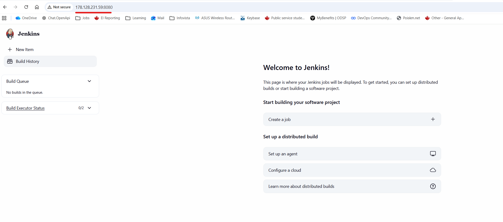

# Module 8 - Containers with Docker
## Demo Project:
Install Jenkins on Digital Ocean 
## Technologies used:
Jenkins, Docker, DigitalOcean, Linux
## Project Description:
* Create an Ubuntu server on Digital Ocean
* Set up and run jenkins as Docker container
* Initialize Jenkins

# Solution

<details>
<summary><b>Create an Ubuntu server on Digital Ocean</b></summary>

* Create a new Droplet on Digital Ocean
```
Region: Toronto (closest to my location)
OS: Ubuntu
Version: 24.0.4 LTS
Shared CPU: Basic
CPU Options: Regular
4 GB/ 2CPUs, 80 GB SSD Drive
Create Droplet
Rename it to 'jenkins-server'
```
* Create a new Firewall for Jenkins
```
ℹ️ My public IP address: https://whatismyipaddress.com/

Networking -> Firewalls -> Create Firewall
Inboubd rules -> New rule
Type: Custom
Protocol: TCP
Port 8080
Sources: only my public IP address 
Add inbound rule
Apply to Droplet - jenkins-server
Name: jenkins-firewall
Create
```
</details>
<details>
<summary><b>Set up and run jenkins as Docker container</b></summary>

*  Install docker and start Jenkins container
```
PS C:\repos\DevOps> ssh root@165.227.47.177
```
```
root@ubuntu-s-2vcpu-4gb-tor1-01:~#  apt update
...
Reading package lists... Done
Building dependency tree... Done
Reading state information... Done
166 packages can be upgraded. Run 'apt list --upgradable' to see them.
```
```
root@ubuntu-s-2vcpu-4gb-tor1-01:~# apt install docker.io
Reading package lists... Done
Building dependency tree... Done
Reading state information... Done
```
* Find a Jenkins image in Docker Hub
```
https://hub.docker.com/r/jenkins/jenkins
Tag: LTS
```
* Start Jenkins container
```
root@ubuntu-s-2vcpu-4gb-tor1-01:~# docker run -d \
> -p 8080:8080 -p 50000:50000 \
> -v jenkins_home:/var/jenkins_home \
> jenkins/jenkins:lts
Unable to find image 'jenkins/jenkins:lts' locally
lts: Pulling from jenkins/jenkins
53c88f1dfeb7: Pull complete
4d2125ccf71c: Pull complete
69503609dc01: Pull complete
6da7907f70f4: Pull complete
6327a7366a6f: Pull complete
01938f7c040b: Pull complete
b7b154fd69a1: Pull complete
876217fdee20: Pull complete
fbae626c1b7a: Pull complete
b19825c62ed8: Pull complete
ec7478903548: Pull complete
e682a95ad036: Pull complete
Digest: sha256:c4098086090ca98491d4bf66182f5e3b015a8232f2acf2df209a212a5801aa8e
Status: Downloaded newer image for jenkins/jenkins:lts
9da29d19fb2805ce9c894a4dfdd1a8e4d9c6735e2b6c10d677660c4fa28ae0c4
root@ubuntu-s-2vcpu-4gb-tor1-01:~#
```
* Validate that the container is running
```
root@ubuntu-s-2vcpu-4gb-tor1-01:~# docker ps
CONTAINER ID   IMAGE                 COMMAND                  CREATED          STATUS          PORTS                                                                                          NAMES
9da29d19fb28   jenkins/jenkins:lts   "/usr/bin/tini -- /u…"   37 seconds ago   Up 36 seconds   0.0.0.0:8080->8080/tcp, [::]:8080->8080/tcp, 0.0.0.0:50000->50000/tcp, [::]:50000->50000/tcp   hungry_wright
```
</details>
<details>
<summary><b>Initialize Jenkins</b></summary>

* Connect from the browser - http://165.227.47.177:8080/
* Login with initial password
```
root@ubuntu-s-2vcpu-4gb-tor1-01:~# docker exec -it 9da29d19fb28 bash
jenkins@9da29d19fb28:/$ cat /var/jenkins_home/secrets/initialAdminPassword
7ca30e3e2a8042e4bc7a428eb73869a1
```
Since we mounted volume, initial password can be located directly on the host
```
jenkins@9da29d19fb28:/$ exit
exit
root@ubuntu-s-2vcpu-4gb-tor1-01:~# docker volume inspect jenkins_home
[
    {
        "CreatedAt": "2026-04-06T16:10:48Z",
        "Driver": "local",
        "Labels": null,
        "Mountpoint": "/var/lib/docker/volumes/jenkins_home/_data",
        "Name": "jenkins_home",
        "Options": null,
        "Scope": "local"
    }
]

root@ubuntu-s-2vcpu-4gb-tor1-01:~# ls /var/lib/docker/volumes/jenkins_home/_data
config.xml               hudson.model.UpdateCenter.xml     jobs              plugins     secret.key.not-so-secret  updates      users
copy_reference_file.log  jenkins.telemetry.Correlator.xml  nodeMonitors.xml  secret.key  secrets                   userContent  war

root@ubuntu-s-2vcpu-4gb-tor1-01:~# cat /var/lib/docker/volumes/jenkins_home/_data/secrets/initialAdminPassword
7ca30e3e2a8042e4bc7a428eb73869a1

root@ubuntu-s-2vcpu-4gb-tor1-01:~#
```
* Create am admin user
```
name: admin
password: admin
```
 
</details>
