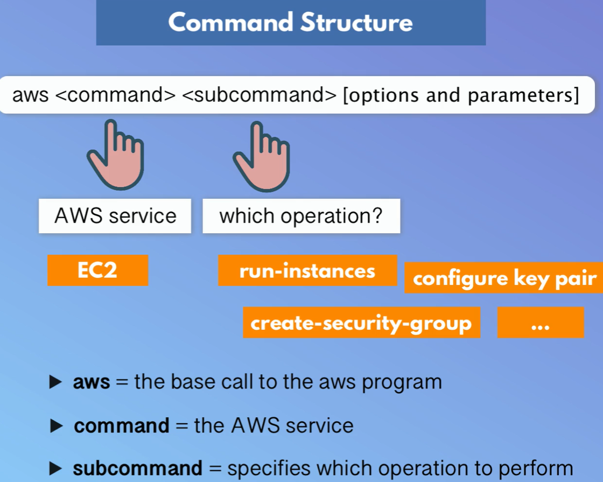

# Module 9 - AWS Services
## Demo Project:
Interacting with AWS CLI
versioning)
## Technologies used:
AWS, Linux
## Project Description:
* Install & configure AWS CLI to connect to our AWS
account
* Create EC2 Instance using AWS CLI with all configurations
like Security Group
* Create SSH key pair
* Create IAM resources like User, Group, Policy using the
AWS CLI
* List and browse AWS resources using the AWS CLI


# Solution

## Repo:
https://gitlab.com/IrinaRoiter/js-app/-/tree/master


<details>
<summary><b>Install & configure AWS CLI to connect to our AWS
account</b></summary>

* Install AWS 
```
Download AWS installer MSI package for Windows and install it

https://awscli.amazonaws.com/AWSCLIV2.msi
```
* Configure credentials
```
PS C:\Repos\js-app> aws configure

Tip: You can deliver temporary credentials to the AWS CLI using your AWS Console session by running the command 'aws login'.

AWS Access Key ID [None]: <access-key-admin>
AWS Secret Access Key [None]: <secret-key-admin>
Default region name [None]: ca-central-1
Default output format [None]: json
PS C:\Repos\js-app>
```
👉🏻 Configuration is stored locally here:
C:\Users\user\.aws

</details>

<details>
<summary><b>AWS tool command structure</b></summary>


</details>

<details>
<summary><b>Create SSH key pair</b></summary>
* Create a Key-Pair
```
PS C:\Repos\js-app> aws ec2 create-key-pair `
>> --key-name MyKpCli   `
>> --query 'KeyMaterial' `
>> --output text > C:\Users\user\.ssh\MyKpCli.pem
```
</details>
<details>
<summary><b>Create EC2 Instance using AWS CLI with all configurations like Security Group </b></summary>

* Find the VPC ID
```
PS C:\Repos\js-app> aws ec2 describe-vpcs
{
    "Vpcs": [
        {
            "OwnerId": "654353650965",
            "InstanceTenancy": "default",
            "CidrBlockAssociationSet": [
                {
                    "AssociationId": "vpc-cidr-assoc-096c07fd7c1214a3f",
                    "CidrBlock": "172.31.0.0/16",
                    "CidrBlockState": {
                        "State": "associated"
                    }
                }
            ],
            "IsDefault": true,
            "BlockPublicAccessStates": {
                "InternetGatewayBlockMode": "off"
            },
            "VpcId": "vpc-0f240ec3029648312", 👈🏻 VPC ID we need
            "State": "available",
            "CidrBlock": "172.31.0.0/16",
            "DhcpOptionsId": "dopt-0895c0b6537fdc668"
        }
    ]
}
```
* Create a new security group
```
PS C:\Repos\js-app> aws ec2 create-security-group --group-name irina-sg --description "My new SG" --vpc-id vpc-0f240ec3029648312
{
    "GroupId": "sg-0d345d5e3dccbc6cd",
    "SecurityGroupArn": "arn:aws:ec2:ca-central-1:654353650965:security-group/sg-0d345d5e3dccbc6cd"
}
👆🏻 - output in json format as we configured it

PS C:\Repos\js-app> aws ec2 describe-security-groups --group-ids sg-0d345d5e3dccbc6cd
{
    "SecurityGroups": [
        {
            "GroupId": "sg-0d345d5e3dccbc6cd",
            "IpPermissionsEgress": [
                {
                    "IpProtocol": "-1",
                    "UserIdGroupPairs": [],
                    "IpRanges": [
                        {
                            "CidrIp": "0.0.0.0/0"
                        }
                    ],
                    "Ipv6Ranges": [],
                    "PrefixListIds": []
                }
            ],
            "VpcId": "vpc-0f240ec3029648312",
            "SecurityGroupArn": "arn:aws:ec2:ca-central-1:654353650965:security-group/sg-0d345d5e3dccbc6cd",
            "OwnerId": "654353650965",
            "GroupName": "irina-sg",
            "Description": "My new SG",
            "IpPermissions": []
        }
    ]
}
```
* Create a new rule for the security group   
```
PS C:\Repos\js-app> aws ec2 authorize-security-group-ingress `
>> --group-id sg-0d345d5e3dccbc6cd `
>> --protocol tcp `
>> --port 22 `
>> --cidr 108.162.140.99/32
{
    "Return": true,
    "SecurityGroupRules": [
        {
            "SecurityGroupRuleId": "sgr-05529a504d6d3158f",
            "GroupId": "sg-0d345d5e3dccbc6cd",
            "GroupOwnerId": "654353650965",
            "IsEgress": false,
            "IpProtocol": "tcp",
            "FromPort": 22,
            "ToPort": 22,
            "CidrIpv4": "108.162.140.99/32",
            "SecurityGroupRuleArn": "arn:aws:ec2:ca-central-1:654353650965:security-group-rule/sgr-05529a504d6d3158f"
        }
    ]
}


PS C:\Repos\js-app> aws ec2 describe-security-groups --group-ids sg-0d345d5e3dccbc6cd
{
    "SecurityGroups": [
        {
            "GroupId": "sg-0d345d5e3dccbc6cd",
            "IpPermissionsEgress": [
                {
                    "IpProtocol": "-1",
                    "UserIdGroupPairs": [],
                    "IpRanges": [
                        {
                            "CidrIp": "0.0.0.0/0"
                        }
                    ],
                    "Ipv6Ranges": [],
                    "PrefixListIds": []
                }
            ],
            "VpcId": "vpc-0f240ec3029648312",
            "SecurityGroupArn": "arn:aws:ec2:ca-central-1:654353650965:security-group/sg-0d345d5e3dccbc6cd",
            "OwnerId": "654353650965",
            "GroupName": "irina-sg",
            "Description": "My new SG",
            "IpPermissions": [
                {
                    "IpProtocol": "tcp",
                    "FromPort": 22,
                    "ToPort": 22,
                    "UserIdGroupPairs": [],
                    "IpRanges": [
                        {
                            "CidrIp": "108.162.140.99/32"
                        }
                    ],
                    "Ipv6Ranges": [],
                    "PrefixListIds": []
                }
            ]
        }
    ]
}
👉🏻 a new rule is added.
```
* Get a subnet ID
```
PS C:\Repos\js-app> aws ec2 describe-subnets
{
    "Subnets": [
        {
            "AvailabilityZoneId": "cac1-az1",
            ....
            "SubnetId": "subnet-040afa63f407d256f",
            "State": "available",
            "VpcId": "vpc-0f240ec3029648312",
            "CidrBlock": "172.31.16.0/20",
            ...
        },
        {
            "AvailabilityZoneId": "cac1-az4",
...
            "SubnetId": "subnet-0711ffea3b1b88a7a",
            "State": "available",
            "VpcId": "vpc-0f240ec3029648312",
            "CidrBlock": "172.31.32.0/20",
...
        },
        {
            "AvailabilityZoneId": "cac1-az2",
...
            "SubnetId": "subnet-0b62c3fc4bde574d5",
            "State": "available",
            "VpcId": "vpc-0f240ec3029648312",
            "CidrBlock": "172.31.0.0/20",
...
        }
    ]
}
👉🏻 Output of the command shows that in the regiosn ca-central-1 there are 3 avaialbility zones. Each zone has its ownsubnetID.
```
* Get an image ID
```
👉🏻 I will use the same image as the one that was used to create another EC2 instance. 
PS C:\Repos\js-app> aws ec2 describe-instances --instance-ids i-08c6cd175194e407d | Select-String image

                    "ImageId": "ami-0495a76ecf381a767"   
```
* Create an EC2 instance 
```
PS C:\Repos\js-app> aws ec2 run-instances `
>> --image-id ami-0495a76ecf381a767 `
>> --count 1 `
>> --instance-type t2.micro `
>> --key-name MyKpCli `
>> --security-group-ids sg-0d345d5e3dccbc6cd `
>> --subnet-id subnet-040afa63f407d256f
{
    "ReservationId": "r-0206a3b52f2a3c7e0",
    "OwnerId": "654353650965",
    "Groups": [],
    "Instances": [
        {
 ...             "Groups": [
                        {
                            "GroupId": "sg-0d345d5e3dccbc6cd",
                            "GroupName": "irina-sg"
                        }
                    ],
...
                    "PrivateDnsName": "ip-172-31-25-106.ca-central-1.compute.internal",
                    "PrivateIpAddress": "172.31.25.106",
                    "PrivateIpAddresses": [
                        {
                            "Primary": true,
                            "PrivateDnsName": "ip-172-31-25-106.ca-central-1.compute.internal",
                            "PrivateIpAddress": "172.31.25.106"
                        }
                    ],
                    "SourceDestCheck": true,
                    "Status": "in-use",
                    "SubnetId": "subnet-040afa63f407d256f",
                    "VpcId": "vpc-0f240ec3029648312",
                    "InterfaceType": "interface",
                    "Operator": {
                        "Managed": false
                    }
                }
...
            "InstanceId": "i-0b78d941ad8afcaaa",
            "ImageId": "ami-0495a76ecf381a767",
...
            "PrivateDnsName": "ip-172-31-25-106.ca-central-1.compute.internal",
...
            "KeyName": "MyKpCli",
...
            "InstanceType": "t2.micro",
            "LaunchTime": "2026-04-28T19:26:50+00:00",
            "Placement": {
                "AvailabilityZoneId": "cac1-az1",
                "GroupName": "",
                "Tenancy": "default",
                "AvailabilityZone": "ca-central-1a"
            },
...
            "SubnetId": "subnet-040afa63f407d256f",
            "VpcId": "vpc-0f240ec3029648312",
            "PrivateIpAddress": "172.31.25.106"
        }
    ]
}
```
* Find a public IP of a new EC2 instance
```
PS C:\Repos\js-app> aws ec2 describe-instances --instance-ids i-0b78d941ad8afcaaa | Select-String publicIP

                                "PublicIp": "99.79.38.82"
                                        "PublicIp": "99.79.38.82"
                    "PublicIpAddress": "99.79.38.82"
```
* Connect to the EC2 instance
```
PS C:\Repos\js-app> ssh -i C:\Users\user\.ssh\MyKpCli.pem ec2-user@99.79.38.82
The authenticity of host '99.79.38.82 (99.79.38.82)' can't be established.
ED25519 key fingerprint is SHA256:xvI0M6kmh/qEqw2I9UDOY6kxhDwdENxqtQBUHLUihbo.
This key is not known by any other names.
Are you sure you want to continue connecting (yes/no/[fingerprint])? y
Please type 'yes', 'no' or the fingerprint: yes
Warning: Permanently added '99.79.38.82' (ED25519) to the list of known hosts.
   ,     #_
   ~\_  ####_        Amazon Linux 2023
  ~~  \_#####\
  ~~     \###|
  ~~       \#/ ___   https://aws.amazon.com/linux/amazon-linux-2023
   ~~       V~' '->
    ~~~         /
      ~~._.   _/
         _/ _/
       _/m/'
[ec2-user@ip-172-31-25-106 ~]$
```
</details>

<details>
<summary><b>Filters and queries in AWS tool</b></summary>

* Use filters and queries to narrow down info
```
PS C:\Repos\js-app> aws ec2 describe-instances --filters "Name=instance-type, Values=t2.micro" --query "Reservations[].Instances[].InstanceId"
[
    "i-08c6cd175194e407d",
    "i-0b78d941ad8afcaaa"
]
```
```
PS C:\Repos\js-app> 
 --filters "Name=tag:type, Values=web-server-docker" --query "Reservations[].Instances[].InstanceId"
[
    "i-08c6cd175194e407d"
]
```
</details>

<details>
<summary><b>Create IAM resources, list and browse AWS resources using the AWS CLI </b></summary>

* Create a group
```
PS C:\Repos\js-app> aws iam create-group --group-name EC2-FullAccess
{
    "Group": {
        "Path": "/",
        "GroupName": "EC2-FullAccess",
        "GroupId": "AGPAZQWUEKUK5D4X3TZQR",
        "Arn": "arn:aws:iam::654353650965:group/EC2-FullAccess",
        "CreateDate": "2026-04-29T15:14:08+00:00"
    }
}
```
* Create an user
```
PS C:\Repos\js-app> aws iam create-user --user-name Marry
{
    "User": {
        "Path": "/",
        "UserName": "Marry",
        "UserId": "AIDAZQWUEKUK5GP3FZWFJ",
        "Arn": "arn:aws:iam::654353650965:user/Marry",
        "CreateDate": "2026-04-29T15:16:13+00:00"
    }
}

PS C:\Repos\js-app>
```

* Add an user to a group
```
PS C:\Repos\js-app> aws iam add-user-to-group --user-name Marry --group-name EC2-FullAccess

PS C:\Repos\js-app> aws iam get-group --group-name EC2-FullAccess
{
    "Users": [
        {
            "Path": "/",
            "UserName": "Marry",
            "UserId": "AIDAZQWUEKUK5GP3FZWFJ",
            "Arn": "arn:aws:iam::654353650965:user/Marry",
            "CreateDate": "2026-04-29T15:16:13+00:00"
        }
    ],
    "Group": {
        "Path": "/",
        "GroupName": "EC2-FullAccess",
        "GroupId": "AGPAZQWUEKUK5D4X3TZQR",
        "Arn": "arn:aws:iam::654353650965:group/EC2-FullAccess",
        "CreateDate": "2026-04-29T15:14:08+00:00"
    }
}
```
* Get group Name/Arn through UI

👉🏻 Arn - Amazon resource number. An unique identifier of the resource. 
```
AWS->IAM->Policies->Search 'ec2'
Choose 'AmazonEC2ContainerRegistryFullAccess' policy and click on it to get a detailed view.
The view shows you an ARN. 
Policy name is AmazonEC2ContainerRegistryFullAccess
```
* Get Arn through through AWS CLI
```
PS C:\Repos\js-app> aws iam list-policies --query  'Policies[?PolicyName==`AmazonEC2FullAccess`].Arn' --output text
arn:aws:iam::aws:policy/AmazonEC2FullAccess
```
* Attach the policy to the group
```
PS C:\Repos\js-app> aws iam attach-group-policy --group-name EC2-FullAccess --policy-arn arn:aws:iam::aws:policy/AmazonEC2FullAccess

PS C:\Repos\js-app> aws iam list-attached-group-policies --group-name EC2-FullAccess
{
    "AttachedPolicies": [
        {
            "PolicyName": "AmazonEC2FullAccess",
            "PolicyArn": "arn:aws:iam::aws:policy/AmazonEC2FullAccess"
        }
    ]
}
```
* Create initial password for an user and request to reset it on first time login
```
PS C:\Repos\js-app> aws iam create-login-profile --user-name Marry --password MyPassword! --password-reset-required
{
    "LoginProfile": {
        "UserName": "Marry",
        "CreateDate": "2026-04-29T15:58:14+00:00",
        "PasswordResetRequired": true
    }
}
```
👉🏻 To be able to change the password, a user must have permissions. As of now, an user only has full access to ec2 permission. Under AIM services there is no predefined policy for that. Therefore, we need to create one.

* Create a policy to change a password
```
Create a JSON file with the policy and save it as changePolicy.json
{
    "Version": "2012-10-17",
    "Statement": [
        {
            "Effect": "Allow",
            "Action": [
                "iam:ChangePassword"
            ],
            "Resource": [
			    "arn:aws:iam::654353650965:user/${aws:username}"
			]
        },
		        {
            "Effect": "Allow",
            "Action": [
                "iam:GetAccountPasswordPolicy"
            ],
            "Resource": "*"
        }
    ]
}
```
```
PS C:\Repos\js-app> aws iam create-policy --policy-name changePwd --policy-document file://C:\Users\user\Downloads\changePolicy.json
{
    "Policy": {
        "PolicyName": "changePwd",
        "PolicyId": "ANPAZQWUEKUKX4GEDUHNH",
        "Arn": "arn:aws:iam::654353650965:policy/changePwd",
        "Path": "/",
        "DefaultVersionId": "v1",
        "AttachmentCount": 0,
        "PermissionsBoundaryUsageCount": 0,
        "IsAttachable": true,
        "CreateDate": "2026-04-29T16:26:02+00:00",
        "UpdateDate": "2026-04-29T16:26:02+00:00"
    }
}
```
* Attach the policy to the group
```
PS C:\Repos\js-app> aws iam attach-group-policy --group-name EC2-FullAccess --policy-arn arn:aws:iam::654353650965:policy/changePwd
```
* Create an access key for an user
```
PS C:\Repos\js-app> aws iam create-access-key --user-name Marry
{
    "AccessKey": {
        "UserName": "Marry",
        "AccessKeyId": "XXX",
        "Status": "Active",
        "SecretAccessKey": "XXX",
        "CreateDate": "2026-04-30T15:59:21+00:00"
    }
} 
```
* Temporarely set Marry's credentials (access key+secrect access key) in the current CLI session
```
PS C:\Repos\js-app> $env:AWS_ACCESS_KEY_ID = "XXX"
PS C:\Repos\js-app> $env:AWS_SECRET_ACCESS_KEY = "XXX"
👉🏻 For Linux environment:
export AWS_ACCESS_KEY_ID=XXX
export AWS_SECRET_ACCESS_KEY=XXX
```
* Validate that Marry can access ec2 service data now 
```
PS C:\Repos\js-app> aws ec2 describe-instances
{
    "Reservations": [
        {
            "ReservationId": "r-051d0fbd968ab5dda",
            "OwnerId": "654353650965",
            "Groups": [],
            "Instances": [
                {
                    "Architecture": "x86_64",
```  
* Validate that 'Marry' cannot access other services' data on AWS
```
PS C:\Repos\js-app> aws iam create-user --user-name test

aws: [ERROR]: An error occurred (AccessDenied) when calling the CreateUser operation: User: arn:aws:iam::654353650965:user/Marry is not authorized to perform: iam:CreateUser on resource: arn:aws:iam::654353650965:user/test because no identity-based policy allows the iam:CreateUser action
PS C:\Repos\js-app> 
```
</details>