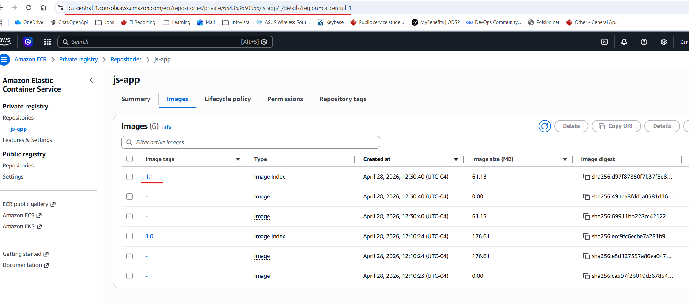

# Module 9 - AWS Services
## Demo Project:
Create repository on AWS and push to private Docker registry
versioning)
## Technologies used:
Docker, Amazon ECR
## Project Description:
* Create private Docker registry on AWS (Amazon ECR)
* Tag and Push Docker image to this private repository


# Solution

## Repo:
https://gitlab.com/IrinaRoiter/js-app/-/tree/master


<details>
<summary><b>Create private Docker registry on AWS (Amazon ECR)</b></summary>

* 
```
On AWS
Service: elastic container registry
Create a repository
Name: js-app
Create  
```
* Check commands for image tagging and pushing
```
Amazon ECR->Private registry->Repositories->js-app
Click on "View push commands" button
ℹ️ It will show the commands to login, uild, tag, push
(Get-ECRLoginCommand).Password | docker login --username AWS --password-stdin 654353650965.dkr.ecr.ca-central-1.amazonaws.com
docker build -t js-app .
docker tag js-app:latest 654353650965.dkr.ecr.ca-central-1.amazonaws.com/js-app:latest
docker push 654353650965.dkr.ecr.ca-central-1.amazonaws.com/js-app:latest
```
</details>

<details>
<summary><b>Install AWS CLI for Powershell on Windows</b></summary>

* Download AWS installer MSI package for Windows and install it

https://awscli.amazonaws.com/AWSCLIV2.msi

* Restart powershell window and install AWS modules in powershell
```
 Install-Module -Name AWS.Tools.Installer
 Set-ExecutionPolicy RemoteSigned
 Install-AWSToolsModule AWS.Tools.ECR -CleanUp

```
* Setup credentials to connect from Docker to ECR and login to Docker
```
IAM -> IAM users -> admin
Create access key
Use case: Command Line Interface (CLI)
Export a key in .csv file and store securely for future use

PS C:\Users\user> Set-AWSCredential `
>> -AccessKey <access key from .cvs file> `
>> -SecretKey <secret key from .csv file> `
>> -StoreAs default

PS C:\Users\user> Get-AWSCredential -ListProfileDetail

ProfileName StoreTypeName         ProfileLocation
----------- -------------         ---------------
default     NetSDKCredentialsFile

PS C:\Users\user> Get-STSCallerIdentity

PS C:\Users\user> (Get-ECRLoginCommand).Password | docker login --username AWS --password-stdin 654353650965.dkr.ecr.ca-central-1.amazonaws.com
Login Succeeded

```
</details>

<details>
<summary><b>Build and push a js-app image to ECR</b></summary>

*  Build an image
```
PS C:\Repos\js-app> docker build -t irina-js-app:1.1 .
[+] Building 12.5s (12/12) FINISHED                                                                                                    

PS C:\Repos\js-app> docker tag irina-js-app:1.1 654353650965.dkr.ecr.ca-central-1.amazonaws.com/js-app:1.1

PS C:\Repos\js-app> docker images

IMAGE                                                              ID             DISK USAGE   CONTENT SIZE   EXTRA
654353650965.dkr.ecr.ca-central-1.amazonaws.com/js-app:1.0         ecc9fc6ecbe7        503MB          177MB
654353650965.dkr.ecr.ca-central-1.amazonaws.com/js-app:1.1         d97f87850f7b        258MB         61.1MB
amazoncorretto:17-alpine                                           9e6c3ad81171        452MB          153MB
debian:latest                                                      55a15a112b42        186MB         52.5MB
irina-js-app:1.0                                                   ecc9fc6ecbe7        503MB          177MB
irina-js-app:1.1                                                   d97f87850f7b        258MB         61.1MB

PS C:\Repos\js-app> docker push 654353650965.dkr.ecr.ca-central-1.amazonaws.com/js-app:1.1
The push refers to repository [654353650965.dkr.ecr.ca-central-1.amazonaws.com/js-app]
...
1.1: digest: sha256:d97f87850f7b37f5e894f235df7e05037abd49711961c1debd1ec4afe78a06cc size: 856
```
* Verify on ECR

</details>