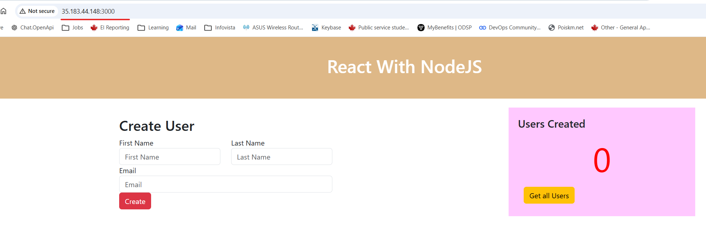

# Module 9 - AWS Services
## Demo Project:
Deploy Web Application on EC2 Instance (manually)
## Technologies used:
AWS, Docker, Linux
## Project Description:
* Create and configure an EC2 Instance on AWS
* Install Docker on remote EC2 Instance
* Deploy Docker image from private Docker repository on EC2 Instance

## Repo:
https://gitlab.com/IrinaRoiter/react-nodejs-example/-/tree/master/
Branch: master

# Solution

<details>
<summary><b>Create and configure an EC2 Instance on AWS</b></summary>

```
Services->EC2->Launch instance
Name: irina-vm
Add aditional tags: 
Key: type Value: web-server-docker

Application and OS images: Amazon Linux (optimazed Linux for Amazon Platform)
Key pair (login)->Create new key pair
Name: irina-vms
Key pair type: ED25519
Private key file format: .pem (Linux, Mac, modern Windows)
Create key pair

Downloaded: irina-vms.pem

Network settings: 
VPC: default
Subnets: no preference
Auto-assign public IP: enable

Firewall:
Create a new security group
Security group name: security-group-irina-vms
Inbound Security Group Rules:
Security group rule 1 (exists by default):
update it by changing 'Source type' to 'My IP'. 
My computer IP is detected automatically

Configure storage:
Leave default values
1 x 8GB

Create instance
```
* Connect to it
```
PS C:\Repos\js-app>  ssh -i C:\Users\user\.ssh\irina-vms.pem ec2-user@35.183.44.148

The authenticity of host '35.183.44.148 (35.183.44.148)' can't be established.
ED25519 key fingerprint is SHA256:Qv4jaH8ODo2DRDc6cdYOJ6rCuqIgH+3QY7YnhG2mj0M.
This key is not known by any other names.
Are you sure you want to continue connecting (yes/no/[fingerprint])? yes
Warning: Permanently added '35.183.44.148' (ED25519) to the list of known hosts.
   ,     #_
   ~\_  ####_        Amazon Linux 2023
  ~~  \_#####\
  ~~     \###|
  ~~       \#/ ___   https://aws.amazon.com/linux/amazon-linux-2023
   ~~       V~' '->
    ~~~         /
      ~~._.   _/
         _/ _/
       _/m/'
[ec2-user@ip-172-31-31-18 ~]$
👉🏻 ec2-user - default admin user for Amazon Linux. ssh under root is disabled.
👉🏻 172-31-31-18 - private IP address

```
</details>
<details>
<summary><b>Install Docker on remote EC2 Instance</b></summary>

```
[ec2-user@ip-172-31-31-18 ~]$ sudo yum update
Amazon Linux 2023 Kernel Livepatch repository                                           219 kB/s |  31 kB     00:00
Dependencies resolved.
Nothing to do.
Complete!
[ec2-user@ip-172-31-31-18 ~]$

[ec2-user@ip-172-31-31-18 ~]$ sudo yum install docker
Last metadata expiration check: 0:02:51 ago on Tue Apr 21 20:45:18 2026.
Dependencies resolved.
...
Installed:
  container-selinux-4:2.245.0-1.amzn2023.noarch                   containerd-2.2.1-1.amzn2023.0.2.x86_64
  docker-25.0.14-1.amzn2023.0.3.x86_64                            iptables-libs-1.8.8-3.amzn2023.0.2.x86_64
  iptables-nft-1.8.8-3.amzn2023.0.2.x86_64                        libcgroup-3.0-1.amzn2023.0.1.x86_64
  libnetfilter_conntrack-1.0.8-2.amzn2023.0.2.x86_64              libnfnetlink-1.0.1-19.amzn2023.0.2.x86_64
  libnftnl-1.2.2-2.amzn2023.0.2.x86_64                            pigz-2.5-1.amzn2023.0.3.x86_64
  runc-1.3.4-3.amzn2023.0.2.x86_64

Complete!

[ec2-user@ip-172-31-31-18 ~]$ docker -v
Docker version 25.0.14, build 0bab007
```
* Start Docker Engine (docker deamon)
```
[ec2-user@ip-172-31-31-18 ~]$ sudo service docker start
Redirecting to /bin/systemctl start docker.service

[ec2-user@ip-172-31-31-18 ~]$ ps aux | grep docker | grep -v grep
root       28392  0.3  8.4 1776456 83224 ?       Ssl  20:50   0:00 /usr/bin/dockerd -H fd:// --containerd=/run/containerd/containerd.sock --default-ulimit nofile=32768:65536
[ec2-user@ip-172-31-31-18 ~]$

```
* Add ec2-user to Docker group

👉🏻 It is to be able to run docker commands without sudo
```
[ec2-user@ip-172-31-31-18 ~]$ sudo usermod -aG docker $USER

ec2-user@ip-172-31-31-18 ~]$ groups
ec2-user adm wheel systemd-journal
👉🏻 docker group is not in the list yet. It requires log out / log in back

[ec2-user@ip-172-31-31-18 ~]$ exit
logout
Connection to 35.183.44.148 closed.

PS C:\repos\jenkins-exercises> ssh -i C:\Users\user\.ssh\irina-vms.pem ec2-user@35.183.44.148
Last login: Tue Apr 21 20:30:20 2026 from 108.162.140.99

[ec2-user@ip-172-31-31-18 ~]$ groups
ec2-user adm wheel systemd-journal docker
👉🏻 docker is listed now
````

</details>
<details>
<summary><b>Deploy Docker image from private Docker repository on EC2 Instance</b></summary>

* Login to Docker
```
[ec2-user@ip-172-31-31-18 ~]$ docker login
Log in with your Docker ID or email address to push and pull images from Docker Hub. If you don't have a Docker ID, head over to https://hub.docker.com/ to create one.
You can log in with your password or a Personal Access Token (PAT). Using a limited-scope PAT grants better security and is required for organizations using SSO. Learn more at https://docs.docker.com/go/access-tokens/

Username: irinaroiter
Password:
WARNING! Your password will be stored unencrypted in /home/ec2-user/.docker/config.json.
Configure a credential helper to remove this warning. See
https://docs.docker.com/engine/reference/commandline/login/#credentials-store

Login Succeeded

[ec2-user@ip-172-31-31-18 ~]$ ls -a
.  ..  .bash_history  .bash_logout  .bash_profile  .bashrc  .docker  .ssh
[ec2-user@ip-172-31-31-18 ~]$ ls .docker/config.json
.docker/config.json

👉🏻 Authorization has been stored in .docker/config.json. It won't require login next time.
```
* Pull the image
```
[ec2-user@ip-172-31-31-18 ~]$ docker pull irinaroiter/demo-app:react-node-1.0
react-node-1.0: Pulling from irinaroiter/demo-app
3e6b9d1a9511: Pull complete
37927ed901b1: Pull complete
79b2f47ad444: Pull complete
e23f099911d6: Pull complete
cda7f44f2bdd: Pull complete
c6b30c3f1696: Pull complete
3697be50c98b: Pull complete
461077a72fb7: Pull complete
4f4fb700ef54: Pull complete
4272e502d366: Pull complete
ee4f13488ba2: Pull complete
82196ffdc495: Pull complete
e4e8c74ada40: Pull complete
Digest: sha256:a92af9d11cfcc058f6d42c790102eb53dd89c10cf1804962b9c69ff2b3e2263d
Status: Downloaded newer image for irinaroiter/demo-app:react-node-1.0
docker.io/irinaroiter/demo-app:react-node-1.0

[ec2-user@ip-172-31-31-18 ~]$ docker images
REPOSITORY             TAG              IMAGE ID       CREATED          SIZE
irinaroiter/demo-app   react-node-1.0   f957f45edac3   28 minutes ago   1.13GB
[ec2-user@ip-172-31-31-18 ~]$
```
* Start container
```
[ec2-user@ip-172-31-31-18 ~]$ docker run -d -p 3000:3080 irinaroiter/demo-app:react-node-1.0
821aa8c96a34bd45dfd2cd4b71f3711e50c392da6a9061ab8cf8626844fb39b5

[ec2-user@ip-172-31-31-18 ~]$ docker ps
CONTAINER ID   IMAGE                                 COMMAND                  CREATED          STATUS          PORTS                                       NAMES
821aa8c96a34   irinaroiter/demo-app:react-node-1.0   "docker-entrypoint.s…"   26 seconds ago   Up 25 seconds   0.0.0.0:3000->3080/tcp, :::3000->3080/tcp   focused_blackburn
```
* Make an application accessible from a browrser
```
AWS -> my instance->Security->click on security group attached to my instance (VM) - 'sg-0fcb92eef1920f473 - security-group-irina-vms'
 
Add inbound rule
Type: Custom
Protocol: TCP
Port: 3000
Source: 108.162.140.99/32 (my public IP only)
```
* Connect from the browser
http://35.183.44.148:3000/
👉🏻 35.183.44.148 - public IPv4

http://ec2-35-183-44-148.ca-central-1.compute.amazonaws.com:3000/
👉🏻 ec2-35-183-44-148.ca-central-1.compute.amazonaws.com - public DNS name 



</details>